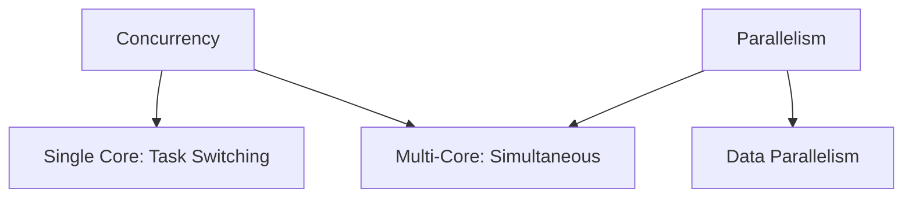

# Concurrency & Parallelism

## Overview

Concurrency and parallelism are concepts in computing for handling multiple tasks. Concurrency involves managing multiple tasks that may overlap in execution time, while parallelism executes multiple tasks simultaneously, often on multiple processors.

## Detailed Explanation

### Concurrency

Concurrency allows programs to handle multiple tasks by interleaving their execution. It's about structure, not necessarily speed. Useful for I/O-bound tasks.

- **In Java**: Threads, Executors, Futures.

### Parallelism

Parallelism runs multiple tasks at the same time, typically on multi-core systems. It's about speed through simultaneous execution.

- **In Java**: Parallel streams, ForkJoinPool.

Key difference: Concurrency can occur on a single core; parallelism requires multiple cores.



## Real-world Examples & Use Cases

- **Web Server**: Concurrently handles multiple client requests using threads.
- **Data Processing**: Parallel processing of large datasets in big data applications.
- **Video Encoding**: Parallel encoding of video frames.

Use cases: Improving responsiveness in UI apps, speeding up computations in scientific simulations.

## Code Examples

### Java Concurrency with Threads

```java
public class ConcurrentExample {
    public static void main(String[] args) {
        Runnable task = () -> {
            System.out.println("Task running in thread: " + Thread.currentThread().getName());
        };
        
        Thread thread1 = new Thread(task);
        Thread thread2 = new Thread(task);
        
        thread1.start();
        thread2.start();
    }
}
```

### Java Parallelism with Streams

```java
import java.util.Arrays;

public class ParallelExample {
    public static void main(String[] args) {
        int[] numbers = {1, 2, 3, 4, 5, 6, 7, 8, 9, 10};
        
        int sum = Arrays.stream(numbers)
                        .parallel()
                        .sum();
        
        System.out.println("Sum: " + sum);
    }
}
```

## References

- [Java Concurrency in Practice](https://jcip.net/)
- [Oracle Java Concurrency Tutorial](https://docs.oracle.com/javase/tutorial/essential/concurrency/)
- [Parallel Streams in Java](https://docs.oracle.com/en/java/javase/17/docs/api/java.base/java/util/stream/package-summary.html)

## Github-README Links & Related Topics

- [Multithreading & Concurrency in Java](multithreading-and-concurrency-in-java/README.md)
- [Java Memory Model and Concurrency](java-memory-model-and-concurrency/README.md)
- [Concurrent Programming Patterns](concurrent-programming-patterns/README.md)