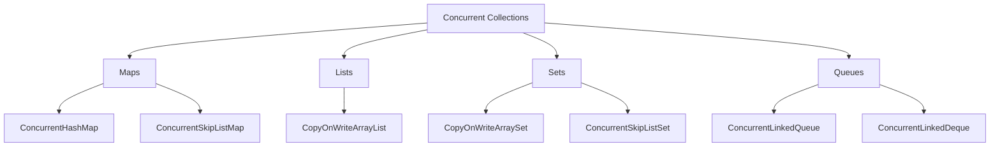

## Overview

Concurrent collections in Java are thread-safe data structures designed for high-performance concurrent access. Unlike synchronized collections, they minimize contention through advanced locking mechanisms or lock-free algorithms, making them ideal for multi-threaded applications.

## Detailed Explanation

Java's `java.util.concurrent` package provides several concurrent collection implementations that support concurrent operations without requiring external synchronization. These collections use techniques like segment-based locking, copy-on-write, and non-blocking algorithms to achieve thread-safety.

### Key Concurrent Collections

| Collection | Description | Thread-Safety Mechanism | Best Use Case |
|------------|-------------|--------------------------|---------------|
| `ConcurrentHashMap<K,V>` | High-concurrency hash map | Segment-based locking for writes, lock-free reads | General-purpose concurrent maps with frequent reads |
| `ConcurrentSkipListMap<K,V>` | Concurrent navigable map | Lock-free operations using skip lists | Ordered maps requiring concurrent access |
| `ConcurrentSkipListSet<E>` | Concurrent navigable set | Based on ConcurrentSkipListMap | Ordered sets with concurrent operations |
| `CopyOnWriteArrayList<E>` | Thread-safe array list | Copy-on-write for mutations | Read-heavy scenarios with infrequent writes |
| `CopyOnWriteArraySet<E>` | Thread-safe set | Based on CopyOnWriteArrayList | Read-heavy sets with rare modifications |
| `ConcurrentLinkedQueue<E>` | Concurrent FIFO queue | Lock-free linked nodes | Producer-consumer patterns |
| `ConcurrentLinkedDeque<E>` | Concurrent double-ended queue | Lock-free linked nodes | Deque operations in concurrent environments |



### Memory Consistency

All concurrent collections provide memory consistency guarantees: actions prior to insertion happen-before subsequent access or removal in another thread.

## Real-world Examples & Use Cases

- **Web Server Caching**: Using `ConcurrentHashMap` for session storage or cache with multiple concurrent requests.
- **Event Processing**: `CopyOnWriteArrayList` for listener lists where reads vastly outnumber writes.
- **Task Scheduling**: `ConcurrentLinkedQueue` in thread pools for job queues.
- **Configuration Sharing**: Immutable configurations using copy-on-write collections.
- **Real-time Analytics**: Concurrent maps for aggregating data from multiple threads.

## Code Examples

### ConcurrentHashMap with Parallel Processing

```java
import java.util.concurrent.ConcurrentHashMap;
import java.util.concurrent.ExecutorService;
import java.util.concurrent.Executors;

public class ConcurrentMapExample {
    public static void main(String[] args) {
        ConcurrentHashMap<String, Integer> map = new ConcurrentHashMap<>();
        
        // Concurrent puts
        ExecutorService executor = Executors.newFixedThreadPool(4);
        for (int i = 0; i < 100; i++) {
            final int key = i;
            executor.submit(() -> map.put("key" + key, key * 2));
        }
        
        // Parallel computation
        map.forEach(4, (k, v) -> {
            System.out.println(k + " -> " + v);
        });
        
        executor.shutdown();
    }
}
```

### CopyOnWriteArrayList for Safe Iteration

```java
import java.util.concurrent.CopyOnWriteArrayList;
import java.util.Iterator;

public class CopyOnWriteExample {
    public static void main(String[] args) {
        CopyOnWriteArrayList<String> list = new CopyOnWriteArrayList<>();
        list.add("A");
        list.add("B");
        list.add("C");
        
        // Safe iteration during modification
        Iterator<String> iterator = list.iterator();
        while (iterator.hasNext()) {
            String item = iterator.next();
            if (item.equals("B")) {
                list.add("D"); // Creates new copy, iterator unaffected
            }
            System.out.println(item);
        }
        
        System.out.println("Final list: " + list);
    }
}
```

### Producer-Consumer with ConcurrentLinkedQueue

```java
import java.util.concurrent.ConcurrentLinkedQueue;
import java.util.concurrent.ExecutorService;
import java.util.concurrent.Executors;

public class ProducerConsumerExample {
    private static final ConcurrentLinkedQueue<String> queue = new ConcurrentLinkedQueue<>();
    
    public static void main(String[] args) {
        ExecutorService executor = Executors.newFixedThreadPool(2);
        
        // Producer
        executor.submit(() -> {
            for (int i = 0; i < 10; i++) {
                queue.offer("Task " + i);
                try {
                    Thread.sleep(100);
                } catch (InterruptedException e) {
                    Thread.currentThread().interrupt();
                }
            }
        });
        
        // Consumer
        executor.submit(() -> {
            while (true) {
                String task = queue.poll();
                if (task != null) {
                    System.out.println("Processed: " + task);
                } else {
                    break;
                }
            }
        });
        
        executor.shutdown();
    }
}
```

## Common Pitfalls & Edge Cases

- **Iterator Weak Consistency**: Iterators may not reflect modifications made after creation.
- **Size Approximation**: `ConcurrentHashMap.size()` is approximate and may not be exact.
- **CopyOnWrite Performance**: High memory overhead for frequent writes due to copying.
- **Blocking Operations**: Blocking queues can cause deadlocks if not designed carefully.
- **Compound Operations**: Use atomic methods like `computeIfAbsent` instead of get-then-put sequences.

## Tools & Libraries

- **Built-in**: Java's `java.util.concurrent` package (JDK 5+)
- **Third-party**: Guava's `Multimap` implementations, Apache Commons Collections

## References

- [Oracle Java SE 17 Documentation: java.util.concurrent](https://docs.oracle.com/en/java/javase/17/docs/api/java.base/java/util/concurrent/package-summary.html)
- [Java Concurrency in Practice](https://www.amazon.com/Java-Concurrency-Practice-Brian-Goetz/dp/0321349601)
- [Concurrent Collections Javadoc](https://docs.oracle.com/javase/8/docs/api/java/util/concurrent/package-summary.html#ConcurrentCollections)

## Github-README Links & Related Topics

- [Java Collections Framework](java/collections-framework/README.md)
- [Concurrent Programming Patterns](concurrent-programming-patterns/README.md)
- [Java Memory Model and Concurrency](java/java-memory-model-and-concurrency/README.md)
- [Threads Executors Futures](java/threads-executors-futures/README.md)