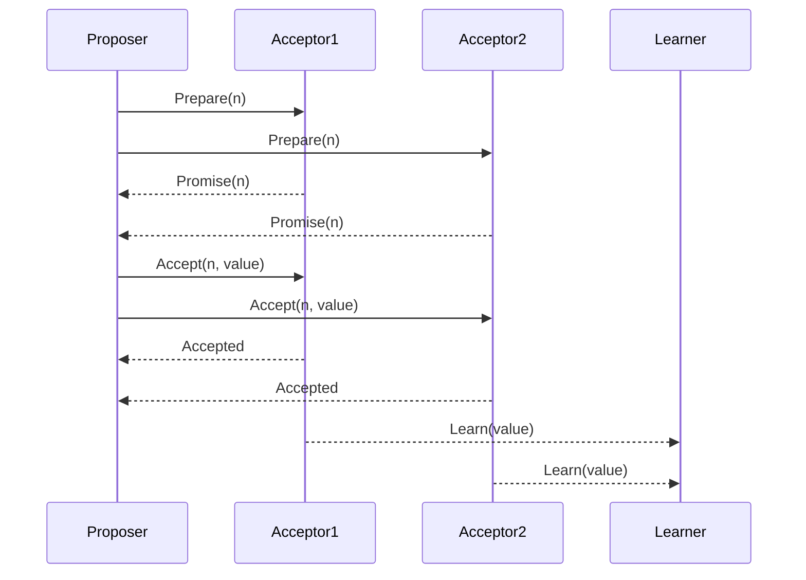

# Consensus Algorithms Overview

## Overview

Consensus algorithms ensure that a group of processes agree on a single value or decision in a distributed system, even in the presence of failures. They are fundamental to fault-tolerant distributed systems.

## Detailed Explanation

Consensus solves the problem of getting multiple nodes to agree on a value. Key properties: Agreement, Validity, Termination, Integrity.

### Common Algorithms

- **Paxos**: Classic, complex, phases: Prepare, Accept, Learn.
- **Raft**: Simpler, leader-based, log replication.
- **Zab**: Used in ZooKeeper, similar to Paxos.
- **Viewstamped Replication**: Another variant.

### Paxos Phases

1. **Prepare**: Proposer sends prepare with proposal number.
2. **Accept**: Proposer sends accept with value.
3. **Learn**: Learners learn the decided value.



## Real-world Examples & Use Cases

- **Distributed Databases**: Google Spanner uses Paxos-like.
- **Blockchain**: Bitcoin uses Proof-of-Work for consensus.
- **ZooKeeper**: Zab for coordination.
- **etcd**: Raft for key-value consensus.

## Code Examples

### Simplified Raft Leader Election

```go
type Server struct {
    id int
    term int
    votedFor int
}

func (s *Server) RequestVote(term int, candidateId int) bool {
    if term > s.term {
        s.term = term
        s.votedFor = candidateId
        return true
    }
    return false
}
```

## Common Pitfalls & Edge Cases

- **Byzantine Failures**: Some algorithms handle, others don't.
- **Network Delays**: Can cause livelocks.
- **Quorum Requirements**: Need majority for progress.

## Tools & Libraries

- **Raft**: etcd, Consul.
- **Paxos**: Chubby, Spanner.
- **Blockchain**: Ethereum (Proof-of-Stake).

## References

- [Paxos Made Simple](https://lamport.azurewebsites.net/pubs/paxos-simple.pdf)
- [Raft Paper](https://raft.github.io/raft.pdf)

## Github-README Links & Related Topics

- [Paxos Algorithm](paxos-algorithm/README.md)
- [Raft and Leader Election](raft-and-leader-election/README.md)
- [Consensus Algorithms](consensus-algorithms/README.md)
- [Byzantine Fault Tolerance](byzantine-fault-tolerance/README.md)