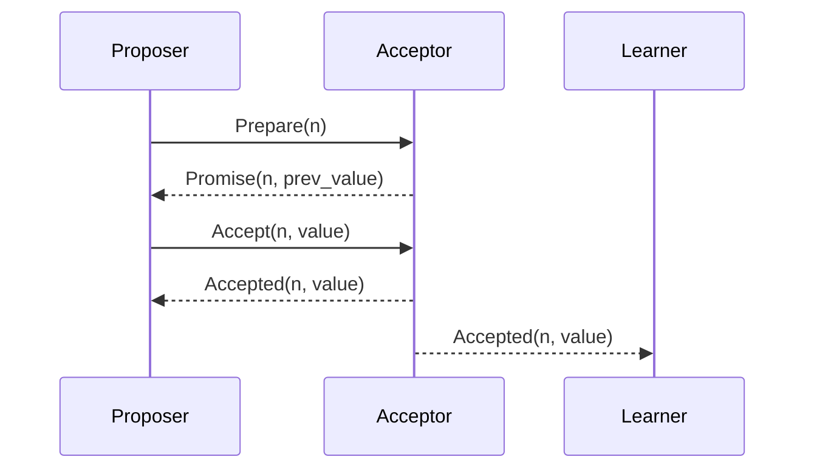
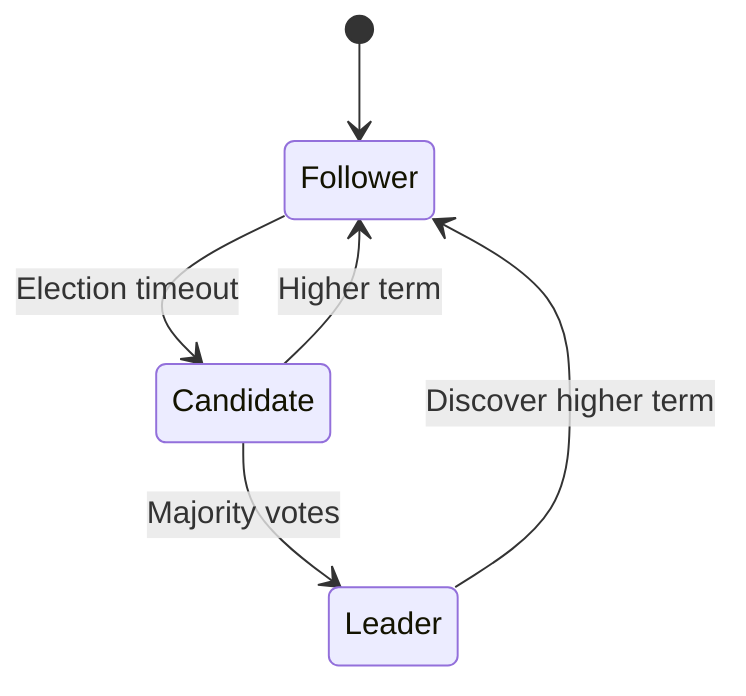

## Overview

Consensus algorithms enable multiple distributed processes to agree on a single value or state, even in the presence of failures. They are fundamental to fault-tolerant distributed systems, ensuring consistency across replicas. Key properties include termination (eventual decision), agreement (all correct processes decide the same value), and validity (decided value was proposed). Consensus is essential for applications like distributed databases, blockchain, and leader election.

## Detailed Explanation

### What is Consensus?

In distributed systems, consensus solves the problem of getting a group of processes to agree on a value despite failures. Processes communicate via messages, which may be delayed, lost, or reordered. Consensus must handle two main failure types:

- **Crash Failures**: Processes halt unexpectedly but do not behave maliciously.
- **Byzantine Failures**: Processes may send conflicting or incorrect messages, simulating arbitrary faults.

The FLP Impossibility Result proves that deterministic consensus is impossible in asynchronous systems with even one crash failure. Practical algorithms use randomization, synchrony assumptions, or failure bounds.

### Key Algorithms

#### Paxos

Developed by Leslie Lamport, Paxos is a family of protocols for achieving consensus. It uses a two-phase approach:

1. **Phase 1 (Prepare)**: A proposer selects a proposal number and sends prepare messages to acceptors. Acceptors promise not to accept lower-numbered proposals.
2. **Phase 2 (Accept)**: The proposer sends an accept message with the value. Acceptors accept if they haven't promised higher numbers.

Paxos tolerates up to f crash failures with 2f+1 processes. Multi-Paxos optimizes for multiple rounds by electing a leader.



#### Raft

Raft, designed by Diego Ongaro and John Ousterhout, simplifies Paxos for understandability. It uses leader election, log replication, and safety mechanisms.

- **Roles**: Leader, Follower, Candidate.
- **Leader Election**: Candidates request votes; majority elects a leader.
- **Log Replication**: Leader replicates log entries to followers.
- **Safety**: Ensures committed entries are durable and consistent.

Raft tolerates up to f failures with 2f+1 nodes.



#### Byzantine Fault Tolerance (BFT)

For Byzantine failures, algorithms like Practical Byzantine Fault Tolerance (PBFT) require 3f+1 processes to tolerate f faults. PBFT uses a primary-backup model with message authentication.

### Comparison Table

| Algorithm | Failure Type | Nodes Needed | Complexity | Use Cases |
|-----------|--------------|--------------|------------|-----------|
| Paxos    | Crash        | 2f+1        | High      | Databases (e.g., Chubby) |
| Raft     | Crash        | 2f+1        | Medium    | Kubernetes, etcd |
| PBFT     | Byzantine    | 3f+1        | High      | Blockchains, avionics |

## Real-world Examples & Use Cases

- **Distributed Databases**: ZooKeeper uses Paxos-like consensus for leader election and configuration.
- **Blockchain**: Bitcoin uses proof-of-work for consensus; Ethereum 2.0 uses PBFT variants.
- **Cloud Systems**: Google's Chubby and Spanner rely on Paxos for consistency.
- **Leader Election**: Raft in etcd for Kubernetes coordination.
- **Fault-Tolerant Systems**: Boeing 777 flight controls use BFT to handle Byzantine faults in avionics.

## Code Examples

### Basic Paxos Pseudocode (Python-like)

```python
class Paxos:
    def __init__(self, acceptors):
        self.acceptors = acceptors
        self.proposal_num = 0

    def propose(self, value):
        self.proposal_num += 1
        promises = []
        for acceptor in self.acceptors:
            promise = acceptor.prepare(self.proposal_num)
            if promise:
                promises.append(promise)
        
        if len(promises) > len(self.acceptors) // 2:
            accepted_value = value  # or max from promises
            accepts = 0
            for acceptor in self.acceptors:
                if acceptor.accept(self.proposal_num, accepted_value):
                    accepts += 1
            if accepts > len(self.acceptors) // 2:
                return accepted_value
        return None
```

### Raft Leader Election (Simplified Go-like)

```go
type Raft struct {
    state string // "follower", "candidate", "leader"
    term int
    votes int
}

func (r *Raft) startElection() {
    r.state = "candidate"
    r.term++
    r.votes = 1  // vote for self
    for _, peer := range r.peers {
        go r.requestVote(peer)
    }
}

func (r *Raft) requestVote(peer *Raft) {
    if peer.vote(r.term) {
        r.votes++
        if r.votes > len(r.peers)/2 {
            r.state = "leader"
        }
    }
}
```

## Journey / Sequence

1. **Initialization**: Nodes start in follower state (Raft) or idle (Paxos).
2. **Proposal**: A node proposes a value and initiates consensus.
3. **Voting/Preparation**: Nodes exchange messages to prepare or vote.
4. **Acceptance**: Majority agrees on the value.
5. **Commitment**: Value is committed and replicated.
6. **Recovery**: Handle failures via retries or leader changes.

## Common Pitfalls & Edge Cases

- **FLP Impossibility**: No deterministic algorithm guarantees consensus in async systems with failures.
- **Network Partitions**: Can cause splits; requires reconfiguration.
- **Leader Failures**: Raft handles via elections; Paxos via new rounds.
- **Byzantine Attacks**: Require authenticated messages; otherwise, arbitrary faults can disrupt.
- **Performance**: High message overhead in Paxos; Raft optimizes with leadership.

## Tools & Libraries

- **etcd**: Uses Raft for distributed key-value store.
- **ZooKeeper**: Paxos-based for coordination.
- **Consul**: Raft for service discovery.
- **Hyperledger Fabric**: PBFT for blockchain consensus.
- **Derecho**: C++ library for RDMA-optimized Paxos.

## References

- [Consensus (computer science) - Wikipedia](https://en.wikipedia.org/wiki/Consensus_(computer_science))
- [Paxos (computer science) - Wikipedia](https://en.wikipedia.org/wiki/Paxos_(computer_science))
- [Raft Consensus Algorithm](https://raft.github.io/)
- [Byzantine fault - Wikipedia](https://en.wikipedia.org/wiki/Byzantine_fault)
- Lamport, L. (1998). The Part-Time Parliament. ACM Transactions on Computer Systems, 16(2), 133–169. https://doi.org/10.1145/279227.279229
- Ongaro, D., & Ousterhout, J. (2014). In Search of an Understandable Consensus Algorithm. USENIX ATC. https://raft.github.io/raft.pdf

## Github-README Links & Related Topics

- [CAP Theorem](../cap-theorem-and-distributed-systems/)
- [Raft and Leader Election](../raft-and-leader-election/)
- [Distributed Databases](../database-indexing-strategies/)
- [Blockchain Basics](../blockchain-basics/)
- [Fault Tolerance in Distributed Systems](../fault-tolerance-in-distributed-systems/)