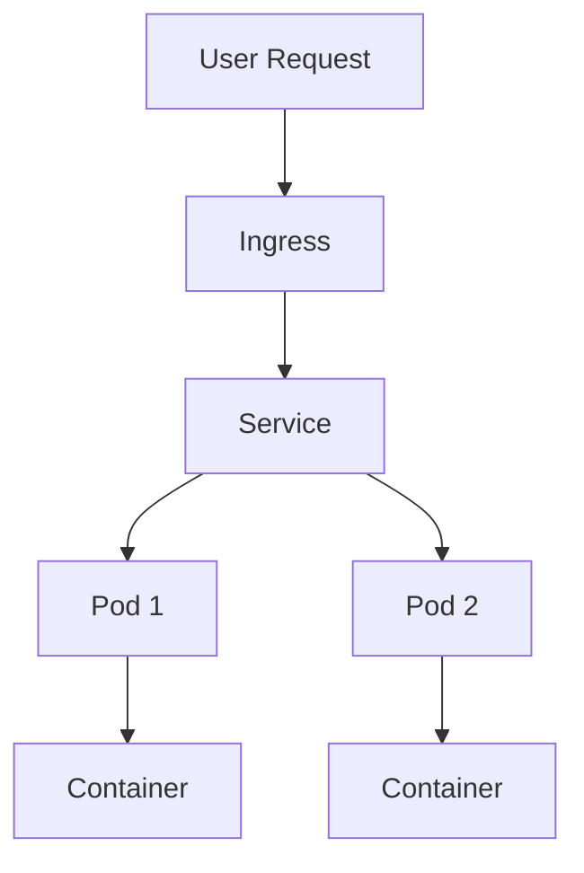

# Overview

## Overview

Container orchestration automates the deployment, scaling, and management of containerized applications. Kubernetes (K8s) is the leading platform for this, providing features like service discovery, load balancing, and self-healing.

## Detailed Explanation

### Core Components

- **Pods:** Smallest deployable units, containing one or more containers.
- **Services:** Abstractions for accessing pods, providing load balancing.
- **Deployments:** Manage replica sets and updates.
- **ConfigMaps and Secrets:** Manage configuration and sensitive data.
- **Namespaces:** Isolate resources within a cluster.

### Key Features

- **Auto-scaling:** Horizontal Pod Autoscaler adjusts pod count based on CPU/memory usage.
- **Rolling Updates:** Update applications without downtime.
- **Self-healing:** Restarts failed containers, replaces unhealthy pods.
- **Load Balancing:** Distributes traffic across pods.

### Architecture



## Real-world Examples & Use Cases

- **Microservices Deployment:** Netflix uses Kubernetes to manage thousands of microservices.
- **CI/CD Pipelines:** Automate testing and deployment with Kubernetes.
- **Scalable Web Apps:** Handle traffic spikes for e-commerce sites.

## Code Examples

### Deployment YAML

```yaml
apiVersion: apps/v1
kind: Deployment
metadata:
  name: my-app
spec:
  replicas: 3
  selector:
    matchLabels:
      app: my-app
  template:
    metadata:
      labels:
        app: my-app
    spec:
      containers:
      - name: my-app
        image: my-app:latest
        ports:
        - containerPort: 8080
```

### Service YAML

```yaml
apiVersion: v1
kind: Service
metadata:
  name: my-app-service
spec:
  selector:
    app: my-app
  ports:
    - protocol: TCP
      port: 80
      targetPort: 8080
  type: LoadBalancer
```

## References

- [Kubernetes Documentation](https://kubernetes.io/docs/)
- [Kubernetes Concepts](https://kubernetes.io/docs/concepts/)

## Github-README Links & Related Topics

- [Docker Containerization](./docker-containerization/)
- [Container Orchestration Patterns](./container-orchestration-patterns/)
- [Helm for Kubernetes](./helm-for-kubernetes/)