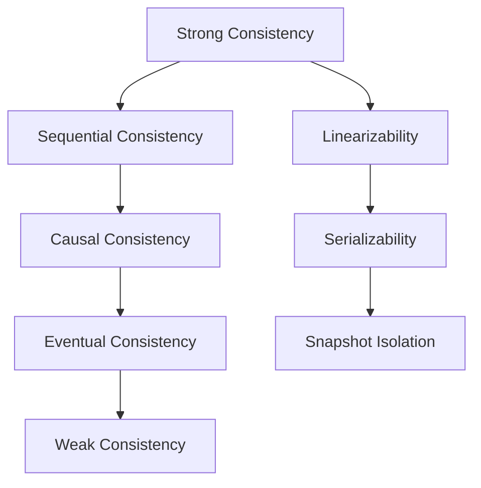

# Data Consistency Models

## Overview

Data consistency models define the rules governing how data updates propagate and are observed in distributed systems. They address the trade-offs between availability, performance, and correctness, especially under network partitions and concurrent operations. Stronger models ensure immediate visibility of updates but may sacrifice availability, while weaker models prioritize availability at the cost of temporary inconsistencies. Key models include linearizability (strong consistency), eventual consistency, and causal consistency, each suited to different application needs.

## Detailed Explanation

Consistency models specify constraints on the order and visibility of operations across replicas. They range from strict (linearizability) to relaxed (eventual consistency). Below is a hierarchy of common models, with explanations and a Mermaid diagram illustrating their relationships.

### Key Models

- **Linearizability (Strong Consistency)**: Operations appear to occur atomically at a single point in time between invocation and completion. Reads always return the most recent write. Equivalent to serializability with real-time bounds. Prohibits stale reads and ensures monotonicity.
  
- **Sequential Consistency**: Operations from each process occur in program order, but without real-time constraints. All processes see the same sequence of operations, though not necessarily in wall-clock time.

- **Causal Consistency**: Only causally related operations are ordered. Writes that depend on prior reads are seen in sequence, but concurrent writes may appear in different orders.

- **Eventual Consistency**: If no new updates occur, all replicas converge to the same value. Includes variants like read-your-writes (a process sees its own writes) and monotonic reads (no reverting to older values).

- **Weak Consistency**: No guarantees on update visibility; clients may see arbitrary stale data until synchronization.



| Model | Guarantees | Trade-offs | Use Cases |
|-------|------------|------------|-----------|
| Linearizability | Atomic, real-time order | Low availability, high latency | Financial transactions, locks |
| Sequential Consistency | Process order preserved | No real-time bounds | Shared memory systems |
| Causal Consistency | Causal dependencies ordered | Concurrent writes unordered | Collaborative apps (e.g., Google Docs) |
| Eventual Consistency | Convergence without updates | Temporary inconsistencies | Social media, DNS |
| Weak Consistency | Minimal guarantees | High performance | Caches, read-heavy systems |

## Real-world Examples & Use Cases

- **Amazon Dynamo**: Uses eventual consistency with tunable N, W, R parameters for high availability in e-commerce. Shopping carts merge during partitions.
- **DNS**: Eventual consistency; updates propagate via caching, ensuring global visibility over time.
- **RDBMS Replication**: Synchronous (strong) vs. asynchronous (eventual); e.g., PostgreSQL streaming replication.
- **Cassandra**: Configurable consistency levels (e.g., QUORUM for strong, ONE for eventual) for balancing performance and correctness.
- **Google Spanner**: Linearizable with atomic clocks for global transactions.

## Code Examples

### Linearizability Example (Java-like Pseudo-code)
```java
// Atomic register: all reads see latest write
class LinearizableRegister {
    private volatile int value;
    
    void write(int newValue) {
        // Atomic update
        value = newValue;
    }
    
    int read() {
        return value; // Always latest
    }
}
```

### Eventual Consistency Example (Python-like)
```python
// Eventual consistency: replicas converge
class EventualStore:
    def __init__(self):
        self.replicas = [{}, {}, {}]  # Three replicas
    
    def write(self, key, value):
        // Update one replica; others sync lazily
        self.replicas[0][key] = value
        // Background: propagate to others
    
    def read(self, key):
        // May return stale value from any replica
        return self.replicas[random.randint(0, 2)].get(key, None)
```

### Causal Consistency with Version Vectors
```python
// Simple causal store
class CausalStore:
    def __init__(self):
        self.data = {}
        self.version = {}  // Version vector
    
    def write(self, key, value, deps):
        // Check causal dependencies
        if all(self.version.get(k, 0) >= v for k, v in deps.items()):
            self.data[key] = value
            self.version[key] = self.version.get(key, 0) + 1
```

## Common Pitfalls & Edge Cases

- **Stale Reads**: In eventual consistency, clients may read outdated data; mitigate with versioning or client-side caching.
- **Write Conflicts**: Concurrent writes in weak models lead to divergence; use CRDTs or last-write-wins.
- **Partition Handling**: Strong models fail writes during partitions; eventual models allow progress but require reconciliation.
- **Monotonicity Violations**: Without guarantees, reads may oscillate; enforce session consistency.
- **Performance vs. Correctness**: Over-relying on strong consistency reduces scalability; profile for bottlenecks.

## Tools & Libraries

- **Databases**: Cassandra (eventual), DynamoDB (configurable), PostgreSQL (serializable), Spanner (linearizable).
- **Libraries**: Akka (causal consistency), Riak (eventual), ZooKeeper (linearizable for coordination).
- **Frameworks**: CRDT libraries (e.g., AntidoteDB) for conflict-free replicated data types.

## References

- Vogels, W. (2008). [Eventually Consistent - Revisited](https://www.allthingsdistributed.com/2008/12/eventually_consistent.html). All Things Distributed.
- Wikipedia. (2023). [Consistency Model](https://en.wikipedia.org/wiki/Consistency_model).
- Jepsen. (2023). [Consistency Models](https://jepsen.io/consistency/models).
- Aphyr, K. (2014). [Strong Consistency Models](https://aphyr.com/posts/313-strong-consistency-models).
- Bailis, P., et al. (2014). [Highly Available Transactions: Virtues and Limitations](https://www.vldb.org/pvldb/vol7/p181-bailis.pdf). VLDB.

## Github-README Links & Related Topics

- [CAP Theorem](../cap-theorem-and-distributed-systems/README.md)
- [Database Indexing Strategies](../database-indexing-strategies/README.md)
- [Replication vs Sharding](../replication-vs-sharding-vs-partitioning/README.md)
- [Distributed Systems Basics](../system-design-basics/README.md)