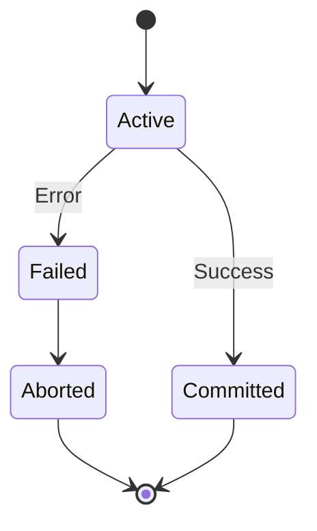

# Database ACID Properties

## Overview

ACID (Atomicity, Consistency, Isolation, Durability) are properties that guarantee reliable database transactions. They ensure data integrity and reliability in database systems.

## Detailed Explanation

### ACID Properties

- **Atomicity**: All operations in a transaction succeed or none do.
- **Consistency**: Transaction brings database from one valid state to another.
- **Isolation**: Concurrent transactions don't interfere with each other.
- **Durability**: Committed changes persist even after system failure.

### Transaction States



## Real-world Examples & Use Cases

- **Banking**: Transfer money between accounts atomically.
- **E-commerce**: Order processing with inventory updates.
- **Reservation Systems**: Book seats or rooms with conflict prevention.

## Code Examples

### SQL Transaction Example

```sql
BEGIN TRANSACTION;

UPDATE accounts SET balance = balance - 100 WHERE id = 1;
UPDATE accounts SET balance = balance + 100 WHERE id = 2;

COMMIT;
```

### Java with JDBC

```java
Connection conn = DriverManager.getConnection(url);
conn.setAutoCommit(false);

try {
    PreparedStatement stmt1 = conn.prepareStatement("UPDATE accounts SET balance = balance - ? WHERE id = ?");
    stmt1.setInt(1, 100);
    stmt1.setInt(2, 1);
    stmt1.executeUpdate();

    PreparedStatement stmt2 = conn.prepareStatement("UPDATE accounts SET balance = balance + ? WHERE id = ?");
    stmt2.setInt(1, 100);
    stmt2.setInt(2, 2);
    stmt2.executeUpdate();

    conn.commit();
} catch (SQLException e) {
    conn.rollback();
}
```

## Common Pitfalls & Edge Cases

- **Dirty Reads**: Reading uncommitted data.
- **Non-repeatable Reads**: Data changes between reads.
- **Phantom Reads**: New rows appear in result sets.

## References

- [ACID Properties on Wikipedia](https://en.wikipedia.org/wiki/ACID)
- [Database Transaction Fundamentals](https://www.postgresql.org/docs/current/tutorial-transactions.html)

## Github-README Links & Related Topics

- [Database Design Principles](../database-design-principles/README.md)
- [CAP Theorem & Distributed Systems](../cap-theorem-and-distributed-systems/README.md)