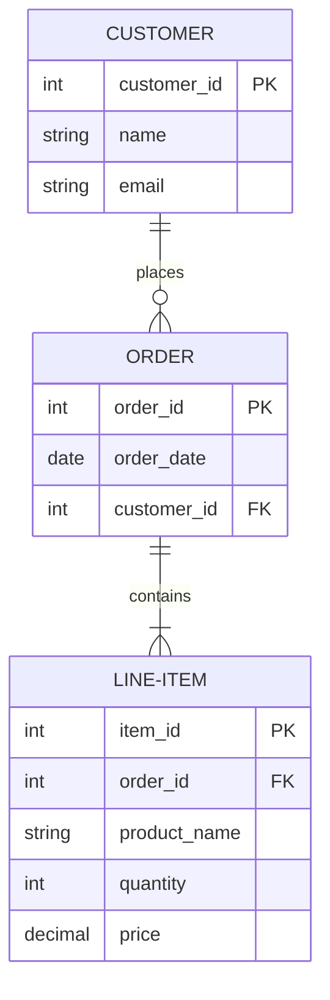

# Database Design Principles

## Overview

Database design principles encompass the fundamental guidelines and best practices for creating efficient, scalable, and maintainable database schemas. These principles guide the structuring of data to ensure data integrity, optimal performance, and ease of maintenance.

## Detailed Explanation

### Key Principles

1. **Normalization**: The process of organizing data to minimize redundancy and improve data integrity. Normal forms (1NF, 2NF, 3NF, BCNF) provide progressive levels of normalization.

2. **Denormalization**: Strategic introduction of redundancy to improve read performance, often used in data warehouses or high-read systems.

3. **Indexing Strategies**: Proper use of indexes to speed up data retrieval while balancing write performance.

4. **Data Integrity**: Ensuring data accuracy and consistency through constraints, triggers, and referential integrity.

5. **Scalability Considerations**: Designing for horizontal/vertical scaling, partitioning, and sharding.

6. **Security**: Implementing access controls, encryption, and audit trails.

### Normalization Forms

| Form | Description | Example |
|------|-------------|---------|
| 1NF | Eliminates repeating groups, ensures atomic values | Separate multi-value attributes |
| 2NF | Removes partial dependencies on the primary key | Move dependent attributes to separate table |
| 3NF | Eliminates transitive dependencies | Ensure non-key attributes depend only on key |
| BCNF | Stronger form of 3NF, removes all functional dependencies | Handle overlapping keys |

### Entity-Relationship Diagram Example



## Real-world Examples & Use Cases

### E-commerce Platform
```sql
-- Normalized design for products and categories
CREATE TABLE categories (
    category_id INT PRIMARY KEY,
    category_name VARCHAR(100) NOT NULL
);

CREATE TABLE products (
    product_id INT PRIMARY KEY,
    product_name VARCHAR(200) NOT NULL,
    category_id INT,
    price DECIMAL(10,2),
    FOREIGN KEY (category_id) REFERENCES categories(category_id)
);
```

### Social Media Application
- User profiles normalized to avoid data duplication
- Posts table with foreign keys to users
- Many-to-many relationships for followers/following

### Financial System
- Strict normalization for transaction integrity
- Audit trails for compliance
- Partitioning by date for performance

## Code Examples

### Creating a Normalized Schema
```sql
-- Example of 3NF design for a library system
CREATE TABLE authors (
    author_id INT PRIMARY KEY AUTO_INCREMENT,
    first_name VARCHAR(50),
    last_name VARCHAR(50),
    birth_date DATE
);

CREATE TABLE books (
    book_id INT PRIMARY KEY AUTO_INCREMENT,
    title VARCHAR(200),
    isbn VARCHAR(13) UNIQUE,
    publication_year YEAR,
    author_id INT,
    FOREIGN KEY (author_id) REFERENCES authors(author_id)
);

CREATE TABLE book_copies (
    copy_id INT PRIMARY KEY AUTO_INCREMENT,
    book_id INT,
    location VARCHAR(100),
    status ENUM('available', 'checked_out', 'lost'),
    FOREIGN KEY (book_id) REFERENCES books(book_id)
);
```

### Indexing Strategy
```sql
-- Adding indexes for performance
CREATE INDEX idx_books_author ON books(author_id);
CREATE INDEX idx_books_title ON books(title);
CREATE INDEX idx_book_copies_status ON book_copies(status);
```

### Denormalization Example
```sql
-- Denormalized view for reporting
CREATE VIEW book_report AS
SELECT 
    b.book_id,
    b.title,
    CONCAT(a.first_name, ' ', a.last_name) AS author_name,
    b.publication_year,
    COUNT(bc.copy_id) AS total_copies,
    SUM(CASE WHEN bc.status = 'available' THEN 1 ELSE 0 END) AS available_copies
FROM books b
JOIN authors a ON b.author_id = a.author_id
LEFT JOIN book_copies bc ON b.book_id = bc.book_id
GROUP BY b.book_id, b.title, author_name, b.publication_year;
```

## Common Pitfalls & Edge Cases

- Over-normalization leading to complex joins
- Under-normalization causing data anomalies
- Ignoring performance implications of normalization
- Not planning for future scalability
- Forgetting to handle NULL values properly

## Tools & Libraries

- **MySQL Workbench**: Visual database design tool
- **pgAdmin**: PostgreSQL administration and design tool
- **ERwin**: Enterprise data modeling software
- **Liquibase**: Database migration and refactoring tool

## References

- [Database Normalization - Wikipedia](https://en.wikipedia.org/wiki/Database_normalization)
- [SQL Indexing Best Practices](https://dev.mysql.com/doc/refman/8.0/en/mysql-indexes.html)
- [PostgreSQL Documentation - Database Design](https://www.postgresql.org/docs/current/ddl.html)

## Github-README Links & Related Topics

- [Database Indexing Strategies](../database-indexing-strategies/README.md)
- [Database Normalization](../database-normalization/README.md)
- [Database Sharding Strategies](../database-sharding-strategies/README.md)
- [ACID vs BASE Tradeoffs](../acid-vs-base-tradeoffs/README.md)