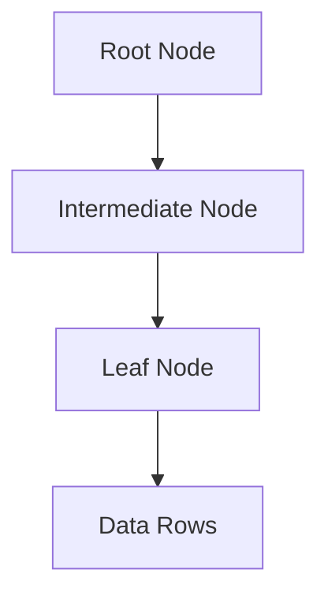

# Database Indexing Best Practices

## Overview

Database indexing is a technique to improve query performance by creating data structures that allow quick lookups. Proper indexing can reduce query time from O(n) to O(log n), but poor indexing can lead to wasted space and slow writes.

## Detailed Explanation

### Types of Indexes

- **B-Tree:** Default for most databases, good for range queries.
- **Hash:** Fast equality lookups, not for ranges.
- **Full-Text:** For text search.
- **Composite:** Multiple columns.

### When to Index

- Frequently queried columns
- Foreign keys
- Columns in WHERE, JOIN, ORDER BY

### Best Practices

- Index selective columns
- Avoid over-indexing
- Use composite indexes wisely
- Monitor and maintain indexes

## Real-world Examples & Use Cases

- E-commerce: Index product IDs and categories for fast searches.
- Social media: Index user IDs for timeline queries.

## Code Examples

### Creating an Index in SQL

```sql
CREATE INDEX idx_user_email ON users(email);
```

### Composite Index

```sql
CREATE INDEX idx_order_user_date ON orders(user_id, order_date);
```

## References

- [Database Indexing](https://www.postgresql.org/docs/current/indexes.html)

## Github-README Links & Related Topics

- [Database Design Principles](./database-design-principles/)
- [Database Performance Tuning](./database-performance-tuning/)

## Index Structure Diagram

