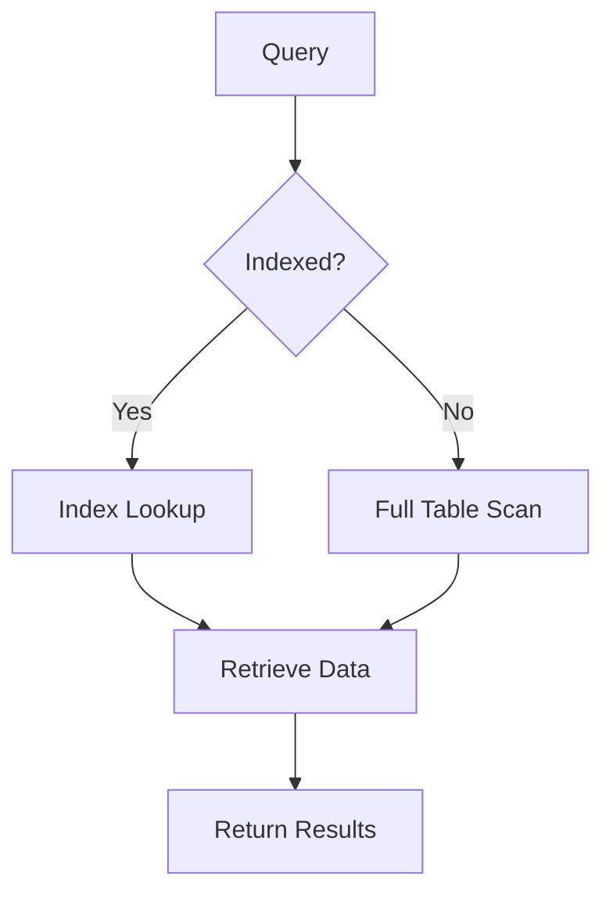

## Overview

Database indexing strategies involve creating data structures to optimize query performance by reducing the time to locate and retrieve data. Indexes act as pointers to data rows, enabling faster lookups, joins, and sorts. However, they introduce overhead in write operations and storage. Effective strategies balance read performance with write efficiency, considering factors like query patterns, data distribution, and database type (e.g., B-Tree for relational, LSM-Tree for NoSQL).

## Detailed Explanation

Indexes are auxiliary data structures that map keys to data locations. They speed up SELECT queries but slow INSERT/UPDATE/DELETE due to maintenance.

### Types of Indexes
- **B-Tree Indexes**: Balanced tree structures for range queries and equality searches. Used in PostgreSQL, MySQL.
- **Hash Indexes**: Fast equality lookups but no range support. Suitable for in-memory databases like Redis.
- **Bitmap Indexes**: Efficient for low-cardinality columns (e.g., gender: M/F). Compresses data for analytics.
- **Full-Text Indexes**: For text search, using inverted indexes (e.g., Elasticsearch).
- **Composite Indexes**: Multi-column indexes for queries filtering on multiple fields.
- **Partial Indexes**: Index only a subset of rows (e.g., WHERE active = true).
- **Functional Indexes**: Index expressions (e.g., LOWER(name)).

### Indexing Strategies
| Strategy | Description | Pros | Cons | Use Case |
|----------|-------------|------|------|----------|
| Single-Column | Index one column | Simple, fast lookups | Limited for multi-column queries | Primary keys |
| Composite | Multiple columns | Covers complex queries | Order matters (leftmost prefix) | WHERE clauses with AND |
| Covering | Includes all query columns | Avoids table access | Larger index size | SELECT * optimizations |
| Clustered | Data sorted by index | Fast range scans | One per table | Primary key in InnoDB |
| Non-Clustered | Separate from data | Multiple allowed | Extra lookups | Secondary indexes |

### Trade-offs
- **Read vs. Write**: Indexes boost reads but penalize writes (e.g., 2-3x slower inserts).
- **Storage**: Indexes consume 10-50% extra space.
- **Maintenance**: Rebuild after bulk loads; monitor fragmentation.



## Real-world Examples & Use Cases

- **E-commerce**: Composite index on (product_category, price) for filtered searches. Covering indexes for product listings to avoid joins.
- **Social Media**: Hash indexes on user IDs for fast profile lookups. Full-text indexes on posts for search.
- **Analytics**: Bitmap indexes on categorical data (e.g., region, age group) for OLAP queries.
- **Time-Series**: Partial indexes on recent data (e.g., WHERE timestamp > '2023-01-01') to optimize hot data queries.
- **Geospatial**: Specialized indexes (e.g., R-Tree) for location-based queries in apps like Uber.

## Code Examples

### Creating Indexes in SQL (PostgreSQL)
```sql
-- Single-column index
CREATE INDEX idx_users_email ON users (email);

-- Composite index
CREATE INDEX idx_orders_user_date ON orders (user_id, order_date);

-- Covering index
CREATE INDEX idx_covering ON orders (user_id, total) INCLUDE (status);

-- Partial index
CREATE INDEX idx_active_users ON users (name) WHERE active = true;

-- Functional index
CREATE INDEX idx_lower_email ON users (LOWER(email));

-- Index Usage Analysis
EXPLAIN SELECT * FROM users WHERE email = 'user@example.com';
```

### NoSQL Example (MongoDB)
```javascript
// Create index
db.users.createIndex({ email: 1 });

// Compound index
db.products.createIndex({ category: 1, price: -1 });

// Text index
db.posts.createIndex({ content: "text" });

// Geospatial index
db.places.createIndex({ location: "2dsphere" });
```

## References

- [Database Index - Wikipedia](https://en.wikipedia.org/wiki/Database_index)
- [PostgreSQL Indexes](https://www.postgresql.org/docs/current/indexes.html)
- [MySQL Indexing Best Practices](https://dev.mysql.com/doc/refman/8.0/en/optimization-indexes.html)
- [MongoDB Indexing](https://docs.mongodb.com/manual/indexes/)
- [Use The Index, Luke!](https://use-the-index-luke.com/) - Markus Winand

## Github-README Links & Related Topics

- [Collections and Data Structures](../collections-and-data-structures/README.md)
- [Database Indexing Strategies](../database-indexing-strategies/README.md)  # Self-reference for completeness
- [Replication vs Sharding vs Partitioning](../replication-vs-sharding-vs-partitioning/README.md)
- [Latency and Throughput](../latency-and-throughput/README.md)
- [Profiling Tools](../profiling-tools/README.md)

## STAR Summary

**Situation**: A reporting dashboard suffered slow queries on a 1M-row table, causing timeouts.

**Task**: Optimize query performance without rewriting the application.

**Action**: Analyzed query patterns, added composite indexes on frequent WHERE clauses, and monitored with EXPLAIN.

**Result**: Query time reduced from 10s to 0.1s, improving user experience and reducing server load.

## Journey / Sequence

1. **Analyze Queries**: Use EXPLAIN to identify slow scans.
2. **Choose Index Type**: Match to query (e.g., B-Tree for ranges).
3. **Create and Test**: Add index, benchmark performance.
4. **Monitor Maintenance**: Check for fragmentation; rebuild if needed.
5. **Iterate**: Adjust based on new queries or data growth.

## Data Models / Message Formats

- **Index Metadata**: JSON-like structure: `{"name": "idx_users_email", "columns": ["email"], "type": "btree"}`.
- **Query Plans**: EXPLAIN output: `Index Scan using idx_users_email on users (cost=0.42..8.44 rows=1 width=32)`.

## Common Pitfalls & Edge Cases

- **Over-Indexing**: Too many indexes slow writes; limit to 5-10 per table.
- **Index Fragmentation**: Rebuild after bulk inserts (e.g., PostgreSQL REINDEX).
- **Composite Index Order**: Leftmost columns should be most selective.
- **Selectivity**: Low-selectivity columns (e.g., boolean flags) may not benefit.
- **Write-Heavy Workloads**: Indexes slow INSERTs; consider deferred indexing.

## Tools & Libraries

- **Database Tools**: pgAdmin (PostgreSQL), MySQL Workbench.
- **Monitoring**: Percona Toolkit, SolarWinds Database Performance Analyzer.
- **Libraries**: JDBC/ODBC drivers, Hibernate (Java ORM with index hints).