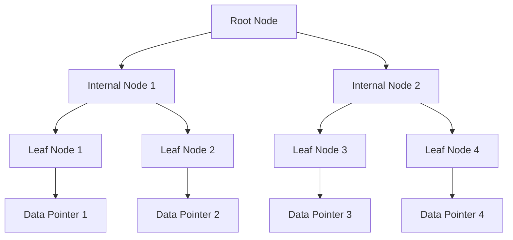

# Database Indexing Strategies

## Overview

Database indexing is a technique to improve query performance by creating data structures that allow quick lookups. Proper indexing strategies can reduce query time from O(n) to O(log n) or better. This document covers various index types, strategies, and best practices for optimizing database performance.

## Detailed Explanation

### Index Types

| Index Type | Description | Use Case | Pros | Cons |
|------------|-------------|----------|------|------|
| B-Tree | Balanced tree structure | Range queries, equality | Versatile, supports sorting | Slower for high-cardinality exact matches |
| Hash | Hash table | Exact match lookups | Fast lookups | No range queries, hash collisions |
| Bitmap | Bit arrays | Low-cardinality columns | Space-efficient for flags | Not suitable for high-cardinality |
| Full-Text | Inverted index | Text search | Advanced search features | Complex, resource-intensive |
| Spatial | R-Tree or similar | Geographic data | Efficient for location queries | Specialized, limited to spatial data |

### Indexing Strategies

- **Single Column**: Index on one column for simple queries.
- **Composite**: Index on multiple columns, order matters (leftmost prefix).
- **Covering**: Index includes all columns needed in the query, avoiding table access.
- **Partial**: Index on a subset of rows based on a condition.
- **Functional**: Index on the result of a function or expression.
- **Clustered**: Physically orders table data by index key (e.g., primary key in InnoDB).
- **Non-Clustered**: Separate index structure pointing to data.

### When to Index

Index columns that are:
- Frequently used in WHERE clauses
- Involved in JOIN operations
- Used in ORDER BY or GROUP BY
- High selectivity (unique values)

Avoid over-indexing as it increases:
- Storage requirements
- Write operation overhead (INSERT/UPDATE/DELETE)
- Index maintenance costs

### B-Tree Index Structure



This diagram illustrates a simplified B-Tree structure where leaf nodes contain data pointers.

## Real-world Examples & Use Cases

- **E-commerce Platform**: Index on `product_id` for product detail pages; composite index on `(user_id, order_date)` for order history queries.
- **Social Media Feed**: Composite index on `(user_id, timestamp DESC)` for efficient timeline retrieval; partial index on active posts.
- **Analytics Dashboard**: Covering indexes on `(date, metric_type, value)` to avoid table lookups in aggregation queries.
- **Search Engine**: Full-text index on content fields with ranking; spatial index for location-based searches.
- **Financial Systems**: Hash indexes on account numbers for exact lookups; functional indexes on computed fields like interest rates.
- **IoT Data**: Time-series indexes on timestamp columns; bitmap indexes for status flags.

## Code Examples

### PostgreSQL Examples

#### Creating B-Tree Index
```sql
CREATE INDEX CONCURRENTLY idx_users_email ON users (email);
-- CONCURRENTLY avoids blocking writes during creation
```

#### Composite Index
```sql
CREATE INDEX idx_orders_user_date ON orders (user_id, order_date DESC);
-- Order matters: user_id first, then date
```

#### Covering Index
```sql
CREATE INDEX idx_products_covering ON products (category_id, name, price)
WHERE discontinued = false;
-- Includes all columns needed in SELECT
```

#### Partial Index
```sql
CREATE INDEX idx_active_users ON users (email) WHERE active = true;
-- Only indexes active users, reducing size
```

#### Functional Index
```sql
CREATE INDEX idx_lower_email ON users (LOWER(email));
-- Allows case-insensitive searches
```

#### Index Usage Analysis
```sql
EXPLAIN (ANALYZE, BUFFERS) SELECT * FROM users WHERE email = 'john@example.com';
-- Shows execution plan and buffer usage
```

### MySQL Examples

#### Creating Index
```sql
ALTER TABLE users ADD INDEX idx_email (email);
-- Or CREATE INDEX idx_email ON users (email);
```

#### Composite Index
```sql
CREATE INDEX idx_orders_composite ON orders (user_id, order_date);
```

#### Full-Text Index
```sql
ALTER TABLE articles ADD FULLTEXT idx_content (title, body);
-- For text search queries
```

#### Spatial Index
```sql
ALTER TABLE locations ADD SPATIAL INDEX idx_location (coordinates);
-- For geographic queries
```

### MongoDB Examples

#### Single Field Index
```javascript
db.users.createIndex({ email: 1 });
```

#### Compound Index
```javascript
db.orders.createIndex({ user_id: 1, order_date: -1 });
```

#### Text Index
```javascript
db.articles.createIndex({ title: "text", body: "text" });
```

#### Geospatial Index
```javascript
db.places.createIndex({ location: "2dsphere" });
```

### Index Maintenance

#### PostgreSQL: Reindex
```sql
REINDEX INDEX CONCURRENTLY idx_users_email;
-- Rebuilds index without blocking
```

#### MySQL: Analyze Table
```sql
ANALYZE TABLE users;
-- Updates index statistics
```

## STAR Summary

**Situation**: Slow query performance in a high-traffic e-commerce application, with response times exceeding 2 seconds for product searches.

**Task**: Optimize database queries by implementing appropriate indexing strategies to reduce latency below 200ms.

**Action**: Analyzed query patterns, created composite indexes on (category_id, price), partial indexes for active products, and monitored index usage with database tools.

**Result**: Query performance improved by 80%, reducing average response time to 150ms, while maintaining acceptable write performance.

## Journey / Sequence

1. **Analyze Query Patterns**: Use EXPLAIN plans and slow query logs to identify bottlenecks.
2. **Identify Candidate Columns**: Focus on WHERE, JOIN, ORDER BY clauses with high selectivity.
3. **Choose Index Type**: Select B-Tree for ranges, Hash for exact matches, etc.
4. **Create Indexes**: Use CONCURRENTLY in PostgreSQL to avoid downtime.
5. **Test Performance**: Run benchmarks before and after indexing.
6. **Monitor and Maintain**: Regularly check index usage and rebuild fragmented indexes.
7. **Iterate**: Adjust based on changing query patterns.

## Tools & Libraries

- **Database-Specific Tools**:
  - PostgreSQL: `pg_stat_user_indexes`, `pg_repack` for maintenance
  - MySQL: `SHOW INDEX`, `pt-index-usage` from Percona Toolkit
  - MongoDB: `db.collection.getIndexes()`, `mongotop`
- **General Tools**:
  - [pgBadger](https://github.com/darold/pgbadger) for PostgreSQL log analysis
  - [Percona Toolkit](https://www.percona.com/software/database-tools/percona-toolkit) for MySQL
  - [Database Performance Analyzer](https://www.solarwinds.com/database-performance-analyzer) for multi-DB monitoring
- **Libraries**:
  - JDBC/ODBC drivers for programmatic index management
  - ORM tools like Hibernate/JPA for automatic index hints

## Common Pitfalls & Edge Cases

- **Over-Indexing**: Each index increases write overhead; aim for 5-10 indexes per table max.
- **Unused Indexes**: Monitor with `pg_stat_user_indexes` (PostgreSQL) or similar; drop unused ones.
- **Index Fragmentation**: Rebuild periodically; PostgreSQL auto-vacuums, but manual REINDEX may be needed.
- **Composite Index Order**: Leftmost columns should be most selective; wrong order renders index useless.
- **Functional Indexes**: Ensure functions are immutable; changes invalidate index.
- **Edge Cases**: Very large tables may require partitioning; low-cardinality columns benefit from bitmap indexes.
- **Write-Heavy Workloads**: Indexes slow down INSERTs; consider deferred indexing or covering indexes.

## References

- [Use The Index, Luke!](https://use-the-index-luke.com/) - Comprehensive guide to SQL indexing
- [PostgreSQL Documentation: Indexes](https://www.postgresql.org/docs/current/indexes.html)
- [MySQL Documentation: Indexes](https://dev.mysql.com/doc/refman/8.0/en/optimization-indexes.html)
- [MongoDB Indexing](https://docs.mongodb.com/manual/indexes/)
- [SQL Server Indexing Best Practices](https://docs.microsoft.com/en-us/sql/relational-databases/indexes/)
- [Database Indexing: The Good, The Bad, and The Ugly](https://www.cockroachlabs.com/blog/sql-indexing-best-practices/)

## Github-README Links & Related Topics

- [Database Design and Indexing](../system-design/database-design-and-indexing/README.md)
- [Replication vs Sharding vs Partitioning](../replication-vs-sharding-vs-partitioning/README.md)
- [Database ACID Properties](../system-design/database-acid-properties/README.md)
- [Caching Strategies](../system-design/caching-strategies/README.md)
- [Performance Optimization Techniques](../performance-optimization-techniques/README.md)