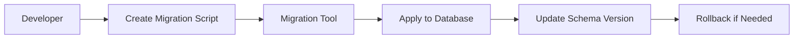

## Overview

Database migration tools automate the process of applying schema changes, data transformations, and version control to databases. They ensure consistent database evolution across development, staging, and production environments, reducing manual errors and downtime.

## Detailed Explanation

### What are Database Migrations?
Migrations are scripts that modify database schema or data in a controlled, reversible manner. Tools track migration history to apply or rollback changes.

### Key Features
- **Version Control**: Track schema versions.
- **Rollback Support**: Revert changes if needed.
- **Multi-Environment**: Apply migrations across dev, test, prod.
- **Dependency Management**: Handle migration order.

### Popular Tools
- **Flyway**: Java-based, supports SQL and Java migrations.
- **Liquibase**: XML/YAML/JSON formats, database-agnostic.
- **Alembic**: For Python/SQLAlchemy.
- **Django Migrations**: Built-in for Django ORM.



## Real-world Examples & Use Cases

- **E-commerce Upgrade**: Migrate user table to add payment info fields using Flyway.
- **Microservices Refactor**: Use Liquibase to split monolithic database into service-specific schemas.
- **Versioned APIs**: Alembic for PostgreSQL schema changes in a Flask app.

## Code Examples

### Flyway SQL Migration
```sql
-- V1__Create_user_table.sql
CREATE TABLE user (
    id INT PRIMARY KEY,
    name VARCHAR(100)
);
```

### Liquibase XML
```xml
<databaseChangeLog>
    <changeSet id="1" author="dev">
        <createTable tableName="user">
            <column name="id" type="int" autoIncrement="true">
                <constraints primaryKey="true"/>
            </column>
            <column name="name" type="varchar(100)"/>
        </createTable>
    </changeSet>
</databaseChangeLog>
```

### Alembic Python
```python
from alembic import op
import sqlalchemy as sa

def upgrade():
    op.create_table('user',
        sa.Column('id', sa.Integer, primary_key=True),
        sa.Column('name', sa.String(100))
    )

def downgrade():
    op.drop_table('user')
```

## Common Pitfalls & Edge Cases

- **Data Loss**: Always backup before migrations.
- **Concurrent Migrations**: Use locks to prevent conflicts.
- **Large Datasets**: Handle long-running migrations with downtime planning.

## Tools & Libraries

- Flyway, Liquibase, Alembic, Django Migrations, Rails Active Record Migrations.

## References

- [Flyway Documentation](https://flywaydb.org/documentation/)
- [Liquibase Guide](https://www.liquibase.org/documentation/)
- [Alembic Tutorial](https://alembic.sqlalchemy.org/en/latest/tutorial.html)

## Github-README Links & Related Topics

- [database-migration-strategies](../database-migration-strategies/README.md)
- [devops-infrastructure-as-code](../devops-infrastructure-as-code/README.md)
- [ci-cd-pipelines](../ci-cd-pipelines/README.md)