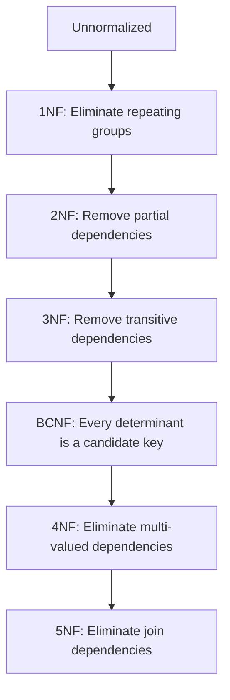

# Database Normalization

## Overview

Database normalization is a systematic approach to organizing relational database schemas to reduce data redundancy, improve data integrity, and eliminate anomalies such as insertion, update, and deletion issues. It involves decomposing tables into smaller, related tables and defining relationships between them using foreign keys. The process is guided by normal forms (1NF to 5NF), each building on the previous to achieve higher levels of normalization. Normalization is crucial for maintaining efficient, scalable databases but must be balanced against query performance, as over-normalization can lead to complex joins.

## Detailed Explanation

Normalization transforms a database from an unnormalized form into a series of normal forms, each with stricter rules. The goal is to minimize redundancy while preserving data dependencies.

### Normal Forms Hierarchy



### First Normal Form (1NF)
- **Rule**: Eliminate repeating groups; ensure atomic values in each column.
- **Example**: A table with multiple phone numbers in one cell violates 1NF. Split into separate rows or a related table.

### Second Normal Form (2NF)
- **Rule**: Remove partial dependencies; non-key attributes must depend on the entire primary key.
- **Example**: In a composite key table, attributes depending only on part of the key are moved to a new table.

### Third Normal Form (3NF)
- **Rule**: Remove transitive dependencies; non-key attributes must not depend on other non-key attributes.
- **Example**: If A → B and B → C, then C depends transitively on A; move C to a new table.

### Boyce-Codd Normal Form (BCNF)
- **Rule**: Every determinant must be a candidate key.
- **Example**: Handles cases where 3NF is insufficient, like in tables with multiple overlapping candidate keys.

### Fourth and Fifth Normal Forms (4NF, 5NF)
- **4NF**: Eliminate multi-valued dependencies.
- **5NF**: Ensure lossless joins without redundancy.

### Denormalization Trade-offs
While normalization reduces redundancy, denormalization (e.g., adding redundant columns) can improve read performance at the cost of update complexity. Use denormalization judiciously for OLAP systems.

## Real-world Examples & Use Cases

- **E-commerce Database**: Normalize customer orders to separate tables for customers, orders, and products, preventing anomalies when updating product prices.
- **Library System**: Books table normalized to avoid repeating author details; use foreign keys for authors and genres.
- **HR System**: Employee data split into personal info, departments, and salaries to handle promotions without redundancy.
- **Banking**: Account transactions normalized to ensure consistency across branches.

In practice, most databases aim for 3NF or BCNF, as higher forms are rare and may complicate queries.

## Code Examples

### Unnormalized to 1NF Example (SQL)

```sql
-- Unnormalized table
CREATE TABLE Students (
    StudentID INT PRIMARY KEY,
    Name VARCHAR(100),
    Courses VARCHAR(500)  -- Comma-separated, violates 1NF
);

-- 1NF: Atomic values
CREATE TABLE Students (
    StudentID INT PRIMARY KEY,
    Name VARCHAR(100)
);

CREATE TABLE Enrollments (
    StudentID INT,
    Course VARCHAR(100),
    FOREIGN KEY (StudentID) REFERENCES Students(StudentID)
);
```

### 1NF to 2NF Example

```sql
-- 1NF table with partial dependency
CREATE TABLE Orders (
    OrderID INT,
    ProductID INT,
    ProductName VARCHAR(100),  -- Depends only on ProductID
    Quantity INT,
    PRIMARY KEY (OrderID, ProductID)
);

-- 2NF: Move ProductName to Products table
CREATE TABLE Orders (
    OrderID INT,
    ProductID INT,
    Quantity INT,
    PRIMARY KEY (OrderID, ProductID),
    FOREIGN KEY (ProductID) REFERENCES Products(ProductID)
);

CREATE TABLE Products (
    ProductID INT PRIMARY KEY,
    ProductName VARCHAR(100)
);
```

### 2NF to 3NF Example

```sql
-- 2NF table with transitive dependency
CREATE TABLE Employees (
    EmpID INT PRIMARY KEY,
    DeptID INT,
    DeptName VARCHAR(100),  -- DeptName depends on DeptID, not EmpID
    Salary DECIMAL(10,2)
);

-- 3NF: Move DeptName to Departments
CREATE TABLE Employees (
    EmpID INT PRIMARY KEY,
    DeptID INT,
    Salary DECIMAL(10,2),
    FOREIGN KEY (DeptID) REFERENCES Departments(DeptID)
);

CREATE TABLE Departments (
    DeptID INT PRIMARY KEY,
    DeptName VARCHAR(100)
);
```

### Checking Normal Forms (Python Script)

```python
# Simplified dependency checker (conceptual)
def check_3nf(table_schema):
    # Assume schema has keys and dependencies
    for attr in non_key_attrs:
        if any(dep in non_key_attrs for dep in dependencies[attr]):
            return False  # Transitive dependency
    return True

# Example usage
schema = {
    'keys': ['EmpID'],
    'attrs': ['DeptID', 'DeptName', 'Salary'],
    'deps': {'DeptName': ['DeptID']}  # DeptName -> DeptID
}
print(check_3nf(schema))  # False if transitive
```

## Common Pitfalls & Edge Cases

- **Over-normalization**: Leads to excessive joins, slowing queries; monitor performance.
- **Under-normalization**: Causes update anomalies; e.g., changing a customer's address in multiple places.
- **Composite Keys**: Ensure all parts are necessary; avoid unnecessary complexity.
- **Null Values**: Handle carefully, as they can violate dependencies.
- **Large Databases**: Normalization may not scale; consider NoSQL for unstructured data.
- **Edge Case: Self-Referencing Tables**: E.g., employee-manager; normalize but watch for cycles.

## Tools & Libraries

- **SQL Databases**: PostgreSQL, MySQL with normalization tools.
- **ORMs**: Hibernate (Java), SQLAlchemy (Python) for schema design.
- **Design Tools**: ERwin, Lucidchart for visualizing normal forms.
- **Analysis**: dbdiagram.io for schema planning.

## References

- [Database Normalization - Wikipedia](https://en.wikipedia.org/wiki/Database_normalization)
- [A Simple Guide to Five Normal Forms in Relational Database Theory - Chris Date](https://www.oreilly.com/library/view/database-design-for/9780123747303/)
- [Normalization in DBMS - GeeksforGeeks](https://www.geeksforgeeks.org/normal-forms-in-dbms/)
- [Boyce-Codd Normal Form - Britannica](https://www.britannica.com/technology/Boyce-Codd-normal-form)

## Github-README Links & Related Topics

- [Database Indexing Strategies](../database-indexing-strategies/)
- [Database Sharding Strategies](../database-sharding-strategies/)
- [SQL Fundamentals](../sql-fundamentals/)
- [Relational Databases](../relational-databases/)