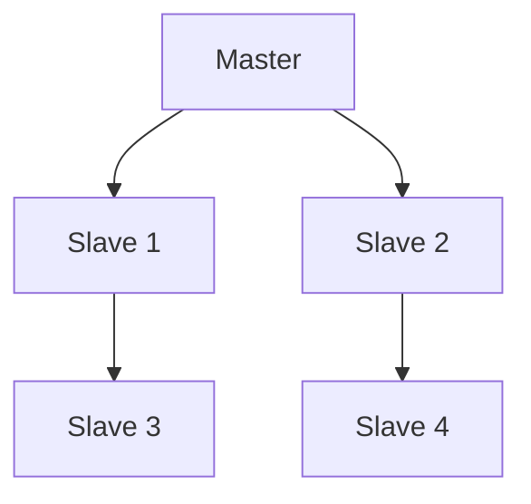

# Database Replication Strategies

## Overview

Database replication involves creating and maintaining multiple copies of data across different database servers. This ensures high availability, fault tolerance, and improved read performance. Various strategies exist, each with trade-offs in consistency, latency, and complexity.

## Detailed Explanation

### Master-Slave Replication

One master handles writes, multiple slaves handle reads. Changes are replicated asynchronously from master to slaves.

Pros: Simple, good for read-heavy workloads

Cons: Single point of failure for writes, eventual consistency

### Master-Master Replication

Multiple masters can handle both reads and writes. Changes are replicated bidirectionally.

Pros: High availability, load distribution

Cons: Conflict resolution complexity, potential data inconsistencies

### Multi-Master Replication

Extension of master-master with more than two masters.

### Synchronous vs Asynchronous Replication

- Synchronous: Transactions commit only after all replicas acknowledge
- Asynchronous: Transactions commit immediately, replication happens later

### Replication Topologies

- Star: One central master, multiple slaves
- Chain: Slaves replicate from other slaves
- Tree: Hierarchical structure



## Real-world Examples & Use Cases

- E-commerce: Master-slave for product catalog reads
- Financial systems: Synchronous replication for consistency
- Global applications: Multi-master for geo-distribution

## Code Examples

### MySQL Master-Slave Setup

Master my.cnf:
```
server-id = 1
log-bin = mysql-bin
```

Slave my.cnf:
```
server-id = 2
relay-log = mysql-relay-bin
```

Setup replication:
```sql
CHANGE MASTER TO MASTER_HOST='master_host', MASTER_USER='repl', MASTER_PASSWORD='password';
START SLAVE;
```

### PostgreSQL Streaming Replication

Primary postgresql.conf:
```
wal_level = replica
max_wal_senders = 3
```

Standby recovery.conf:
```
primary_conninfo = 'host=primary_host user=repl password=password'
standby_mode = 'on'
```

## Common Pitfalls & Edge Cases

- Replication lag causing stale reads
- Network partitions leading to split-brain
- Schema changes requiring careful coordination
- Monitoring replication status

## References

- [MySQL Replication](https://dev.mysql.com/doc/refman/8.0/en/replication.html)
- [PostgreSQL Replication](https://www.postgresql.org/docs/current/warm-standby.html)
- [Database Replication Patterns](https://martinfowler.com/articles/patterns-of-distributed-systems/replication.html)

## Github-README Links & Related Topics

- [database-sharding-strategies](../database-sharding-strategies/README.md)
- [data-consistency-models](../data-consistency-models/README.md)
- [cap-theorem-and-distributed-systems](../cap-theorem-and-distributed-systems/README.md)