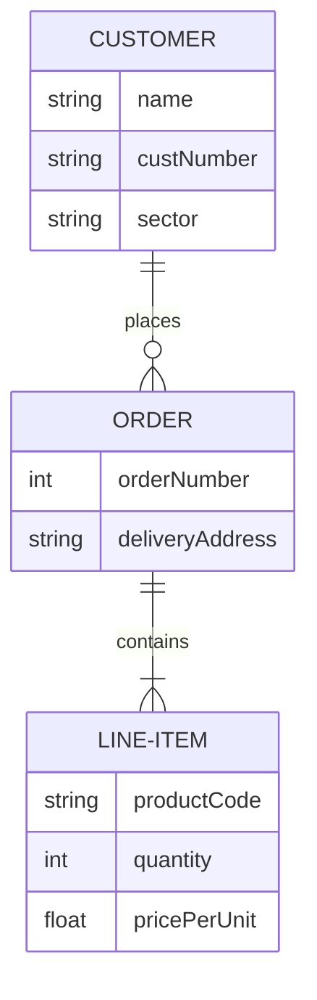

# Overview

Database design principles encompass the fundamental guidelines and best practices for structuring relational databases to ensure efficiency, integrity, and scalability. These principles guide the creation of schemas that minimize redundancy, enforce data integrity, and optimize query performance.

# Detailed Explanation

## Key Principles

### 1. Normalization
Normalization is the process of organizing data to reduce redundancy and improve data integrity. It involves dividing large tables into smaller, related tables.

| Normal Form | Description | Example |
|-------------|-------------|---------|
| 1NF | Eliminate repeating groups | Ensure atomic values |
| 2NF | Remove partial dependencies | Non-key attributes depend on full key |
| 3NF | Remove transitive dependencies | Non-key attributes depend only on key |
| BCNF | Boyce-Codd Normal Form | Every determinant is a candidate key |

### 2. Entity-Relationship Modeling
ER diagrams represent entities, attributes, and relationships.



### 3. Constraints
- Primary Keys: Unique identifiers
- Foreign Keys: Maintain referential integrity
- Check Constraints: Validate data values
- Unique Constraints: Ensure uniqueness

### 4. Indexing Strategies
Indexes improve query performance but add overhead for writes.

### 5. Denormalization
Sometimes applied for read-heavy systems to improve performance at the cost of redundancy.

## Design Process
1. Requirements Analysis
2. Conceptual Design (ER Model)
3. Logical Design (Relational Schema)
4. Physical Design (Implementation)

# Real-world Examples & Use Cases

## E-commerce Platform
- **Entities**: Users, Products, Orders, Payments
- **Relationships**: One-to-many (User-Orders), Many-to-many (Products-Orders via OrderItems)
- **Use Case**: Ensuring inventory accuracy and order history integrity

## Social Media Application
- **Entities**: Users, Posts, Comments, Likes
- **Relationships**: Self-referencing (User follows User), Polymorphic (Likes on Posts/Comments)
- **Use Case**: Handling large-scale data with efficient querying for feeds

## Banking System
- **Entities**: Accounts, Transactions, Customers
- **Constraints**: Strict referential integrity for financial data
- **Use Case**: ACID compliance and audit trails

# Code Examples

## Creating Normalized Tables (SQL)

```sql
-- 1NF: Atomic values
CREATE TABLE Customer (
    customer_id INT PRIMARY KEY,
    first_name VARCHAR(50),
    last_name VARCHAR(50),
    email VARCHAR(100)
);

-- 2NF: Remove partial dependencies
CREATE TABLE Order (
    order_id INT PRIMARY KEY,
    customer_id INT,
    order_date DATE,
    FOREIGN KEY (customer_id) REFERENCES Customer(customer_id)
);

-- 3NF: Remove transitive dependencies
CREATE TABLE Product (
    product_id INT PRIMARY KEY,
    product_name VARCHAR(100),
    category_id INT,
    category_name VARCHAR(50),  -- This would be moved to separate table in 3NF
    price DECIMAL(10,2)
);

-- Proper 3NF
CREATE TABLE Category (
    category_id INT PRIMARY KEY,
    category_name VARCHAR(50)
);

ALTER TABLE Product ADD FOREIGN KEY (category_id) REFERENCES Category(category_id);
```

## Query Optimization with Indexes

```sql
-- Create index for faster lookups
CREATE INDEX idx_customer_email ON Customer(email);

-- Query benefiting from index
SELECT * FROM Customer WHERE email = 'user@example.com';
```

# References

- [Database Design Principles - Oracle Documentation](https://docs.oracle.com/en/database/)
- [Normalization in DBMS - GeeksforGeeks](https://www.geeksforgeeks.org/normalization-in-dbms/)
- [Entity-Relationship Model - Wikipedia](https://en.wikipedia.org/wiki/Entity%E2%80%93relationship_model)
- "Database System Concepts" by Silberschatz, Korth, Sudarshan

# Github-README Links & Related Topics

- [Database Normalization Techniques](./database-normalization-techniques/)
- [Database Indexing Strategies](./database-indexing-strategies/)
- [Database Design Patterns](./database-design-patterns/)
- [CAP Theorem & Distributed Systems](./cap-theorem-and-distributed-systems/)
