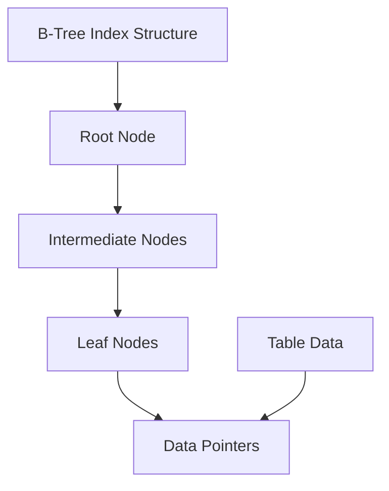

## Overview

Database indexing is a data structure technique that improves the speed of data retrieval operations on database tables. Indexes work by creating a separate data structure that allows the database engine to quickly locate and access the data without scanning the entire table.

Effective indexing strategies can dramatically improve query performance, but poor indexing can lead to increased storage overhead and slower write operations. Understanding different indexing techniques is crucial for database performance optimization.

## Detailed Explanation

### Index Types

1. **B-Tree Indexes**: Most common, balanced tree structure for range queries
2. **Hash Indexes**: Fast equality lookups, poor for range queries
3. **Bitmap Indexes**: Efficient for low-cardinality columns
4. **Full-Text Indexes**: Specialized for text search operations
5. **Spatial Indexes**: For geographic and geometric data
6. **Composite Indexes**: Multiple columns in a single index

### Index Structure



## Real-world Examples & Use Cases

### E-commerce Product Search

```sql
-- Create composite index for product search
CREATE INDEX idx_product_category_price ON products (category_id, price);

-- Query benefits from index
SELECT * FROM products 
WHERE category_id = 1 AND price BETWEEN 100 AND 500
ORDER BY price;

-- Index on frequently searched columns
CREATE INDEX idx_product_name ON products (name);
CREATE INDEX idx_product_sku ON products (sku);
```

### User Authentication System

```java
@Repository
public interface UserRepository extends JpaRepository<User, Long> {
    // Index automatically created for @Id
    
    @Query("SELECT u FROM User u WHERE u.email = :email")
    Optional<User> findByEmail(@Param("email") String email);
    
    @Query("SELECT u FROM User u WHERE u.username = :username AND u.status = :status")
    List<User> findActiveUsersByUsername(@Param("username") String username, 
                                        @Param("status") UserStatus status);
}

// Generated SQL with indexes
CREATE TABLE users (
    id BIGINT PRIMARY KEY,
    username VARCHAR(255),
    email VARCHAR(255) UNIQUE,
    status VARCHAR(50),
    created_at TIMESTAMP
);

CREATE UNIQUE INDEX idx_users_email ON users (email);
CREATE INDEX idx_users_username_status ON users (username, status);
```

### Time-series Analytics

```sql
-- Index for timestamp-based queries
CREATE INDEX idx_events_timestamp ON events (timestamp DESC);

-- Partitioned table with local indexes
CREATE TABLE events (
    id BIGINT,
    timestamp TIMESTAMP,
    event_type VARCHAR(100),
    data JSONB
) PARTITION BY RANGE (timestamp);

-- Query optimized for time ranges
SELECT event_type, COUNT(*) 
FROM events 
WHERE timestamp BETWEEN '2024-01-01' AND '2024-01-31'
GROUP BY event_type;
```

## Code Examples

### Single Column Indexes

```sql
-- Basic index creation
CREATE INDEX idx_users_email ON users (email);

-- Unique index
CREATE UNIQUE INDEX idx_users_username ON users (username);

-- Partial index (PostgreSQL)
CREATE INDEX idx_active_users ON users (email) WHERE status = 'ACTIVE';

-- Descending index
CREATE INDEX idx_posts_created_desc ON posts (created_at DESC);
```

### Composite Indexes

```sql
-- Composite index for multiple conditions
CREATE INDEX idx_orders_customer_date ON orders (customer_id, order_date);

-- Index for sorting
CREATE INDEX idx_products_category_rating ON products (category_id, rating DESC, price);

-- Covering index (includes all queried columns)
CREATE INDEX idx_users_covering ON users (department_id, salary) 
INCLUDE (name, email);
```

### Index Maintenance

```sql
-- Analyze index usage
SELECT schemaname, tablename, indexname, idx_scan, idx_tup_read, idx_tup_fetch
FROM pg_stat_user_indexes 
ORDER BY idx_scan DESC;

-- Rebuild fragmented index
REINDEX INDEX CONCURRENTLY idx_users_email;

-- Index statistics
ANALYZE users;

-- Index size monitoring
SELECT schemaname, tablename, indexname, 
       pg_size_pretty(pg_relation_size(indexrelid)) as size
FROM pg_stat_user_indexes;
```

### Index Strategies in Application Code

```java
@Service
public class ProductService {
    @Autowired
    private ProductRepository productRepository;
    
    // Query with proper indexing
    public List<Product> searchProducts(String category, BigDecimal minPrice, BigDecimal maxPrice) {
        return productRepository.findByCategoryAndPriceRange(category, minPrice, maxPrice);
    }
}

@Repository
public interface ProductRepository extends JpaRepository<Product, Long> {
    // Spring Data generates query with composite index usage
    @Query("SELECT p FROM Product p WHERE p.category = :category AND p.price BETWEEN :minPrice AND :maxPrice")
    List<Product> findByCategoryAndPriceRange(@Param("category") String category,
                                            @Param("minPrice") BigDecimal minPrice,
                                            @Param("maxPrice") BigDecimal maxPrice);
    
    // Index on JSON field (PostgreSQL)
    @Query(value = "SELECT * FROM products WHERE data->>'tags' ? :tag", nativeQuery = true)
    List<Product> findByTag(@Param("tag") String tag);
}
```

### Advanced Indexing Patterns

```sql
-- Functional index
CREATE INDEX idx_users_lower_email ON users (LOWER(email));

-- Partial index with expression
CREATE INDEX idx_recent_orders ON orders (customer_id) 
WHERE order_date > CURRENT_DATE - INTERVAL '30 days';

-- Index on JSONB field
CREATE INDEX idx_products_metadata_gin ON products USING GIN (metadata);

-- Spatial index (PostGIS)
CREATE INDEX idx_locations_geom ON locations USING GIST (geom);
```

## Common Pitfalls & Edge Cases

### Over-Indexing

```sql
-- Too many indexes slow down writes
CREATE INDEX idx1 ON users (email);
CREATE INDEX idx2 ON users (LOWER(email));  -- Redundant
CREATE INDEX idx3 ON users (email, name);    -- If idx1 exists and name has high cardinality
CREATE INDEX idx4 ON users (name, email);    -- Different order, may not be useful
```

**Solution**: Monitor index usage and remove unused indexes.

### Index Fragmentation

```sql
-- Monitor fragmentation
SELECT n_dead_tup, n_live_tup 
FROM pg_stat_user_tables 
WHERE relname = 'users';

-- Rebuild if heavily fragmented
VACUUM FULL users;
REINDEX INDEX idx_users_email;
```

### Index Selection Wrong

```sql
-- Query uses wrong index
EXPLAIN SELECT * FROM users WHERE age > 18 AND status = 'ACTIVE';

-- Force index usage (generally not recommended)
SELECT * FROM users USE INDEX (idx_users_status) 
WHERE age > 18 AND status = 'ACTIVE';
```

### Write Performance Impact

```java
// Batch inserts suffer from index maintenance
@Transactional
public void bulkInsertUsers(List<User> users) {
    // Each insert updates multiple indexes
    for (User user : users) {
        userRepository.save(user);  // Slow with many indexes
    }
}

// Solution: Drop indexes, insert, recreate
public void optimizedBulkInsert(List<User> users) {
    indexManager.dropIndexes("users");
    userRepository.saveAll(users);
    indexManager.createIndexes("users");
}
```

## Tools & Libraries

### Index Analysis Tools

- **pg_stat_statements**: PostgreSQL query performance monitoring
- **EXPLAIN ANALYZE**: Query execution plan analysis
- **pgBadger**: PostgreSQL log analyzer

### ORM Index Management

- **Hibernate**: Automatic index generation from JPA annotations
- **Spring Data JPA**: @Index annotation support
- **Flyway/Liquibase**: Database migration with index management

### Monitoring Solutions

- **DataDog**: Database performance monitoring
- **New Relic**: APM with database query insights
- **SolarWinds**: Database performance analyzer

### Index Optimization Libraries

- **FlexyPool**: Connection pool with index-aware routing
- **QueryDSL**: Type-safe queries with index optimization
- **jOOQ**: Fluent API for complex indexed queries

## References

- [Database Index Design and the Optimizers](https://use-the-index-luke.com/)
- [PostgreSQL Indexing](https://www.postgresql.org/docs/current/indexes.html)
- [MySQL Index Optimization](https://dev.mysql.com/doc/refman/8.0/en/optimization-indexes.html)
- [SQL Server Index Architecture](https://docs.microsoft.com/en-us/sql/relational-databases/indexes/)

## Github-README Links & Related Topics

- [database-indexing-best-practices](database-indexing-best-practices/README.md)
- [database-performance-tuning](database-performance-tuning/README.md)
- [database-design-principles](database-design-principles/README.md)
- [query-optimization](query-optimization/README.md)
