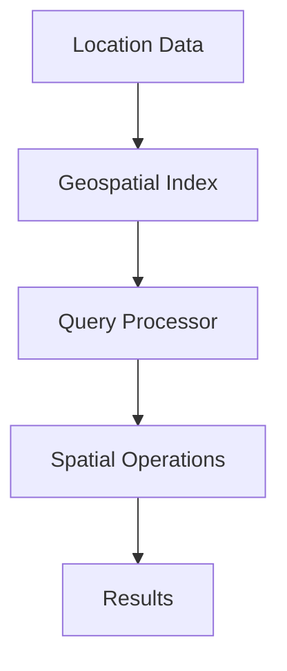

# Geospatial Databases

## Overview

Geospatial databases store, index, and query location-based data, enabling applications to perform spatial operations like distance calculations and area queries efficiently.

## Detailed Explanation

### Key Features

- **Spatial Data Types**: Points, lines, polygons representing geographic entities.
- **Indexing**: R-tree or quad-tree structures for fast queries.
- **Operations**: Intersection, containment, nearest neighbor searches.

### Popular Systems

- **PostGIS**: Extension for PostgreSQL.
- **MongoDB Geospatial**: Native support for 2D and 3D queries.
- **Elasticsearch**: Geospatial queries with aggregations.

### Architecture

- **Storage**: Efficient storage of coordinates and geometries.
- **Query Processing**: Optimized for spatial joins and filters.
- **Scalability**: Sharding based on geographic regions.

## Real-world Examples & Use Cases

- **Mapping Services**: Google Maps stores and queries map data.
- **Ride-Sharing**: Uber finds nearest drivers using geospatial queries.
- **Delivery Apps**: Route optimization for couriers.
- **Real Estate**: Property searches within boundaries.

## Code Examples

### Java: MongoDB Geospatial Query

```java
import com.mongodb.client.MongoCollection;
import org.bson.Document;
import static com.mongodb.client.model.Filters.*;

public class GeospatialQuery {
    public void findNearby(MongoCollection<Document> collection, double lng, double lat, double maxDistance) {
        collection.find(near("location", new double[]{lng, lat}, maxDistance, 0.0));
    }
}
```

### Mermaid Diagram: Geospatial Database Architecture



## Common Pitfalls & Edge Cases

- **Coordinate Systems**: Handling different projections (e.g., WGS84).
- **Performance**: Indexing large datasets.
- **Accuracy**: Precision in distance calculations.

## Tools & Libraries

- PostGIS
- MongoDB Java Driver
- GeoTools

## References

- [PostGIS Documentation](https://postgis.net/documentation/)
- [MongoDB Geospatial](https://docs.mongodb.com/manual/geospatial-queries/)
- [Spatial Databases](https://en.wikipedia.org/wiki/Spatial_database)

## Github-README Links & Related Topics

- [Database Design and Indexing](system-design/database-design-and-indexing/README.md)
- [Partitioning and Sharding](system-design/partitioning-and-sharding/README.md)
- [Google Maps System Design](google-maps-system-design/README.md)