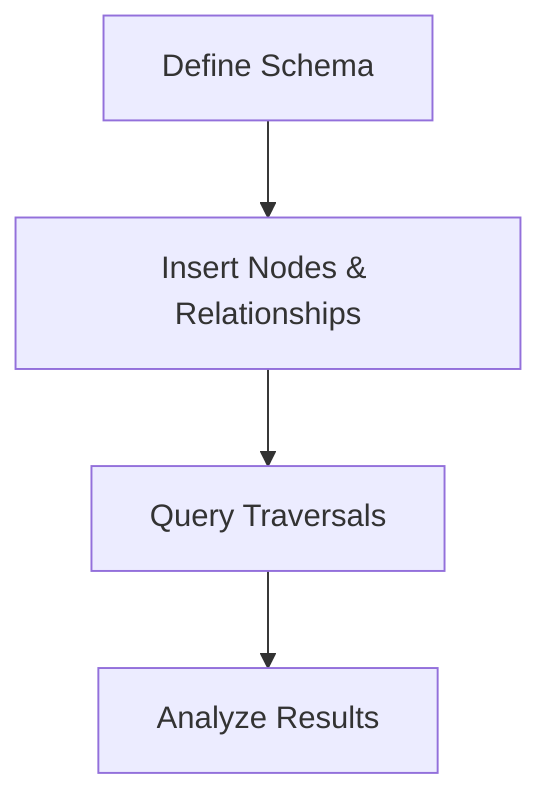

# Graph Databases

## Overview

Graph databases store data as nodes and relationships, optimized for querying connected data. Unlike relational databases, they excel in traversing relationships.

## Detailed Explanation

- **Nodes**: Entities with properties.
- **Relationships**: Connections between nodes with types and properties.
- **Queries**: Use Cypher (Neo4j) or Gremlin for traversal.

Use cases: Social networks, recommendation systems, fraud detection.

## Real-world Examples & Use Cases

- **Social Networks**: Friend connections and recommendations.
- **Recommendation Engines**: Product suggestions based on user behavior.
- **Fraud Detection**: Analyzing transaction patterns.
- **Knowledge Graphs**: Linking entities in AI systems.

## Code Examples

### Neo4j with Cypher

```cypher
CREATE (a:Person {name: 'Alice'})-[:KNOWS]->(b:Person {name: 'Bob'})
MATCH (a:Person)-[:KNOWS]->(b:Person) RETURN a.name, b.name
```

### Java with Neo4j Driver

```java
import org.neo4j.driver.*;

public class GraphExample {
    public static void main(String[] args) {
        Driver driver = GraphDatabase.driver("bolt://localhost:7687", AuthTokens.basic("neo4j", "password"));
        try (Session session = driver.session()) {
            session.run("CREATE (a:Person {name: $name})", Values.parameters("name", "Alice"));
        }
        driver.close();
    }
}
```

## Journey / Sequence



## Common Pitfalls & Edge Cases

- **Performance**: Inefficient queries on large graphs.
- **Data Modeling**: Over-relating can lead to complexity.
- **Scalability**: Sharding graphs is challenging.

## Tools & Libraries

- Neo4j
- Amazon Neptune
- JanusGraph

## References

- [Neo4j Documentation](https://neo4j.com/docs/)
- [Graph Databases Book](https://graphdatabases.com/)

## Github-README Links & Related Topics

- [Database Indexing Strategies](./database-indexing-strategies/README.md)
- [Collections & Data Structures](./collections-and-data-structures/README.md)