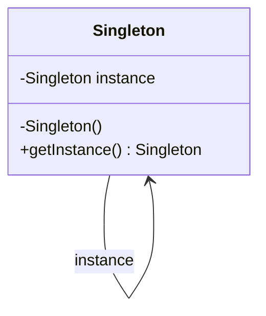

# Design Patterns in Java

## Overview

Design patterns are reusable solutions to common problems in software design. In Java, they promote code reusability, flexibility, and maintainability. The Gang of Four (GoF) catalog includes 23 patterns divided into Creational, Structural, and Behavioral categories.

## Detailed Explanation

### Creational Patterns
These patterns deal with object creation mechanisms.

- **Singleton**: Ensures a class has only one instance and provides a global access point.
- **Factory Method**: Defines an interface for creating objects, letting subclasses decide which class to instantiate.
- **Abstract Factory**: Provides an interface for creating families of related or dependent objects.
- **Builder**: Separates the construction of a complex object from its representation.
- **Prototype**: Creates new objects by copying an existing object.

### Structural Patterns
These patterns concern class and object composition.

- **Adapter**: Allows incompatible interfaces to work together.
- **Bridge**: Decouples an abstraction from its implementation.
- **Composite**: Composes objects into tree structures to represent part-whole hierarchies.
- **Decorator**: Adds responsibilities to objects dynamically.
- **Facade**: Provides a unified interface to a set of interfaces in a subsystem.
- **Flyweight**: Uses sharing to support large numbers of fine-grained objects efficiently.
- **Proxy**: Provides a placeholder or surrogate for another object to control access.

### Behavioral Patterns
These patterns are concerned with algorithms and the assignment of responsibilities between objects.

- **Chain of Responsibility**: Passes requests along a chain of handlers.
- **Command**: Encapsulates a request as an object.
- **Interpreter**: Defines a representation for a grammar along with an interpreter.
- **Iterator**: Provides a way to access elements of an aggregate object sequentially.
- **Mediator**: Defines simplified communication between classes.
- **Memento**: Captures and externalizes an object's internal state.
- **Observer**: Defines a one-to-many dependency between objects.
- **State**: Allows an object to alter its behavior when its internal state changes.
- **Strategy**: Defines a family of algorithms and makes them interchangeable.
- **Template Method**: Defines the skeleton of an algorithm in a method.
- **Visitor**: Separates algorithm from the object structure on which it operates.

| Category       | Patterns                                                                 |
|----------------|--------------------------------------------------------------------------|
| Creational     | Singleton, Factory Method, Abstract Factory, Builder, Prototype         |
| Structural     | Adapter, Bridge, Composite, Decorator, Facade, Flyweight, Proxy         |
| Behavioral     | Chain of Responsibility, Command, Interpreter, Iterator, Mediator, Memento, Observer, State, Strategy, Template Method, Visitor |



## Real-world Examples & Use Cases

- **Singleton**: Managing a database connection pool in a web application.
- **Factory Method**: Creating different types of documents in a word processor.
- **Observer**: Implementing event listeners in GUI frameworks like Swing.
- **Strategy**: Switching between different sorting algorithms based on data size.
- **Decorator**: Adding features like encryption or compression to file streams.

## Code Examples

### Singleton Pattern
```java
public class Singleton {
    private static volatile Singleton instance;
    private Singleton() {}
    
    public static Singleton getInstance() {
        if (instance == null) {
            synchronized (Singleton.class) {
                if (instance == null) {
                    instance = new Singleton();
                }
            }
        }
        return instance;
    }
}
```

### Factory Method Pattern
```java
interface Shape {
    void draw();
}

class Circle implements Shape {
    @Override
    public void draw() {
        System.out.println("Drawing a Circle");
    }
}

class Rectangle implements Shape {
    @Override
    public void draw() {
        System.out.println("Drawing a Rectangle");
    }
}

abstract class ShapeFactory {
    abstract Shape createShape();
}

class CircleFactory extends ShapeFactory {
    @Override
    Shape createShape() {
        return new Circle();
    }
}
```

### Observer Pattern
```java
import java.util.ArrayList;
import java.util.List;

interface Observer {
    void update(String message);
}

class ConcreteObserver implements Observer {
    @Override
    public void update(String message) {
        System.out.println("Received: " + message);
    }
}

class Subject {
    private List<Observer> observers = new ArrayList<>();
    
    public void addObserver(Observer observer) {
        observers.add(observer);
    }
    
    public void notifyObservers(String message) {
        for (Observer observer : observers) {
            observer.update(message);
        }
    }
}
```

## References

- [Design Patterns: Elements of Reusable Object-Oriented Software](https://www.amazon.com/Design-Patterns-Elements-Reusable-Object-Oriented/dp/0201633612)
- [Oracle Java Tutorials: Design Patterns](https://docs.oracle.com/javase/tutorial/java/concepts/)
- [Refactoring Guru: Design Patterns](https://refactoring.guru/design-patterns)

## Github-README Links & Related Topics

- [OOP Principles in Java](../oop-principles-in-java/README.md)
- [Java Fundamentals](../java-fundamentals/README.md)
- [Advanced Java Concepts](../java/advanced-java-concepts/README.md)