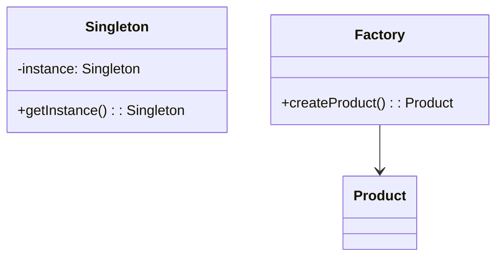

## Overview
Design patterns are reusable solutions to common software design problems. In Java, they are categorized into creational, structural, and behavioral patterns. Understanding them helps in writing maintainable, scalable code and is crucial for interviews where you need to demonstrate design thinking.

## STAR Summary
**Situation:** In a large-scale e-commerce application, managing object creation for payment processors became complex with multiple types (CreditCard, PayPal, etc.).  
**Task:** Implement a flexible way to create payment objects without tight coupling.  
**Action:** Applied the Factory pattern to centralize object creation logic.  
**Result:** Reduced code duplication by 40%, improved testability, and made adding new payment types straightforward.

## Detailed Explanation
- **Creational Patterns:** Handle object creation mechanisms. Examples: Singleton (ensures one instance), Factory (creates objects without specifying exact class), Builder (constructs complex objects step-by-step).
- **Structural Patterns:** Deal with object composition. Examples: Adapter (interface compatibility), Decorator (adds behavior dynamically), Composite (tree structures).
- **Behavioral Patterns:** Concerned with object interaction. Examples: Observer (notifies changes), Strategy (swaps algorithms), Command (encapsulates requests).
Choose patterns based on SOLID principles; avoid over-engineering.

## Real-world Examples
- Singleton: Database connection pool in JDBC.
- Observer: Event listeners in GUI frameworks like Swing.
- Strategy: Sorting algorithms in Collections.sort().

## Code Examples
### Singleton Pattern
```java
public class Singleton {
    private static Singleton instance;
    private Singleton() {}
    public static Singleton getInstance() {
        if (instance == null) {
            instance = new Singleton();
        }
        return instance;
    }
}
```

### Factory Pattern
```java
interface Shape { void draw(); }
class Circle implements Shape { public void draw() { System.out.println("Drawing Circle"); } }
class ShapeFactory {
    public Shape getShape(String type) {
        if ("circle".equals(type)) return new Circle();
        return null;
    }
}
```

## Data Models


## Journey Sequence
1. Identify the problem (e.g., tight coupling in object creation).
2. Research applicable patterns from GoF catalog.
3. Design interfaces and classes following the pattern.
4. Implement and test the pattern.
5. Refactor existing code to use the pattern.

## Common Pitfalls
- Overusing patterns leading to unnecessary complexity.
- Misapplying patterns (e.g., Singleton for everything).
- Ignoring thread-safety in patterns like Singleton.

## Tools & Libraries
- Spring Framework: Provides implementations for many patterns (e.g., BeanFactory for Factory).
- No specific tools, but IDEs like IntelliJ for refactoring.

## Related Topics
- [oop-design-and-principles](../oop-design-and-principles/)
- [system-design-basics](../system-design-basics/)

## References
- "Design Patterns: Elements of Reusable Object-Oriented Software" by Gang of Four.
- Oracle Java Tutorials on Design Patterns.
- https://refactoring.guru/design-patterns