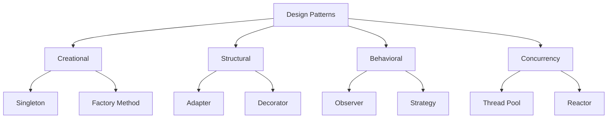

# Overview

Design patterns are general, reusable solutions to commonly occurring problems in software design. They provide templates for structuring code to improve maintainability, scalability, and reusability, particularly in object-oriented programming. Originating from architecture and formalized in the 1990s by the "Gang of Four" (GoF), they are categorized into creational, structural, behavioral, and concurrency patterns.

# Detailed Explanation

Design patterns emerged from Christopher Alexander's architectural patterns in the 1970s and were adapted to software by Kent Beck and Ward Cunningham in the 1980s. The seminal book *Design Patterns: Elements of Reusable Object-Oriented Software* by Erich Gamma, Richard Helm, Ralph Johnson, and John Vlissides (1994) cataloged 23 patterns, influencing modern software engineering.

Patterns are not rigid code but adaptable templates. They promote best practices like loose coupling, high cohesion, and separation of concerns. While primarily OOP-focused, they apply to other paradigms too.

## Categories of Design Patterns

Design patterns are grouped by purpose:

- **Creational**: Handle object creation mechanisms.
- **Structural**: Compose classes and objects into larger structures.
- **Behavioral**: Define communication and responsibility between objects.
- **Concurrency**: Manage multi-threaded programming.



### Creational Patterns

| Pattern | Description | Use Case |
|---------|-------------|----------|
| Singleton | Ensures a class has only one instance and provides global access. | Logging, configuration managers. |
| Factory Method | Defines an interface for creating objects, letting subclasses decide instantiation. | UI component creation. |
| Abstract Factory | Provides an interface for creating families of related objects. | Cross-platform UI toolkits. |
| Builder | Separates construction of complex objects from representation. | Building SQL queries or documents. |
| Prototype | Creates new objects by copying existing ones. | Game object cloning. |

### Structural Patterns

| Pattern | Description | Use Case |
|---------|-------------|----------|
| Adapter | Converts interface of a class into another expected by clients. | Integrating legacy code with new systems. |
| Bridge | Decouples abstraction from implementation. | GUI frameworks with multiple rendering engines. |
| Composite | Composes objects into tree structures for uniform treatment. | File system hierarchies. |
| Decorator | Adds responsibilities to objects dynamically. | Adding features like encryption to streams. |
| Facade | Provides a simplified interface to a complex subsystem. | API gateways. |
| Flyweight | Shares objects to support large numbers of fine-grained objects efficiently. | Text editors with character objects. |
| Proxy | Provides a placeholder for another object to control access. | Lazy loading or security proxies. |

### Behavioral Patterns

| Pattern | Description | Use Case |
|---------|-------------|----------|
| Chain of Responsibility | Passes requests along a chain of handlers. | Event handling in UI. |
| Command | Encapsulates requests as objects. | Undo/redo functionality. |
| Interpreter | Defines a grammar and interpreter for sentences. | SQL parsers. |
| Iterator | Provides sequential access to elements without exposing internals. | Collections traversal. |
| Mediator | Defines communication between objects. | Chat rooms. |
| Memento | Captures and restores object state. | Save/load game states. |
| Observer | Notifies dependents of state changes. | Model-view updates. |
| State | Allows objects to change behavior based on state. | Vending machines. |
| Strategy | Defines interchangeable algorithms. | Sorting algorithms. |
| Template Method | Defines algorithm skeleton, deferring steps to subclasses. | Frameworks like Spring. |
| Visitor | Defines operations on elements of an object structure. | Compilers traversing ASTs. |

### Concurrency Patterns

| Pattern | Description | Use Case |
|---------|-------------|----------|
| Active Object | Decouples method execution from invocation. | Asynchronous processing. |
| Balking | Only executes if object is in correct state. | Resource management. |
| Double-Checked Locking | Optimizes singleton in multi-threaded environments. | Thread-safe singletons. |
| Reactor | Handles service requests concurrently. | Network servers. |
| Thread Pool | Manages pool of worker threads. | Web servers. |

# Real-world Examples & Use Cases

- **Singleton**: Used in Java's `Runtime.getRuntime()` for JVM management or Python's `logging` module for centralized logging.
- **Factory Method**: In Java's `Calendar.getInstance()` for locale-specific calendars.
- **Observer**: GUI frameworks like JavaFX or React's state management for reactive updates.
- **Strategy**: Payment processing systems allowing different algorithms (credit card, PayPal).
- **Decorator**: Java's `BufferedReader` wrapping `FileReader` for buffering.
- **Facade**: Simplifying complex APIs, e.g., JDBC for database access.
- **Command**: Undo systems in text editors like VS Code.
- **Adapter**: Wrapping third-party libraries to match application interfaces.
- **Proxy**: Virtual proxies for lazy loading images in web apps.
- **Thread Pool**: Executors in Java for managing concurrent tasks.

# Code Examples

## Singleton (Java)

```java
public class Singleton {
    private static Singleton instance;
    private Singleton() {}
    public static Singleton getInstance() {
        if (instance == null) {
            instance = new Singleton();
        }
        return instance;
    }
}
```

## Singleton (Python)

```python
class Singleton:
    _instance = None
    def __new__(cls):
        if cls._instance is None:
            cls._instance = super().__new__(cls)
        return cls._instance
```

## Factory Method (Java)

```java
interface Product {}
class ConcreteProductA implements Product {}
class ConcreteProductB implements Product {}

interface Creator {
    Product factoryMethod();
}

class ConcreteCreatorA implements Creator {
    public Product factoryMethod() {
        return new ConcreteProductA();
    }
}
```

## Factory Method (Python)

```python
from abc import ABC, abstractmethod

class Product(ABC):
    pass

class ConcreteProductA(Product):
    pass

class Creator(ABC):
    @abstractmethod
    def factory_method(self):
        pass

class ConcreteCreatorA(Creator):
    def factory_method(self):
        return ConcreteProductA()
```

## Observer (Java)

```java
interface Observer {
    void update(String message);
}

class ConcreteObserver implements Observer {
    public void update(String message) {
        System.out.println("Received: " + message);
    }
}

interface Subject {
    void attach(Observer o);
    void notifyObservers();
}

class ConcreteSubject implements Subject {
    private List<Observer> observers = new ArrayList<>();
    public void attach(Observer o) { observers.add(o); }
    public void notifyObservers() {
        for (Observer o : observers) {
            o.update("State changed");
        }
    }
}
```

## Observer (Python)

```python
class Observer:
    def update(self, message):
        pass

class ConcreteObserver(Observer):
    def update(self, message):
        print(f"Received: {message}")

class Subject:
    def __init__(self):
        self._observers = []
    def attach(self, observer):
        self._observers.append(observer)
    def notify_observers(self):
        for obs in self._observers:
            obs.update("State changed")
```

# References

- [Wikipedia: Software Design Pattern](https://en.wikipedia.org/wiki/Software_design_pattern)
- Gamma, Erich, et al. *Design Patterns: Elements of Reusable Object-Oriented Software*. Addison-Wesley, 1994. ISBN: 978-0201633610.
- Fowler, Martin. *Patterns of Enterprise Application Architecture*. Addison-Wesley, 2002. ISBN: 978-0321127426.
- Hohpe, Gregor, and Bobby Woolf. *Enterprise Integration Patterns*. Addison-Wesley, 2003. ISBN: 978-0321200686.

# Github-README Links & Related Topics

- [Design Patterns in Java](../design-patterns-in-java/)
- [OOP Principles](../java-oop-principles/)
- [Behavioral Interview Questions](../behavioral-interview-questions/)
- [Software Engineering](../algorithms/) (related to algorithmic patterns)
- [Concurrency and Parallelism](../concurrency-and-parallelism/)