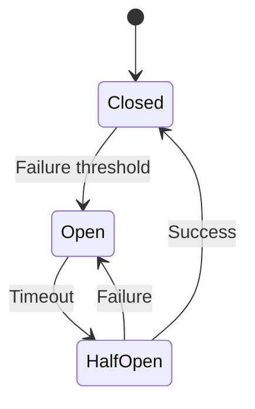

# Fault Tolerance Patterns

## Overview

Fault tolerance patterns help systems continue operating correctly in the presence of faults. They prevent single points of failure and ensure resilience.

## Detailed Explanation

Common patterns:

- **Retry**: Automatically retry failed operations.
- **Circuit Breaker**: Stop calling failing service to prevent cascade.
- **Bulkhead**: Isolate failures to prevent spread.
- **Timeout**: Limit wait time for operations.
- **Fallback**: Provide alternative when primary fails.

### Circuit Breaker States

- Closed: Normal operation.
- Open: Fail fast.
- Half-Open: Test if service recovered.



## Real-world Examples & Use Cases

- **Microservices**: Netflix Hystrix for circuit breaker.
- **Web Services**: Retry on network errors.
- **Databases**: Fallback to cache on DB failure.

## Code Examples

### Circuit Breaker in Java

```java
class CircuitBreaker {
    enum State { CLOSED, OPEN, HALF_OPEN }
    State state = CLOSED;
    int failureCount = 0;
    
    boolean call(Service service) {
        if (state == OPEN) return false; // Fail fast
        try {
            service.execute();
            if (state == HALF_OPEN) state = CLOSED;
            failureCount = 0;
            return true;
        } catch (Exception e) {
            failureCount++;
            if (failureCount > threshold) state = OPEN;
            if (state == HALF_OPEN) state = OPEN;
            return false;
        }
    }
}
```

## Common Pitfalls & Edge Cases

- **Retry Storms**: Too many retries overwhelm recovering service.
- **Circuit Breaker Misconfiguration**: Wrong thresholds cause false positives.
- **Fallback Complexity**: Fallback logic can be complex.

## Tools & Libraries

- **Hystrix**: Netflix's library.
- **Resilience4j**: Java resilience library.
- **Polly**: .NET resilience.

## References

- [Circuit Breaker Pattern](https://martinfowler.com/bliki/CircuitBreaker.html)

## Github-README Links & Related Topics

- [Circuit Breaker Pattern](circuit-breaker-pattern/README.md)
- [Fault Tolerance in Distributed Systems](fault-tolerance-in-distributed-systems/README.md)
- [Microservices Design Patterns](microservices-design-patterns/README.md)