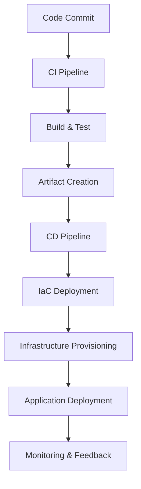
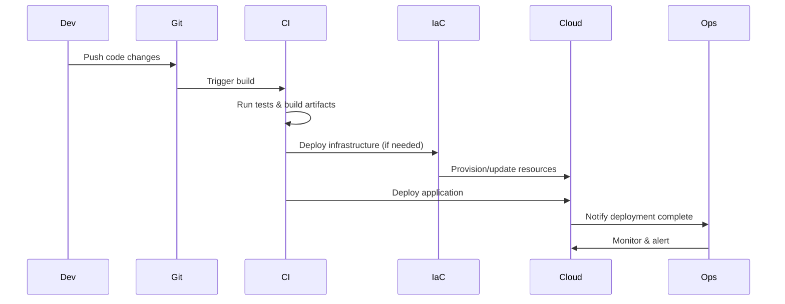

# DevOps & Infrastructure as Code

## Overview

DevOps is a cultural and technical movement that emphasizes collaboration between software development and IT operations teams to deliver high-quality software faster and more reliably. Infrastructure as Code (IaC) is a key DevOps practice that involves managing and provisioning infrastructure through machine-readable definition files, rather than physical hardware configuration or interactive configuration tools.

## Detailed Explanation

### DevOps Principles

DevOps bridges the gap between development and operations by promoting:
- **Collaboration**: Breaking down silos between teams
- **Automation**: Automating manual processes to reduce errors and increase speed
- **Continuous Improvement**: Regular feedback loops and iterative improvements
- **Monitoring and Logging**: Proactive system health monitoring

### Infrastructure as Code

IaC treats infrastructure as software, enabling:
- **Version Control**: Infrastructure changes tracked in git
- **Reproducibility**: Consistent environments across dev, staging, and production
- **Scalability**: Easy replication and scaling of infrastructure
- **Testing**: Infrastructure can be tested before deployment



## STAR Summary

**Situation**: A traditional software company with separate dev and ops teams experienced frequent deployment failures and long release cycles.

**Task**: Implement DevOps practices and IaC to reduce deployment time from weeks to hours and improve system reliability.

**Action**: Introduced CI/CD pipelines using Jenkins, adopted Terraform for infrastructure provisioning, and implemented monitoring with Prometheus. Trained teams on collaborative practices and automated testing.

**Result**: Reduced deployment time by 80%, increased deployment frequency from monthly to daily, and achieved 99.9% uptime with automated rollbacks.

## Journey / Sequence



## Common Pitfalls & Edge Cases

| Pitfall | Description | Mitigation |
|---------|-------------|------------|
| Configuration Drift | Manual changes cause divergence from IaC | Enforce IaC for all changes; regular audits |
| Secret Management | Hardcoded secrets in IaC files | Use secret management tools like Vault |
| State File Management | Terraform state file corruption | Store state remotely; enable versioning |
| Over-Automation | Automating without proper testing | Implement comprehensive testing in pipelines |
| Tool Lock-in | Vendor-specific IaC tools | Use multi-cloud compatible tools |
| CI/CD Complexity | Overly complex pipelines | Keep pipelines simple; modularize |

## Tools & Libraries

| Category | Tool | Description | Use Case |
|----------|------|-------------|----------|
| IaC | Terraform | Declarative IaC tool | Multi-cloud infrastructure |
| IaC | Ansible | Configuration management | Server configuration |
| IaC | CloudFormation | AWS-specific IaC | AWS resources |
| CI/CD | Jenkins | Open-source CI/CD | Custom pipelines |
| CI/CD | GitLab CI | Integrated CI/CD | Git-based workflows |
| CI/CD | GitHub Actions | GitHub-integrated CI/CD | Cloud-native apps |
| Containers | Docker | Containerization | Application packaging |
| Orchestration | Kubernetes | Container orchestration | Microservices deployment |

## Real-world Examples & Use Cases

- **E-commerce Platform**: Automated scaling of web servers during Black Friday using Terraform and Kubernetes
- **Financial Services**: Multi-environment provisioning with strict compliance using Ansible playbooks
- **SaaS Application**: Blue-green deployments with zero downtime using IaC and CI/CD pipelines
- **Data Analytics**: Infrastructure for big data processing that scales based on job requirements

## Code Examples

### Terraform AWS VPC Setup

```hcl
terraform {
  required_providers {
    aws = {
      source  = "hashicorp/aws"
      version = "~> 4.0"
    }
  }
}

provider "aws" {
  region = "us-east-1"
}

resource "aws_vpc" "main" {
  cidr_block = "10.0.0.0/16"

  tags = {
    Name = "main-vpc"
  }
}

resource "aws_subnet" "public" {
  vpc_id     = aws_vpc.main.id
  cidr_block = "10.0.1.0/24"

  tags = {
    Name = "public-subnet"
  }
}
```

### Ansible Playbook for Web Server Setup

```yaml
---
- name: Deploy Web Application
  hosts: webservers
  become: yes
  vars:
    app_port: 8080

  tasks:
    - name: Update package cache
      apt:
        update_cache: yes

    - name: Install Java
      apt:
        name: openjdk-11-jdk
        state: present

    - name: Create application directory
      file:
        path: /opt/myapp
        state: directory
        mode: '0755'

    - name: Download application JAR
      get_url:
        url: https://example.com/myapp.jar
        dest: /opt/myapp/myapp.jar

    - name: Create systemd service
      template:
        src: myapp.service.j2
        dest: /etc/systemd/system/myapp.service

    - name: Start and enable service
      systemd:
        name: myapp
        state: started
        enabled: yes
```

### Jenkins Pipeline (Jenkinsfile)

```groovy
pipeline {
    agent any

    stages {
        stage('Checkout') {
            steps {
                git 'https://github.com/myorg/myapp.git'
            }
        }

        stage('Build') {
            steps {
                sh 'mvn clean package'
            }
        }

        stage('Test') {
            steps {
                sh 'mvn test'
            }
        }

        stage('Deploy Infrastructure') {
            steps {
                sh 'terraform init && terraform apply -auto-approve'
            }
        }

        stage('Deploy Application') {
            steps {
                sh 'ansible-playbook -i inventory deploy.yml'
            }
        }
    }

    post {
        always {
            junit 'target/surefire-reports/*.xml'
        }
    }
}
```

## References

- [DevOps Handbook](https://itrevolution.com/book/the-devops-handbook/)
- [Terraform Documentation](https://developer.hashicorp.com/terraform/docs)
- [Ansible Documentation](https://docs.ansible.com/ansible/latest/index.html)
- [Jenkins User Handbook](https://www.jenkins.io/doc/book/)
- [Infrastructure as Code Best Practices](https://cloud.google.com/docs/terraform/best-practices-for-terraform)

## Github-README Links & Related Topics

- [CI/CD Pipelines](./ci-cd-pipelines/README.md)
- [Monitoring and Logging](./monitoring-and-logging/README.md)
- [Docker Containerization](./docker-containerization/README.md)
- [Kubernetes Fundamentals](./kubernetes-fundamentals/README.md)
