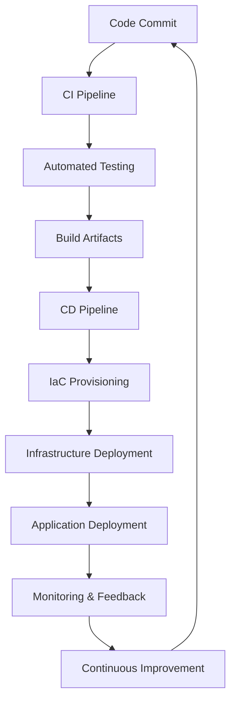

# DevOps & Infrastructure as Code

## Overview

DevOps is a cultural and technical movement that emphasizes collaboration between software development (Dev) and IT operations (Ops) teams to deliver high-quality software faster and more reliably. It combines practices, tools, and philosophies to automate and integrate the processes of software development and infrastructure management, enabling organizations to evolve and improve products at a faster pace.

Infrastructure as Code (IaC) is a key DevOps practice that involves managing and provisioning infrastructure through machine-readable definition files, rather than physical hardware configuration or interactive configuration tools. IaC treats infrastructure as software, allowing for version control, testing, and automation of infrastructure deployments.

Together, DevOps and IaC enable organizations to achieve:
- **Rapid Delivery**: Frequent, reliable releases
- **Improved Collaboration**: Breaking down silos between teams
- **Automation**: Reducing manual errors and increasing efficiency
- **Scalability**: Managing complex systems at scale
- **Reliability**: Ensuring consistent and repeatable deployments

## Detailed Explanation

### DevOps Principles

DevOps bridges the gap between development and operations by promoting:
- **Collaboration**: Integrating Dev and Ops teams, often merging them into cross-functional units
- **Automation**: Automating repetitive tasks like testing, deployment, and monitoring
- **Continuous Improvement**: Implementing feedback loops for iterative enhancements
- **Monitoring and Logging**: Proactive system health monitoring and logging for quick issue resolution
- **Security Integration**: Incorporating security practices throughout the development lifecycle (DevSecOps)

DevOps transforms traditional software delivery by enabling continuous integration (CI) and continuous delivery/deployment (CD), where code changes are automatically tested, built, and deployed to production environments.

### Infrastructure as Code

IaC allows infrastructure to be defined in code, providing:
- **Version Control**: Infrastructure changes tracked in Git, enabling rollbacks and collaboration
- **Reproducibility**: Consistent environments across development, staging, and production
- **Scalability**: Easy replication and scaling of infrastructure components
- **Testing**: Infrastructure can be validated before deployment using automated tests
- **Cost Efficiency**: Reducing manual configuration errors and downtime

IaC tools interact with cloud providers' APIs to provision resources programmatically. This approach supports immutable infrastructure, where resources are replaced rather than modified, ensuring consistency.



The DevOps cycle integrates development, testing, deployment, and monitoring in a continuous loop.

## Real-world Examples & Use Cases

1. **E-commerce Platform Scaling**: An online retailer uses IaC with Terraform to automatically scale web servers and databases during peak shopping seasons, ensuring high availability and cost optimization.

2. **Microservices Deployment**: A fintech company adopts DevOps practices with Kubernetes and IaC to deploy microservices independently, reducing deployment time from days to minutes and improving fault isolation.

3. **Multi-Cloud Migration**: A media streaming service migrates workloads across AWS, Azure, and GCP using IaC tools, maintaining consistent configurations and compliance across environments.

4. **CI/CD Pipeline Automation**: A software company implements Jenkins pipelines integrated with IaC to automate testing and deployment, achieving zero-downtime releases and faster feature delivery.

5. **Compliance and Security**: A healthcare provider uses IaC with policy-as-code to enforce security standards and compliance requirements automatically across all infrastructure components.

## Code Examples

### Terraform: Provisioning an AWS EC2 Instance

```hcl
terraform {
  required_providers {
    aws = {
      source  = "hashicorp/aws"
      version = "~> 5.0"
    }
  }
}

provider "aws" {
  region = "us-east-1"
}

resource "aws_instance" "web" {
  ami           = "ami-0c55b159cbfafe1d0"  # Amazon Linux 2 AMI
  instance_type = "t2.micro"

  tags = {
    Name = "DevOps-Web-Server"
  }
}

resource "aws_security_group" "web_sg" {
  name_prefix = "web-sg-"

  ingress {
    from_port   = 80
    to_port     = 80
    protocol    = "tcp"
    cidr_blocks = ["0.0.0.0/0"]
  }

  ingress {
    from_port   = 443
    to_port     = 443
    protocol    = "tcp"
    cidr_blocks = ["0.0.0.0/0"]
  }

  egress {
    from_port   = 0
    to_port     = 0
    protocol    = "-1"
    cidr_blocks = ["0.0.0.0/0"]
  }
}
```

This Terraform configuration creates an EC2 instance with a security group allowing HTTP and HTTPS traffic.

### Ansible: Configuring a Web Server

```yaml
---
- name: Deploy and Configure Web Server
  hosts: webservers
  become: yes
  vars:
    app_port: 8080
    app_user: webapp

  tasks:
    - name: Update package cache
      apt:
        update_cache: yes
      when: ansible_os_family == "Debian"

    - name: Install required packages
      package:
        name:
          - nginx
          - openjdk-11-jdk
        state: present

    - name: Create application user
      user:
        name: "{{ app_user }}"
        system: yes
        shell: /bin/false

    - name: Create application directory
      file:
        path: /opt/myapp
        state: directory
        owner: "{{ app_user }}"
        group: "{{ app_user }}"
        mode: '0755'

    - name: Copy application JAR
      copy:
        src: myapp.jar
        dest: /opt/myapp/myapp.jar
        owner: "{{ app_user }}"
        group: "{{ app_user }}"
        mode: '0644'

    - name: Configure systemd service
      template:
        src: myapp.service.j2
        dest: /etc/systemd/system/myapp.service

    - name: Start and enable service
      systemd:
        name: myapp
        state: started
        enabled: yes

    - name: Configure Nginx reverse proxy
      template:
        src: nginx.conf.j2
        dest: /etc/nginx/sites-available/myapp
      notify: Reload Nginx

  handlers:
    - name: Reload Nginx
      service:
        name: nginx
        state: reloaded
```

This Ansible playbook installs Java, deploys a JAR application, configures systemd, and sets up Nginx as a reverse proxy.

### Jenkins Pipeline: CI/CD with IaC

```groovy
pipeline {
    agent any

    environment {
        DOCKER_IMAGE = 'myapp:${BUILD_NUMBER}'
    }

    stages {
        stage('Checkout') {
            steps {
                git branch: 'main', url: 'https://github.com/myorg/myapp.git'
            }
        }

        stage('Build') {
            steps {
                sh 'mvn clean compile'
            }
        }

        stage('Unit Tests') {
            steps {
                sh 'mvn test'
            }
            post {
                always {
                    junit 'target/surefire-reports/*.xml'
                }
            }
        }

        stage('Build Docker Image') {
            steps {
                sh 'docker build -t ${DOCKER_IMAGE} .'
            }
        }

        stage('Infrastructure Provisioning') {
            steps {
                sh '''
                    cd infrastructure
                    terraform init
                    terraform plan -out=tfplan
                    terraform apply -auto-approve tfplan
                '''
            }
        }

        stage('Deploy to Staging') {
            steps {
                sh 'ansible-playbook -i staging.ini deploy.yml'
            }
        }

        stage('Integration Tests') {
            steps {
                sh 'mvn verify -P integration-tests'
            }
        }

        stage('Deploy to Production') {
            when {
                branch 'main'
            }
            steps {
                input message: 'Deploy to Production?'
                sh 'ansible-playbook -i production.ini deploy.yml'
            }
        }
    }

    post {
        always {
            sh 'docker rmi ${DOCKER_IMAGE} || true'
            cleanWs()
        }
        success {
            echo 'Pipeline succeeded!'
        }
        failure {
            echo 'Pipeline failed!'
        }
    }
}
```

This Jenkins pipeline demonstrates a complete CI/CD workflow with IaC integration.

## Tools & Libraries

| Category | Tool | Description | Key Features |
|----------|------|-------------|--------------|
| IaC | Terraform | Declarative IaC for multi-cloud | State management, modules, providers |
| IaC | Ansible | Configuration management and IaC | Agentless, YAML playbooks, extensive modules |
| IaC | CloudFormation | AWS-native IaC | JSON/YAML templates, AWS integration |
| IaC | Pulumi | IaC with programming languages | TypeScript, Python, Go support |
| CI/CD | Jenkins | Open-source automation server | Pipelines, plugins, distributed builds |
| CI/CD | GitLab CI | Integrated CI/CD in GitLab | Auto DevOps, Kubernetes integration |
| CI/CD | GitHub Actions | CI/CD in GitHub | Workflows, marketplace, cloud-hosted |
| Containers | Docker | Containerization platform | Images, containers, Docker Compose |
| Orchestration | Kubernetes | Container orchestration | Pods, services, deployments |
| Monitoring | Prometheus | Monitoring and alerting | Metrics collection, Grafana integration |
| Version Control | Git | Distributed version control | Branching, merging, GitOps |

## Common Pitfalls & Edge Cases

| Pitfall | Description | Mitigation |
|---------|-------------|------------|
| Configuration Drift | Manual changes cause divergence from IaC definitions | Regular audits, enforce IaC-only changes, use drift detection tools |
| Secret Management | Hardcoded secrets in IaC files | Use secret management tools (Vault, AWS Secrets Manager), environment variables |
| State File Issues | Terraform state corruption or loss | Remote state storage, state locking, regular backups |
| Over-Automation | Automating without proper testing | Implement comprehensive testing, gradual automation adoption |
| Tool Lock-in | Vendor-specific tools limiting flexibility | Use multi-cloud tools, evaluate abstraction layers |
| Pipeline Complexity | Overly complex CI/CD pipelines | Modularize pipelines, use shared libraries, regular refactoring |
| Resource Dependencies | Improper handling of resource dependencies | Use dependency graphs, explicit ordering in IaC |
| Cost Management | Uncontrolled resource provisioning | Implement cost monitoring, resource tagging, auto-scaling policies |
| Security Vulnerabilities | Outdated IaC tools or configurations | Regular security scans, dependency updates, least-privilege access |
| Team Skill Gaps | Lack of DevOps skills across teams | Training programs, cross-functional teams, knowledge sharing |

## References

- [AWS DevOps - What is DevOps?](https://aws.amazon.com/devops/what-is-devops/)
- [Terraform Introduction](https://www.terraform.io/intro)
- [Ansible Documentation](https://docs.ansible.com/ansible/latest/index.html)
- [Jenkins User Handbook](https://www.jenkins.io/doc/book/)
- [Infrastructure as Code Best Practices - Google Cloud](https://cloud.google.com/docs/terraform/best-practices-for-terraform)
- [DevOps Handbook](https://itrevolution.com/book/the-devops-handbook/)
- [The Phoenix Project](https://itrevolution.com/book/the-phoenix-project/)
- [Site Reliability Engineering](https://sre.google/books/)

## Github-README Links & Related Topics

- [CI/CD Pipelines](./ci-cd-pipelines/README.md)
- [Docker Containerization](./docker-containerization/README.md)
- [Kubernetes Fundamentals](./kubernetes-fundamentals/README.md)
- [Cloud Architecture Patterns](./cloud-architecture-patterns/README.md)
- [Monitoring and Logging](./monitoring-and-logging/README.md)
- [Configuration Management](./configuration-management/README.md)
- [Container Orchestration](./container-orchestration/README.md)