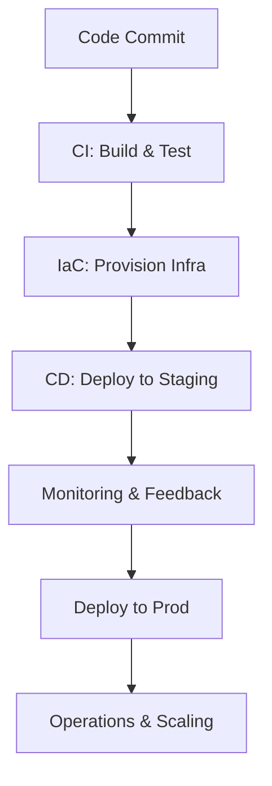

# DevOps & Infrastructure as Code

```yaml
---
title: DevOps & Infrastructure as Code
aliases: [IaC, DevOps IaC]
tags: [devops, infrastructure, automation]
created: 2025-09-26
updated: 2025-09-26
---
```

## Overview

DevOps is a cultural and operational philosophy that integrates software development (Dev) and IT operations (Ops) to accelerate delivery, improve reliability, and foster collaboration. It emphasizes automation, continuous integration/continuous delivery (CI/CD), and iterative improvements.

Infrastructure as Code (IaC) is a key DevOps practice that treats infrastructure provisioning and management as code, enabling version control, repeatability, and automation. IaC allows teams to define, deploy, and manage infrastructure programmatically, reducing manual errors and ensuring consistency across environments.

Together, DevOps and IaC enable organizations to deliver software faster, scale efficiently, and maintain high-quality systems through codified, automated workflows.

## Detailed Explanation

### DevOps Principles and Practices

DevOps breaks down silos between development and operations teams, promoting shared responsibility for the entire software lifecycle. Core practices include:

- **Continuous Integration (CI)**: Frequent code merges into a shared repository, with automated builds and tests to detect issues early.
- **Continuous Delivery/Deployment (CD)**: Automated release pipelines that prepare and deploy code changes reliably.
- **Microservices Architecture**: Breaking applications into small, independent services for faster updates and scalability.
- **Monitoring and Logging**: Real-time tracking of application performance and infrastructure health.
- **Collaboration Tools**: Chat, issue tracking, and wikis to enhance communication.

Benefits include increased deployment frequency, reduced failure rates, and faster recovery times. DevOps also integrates security (DevSecOps) and compliance into the pipeline.

### Infrastructure as Code (IaC) Principles

IaC uses declarative or imperative code to define infrastructure, making it versionable, testable, and reusable. Key principles:

- **Declarative vs. Imperative**: Declarative IaC describes the desired state (e.g., "a server with these specs"), while imperative specifies steps. Declarative is preferred for idempotency.
- **Idempotency**: Repeated executions produce the same result, preventing drift.
- **Version Control**: Infrastructure code is stored in Git, enabling rollbacks and collaboration.
- **Automation**: Tools provision resources via APIs, integrating with CI/CD for seamless deployments.

IaC addresses "environment drift" by ensuring consistency between dev, test, and prod environments.

### DevOps Pipeline with IaC



This diagram illustrates how IaC fits into the DevOps workflow, automating infrastructure changes alongside code deployments.

### Comparison of IaC Tools

| Tool       | Language | Cloud Support | Strengths                  | Weaknesses              |
|------------|----------|---------------|----------------------------|------------------------|
| Terraform | HCL      | Multi-cloud   | Declarative, state mgmt    | Learning curve          |
| Ansible    | YAML     | Multi-cloud   | Agentless, simple          | Procedural focus       |
| CloudFormation | JSON/YAML | AWS-only    | Native AWS integration     | Limited to AWS         |
| Pulumi     | Code     | Multi-cloud   | Supports programming langs | Requires coding skills |

## Real-world Examples & Use Cases

- **Netflix**: Uses DevOps and IaC (with tools like Spinnaker and Terraform) to deploy thousands of times daily, ensuring high availability for global streaming.
- **Amazon**: Employs IaC via CloudFormation for rapid scaling of e-commerce infrastructure, reducing manual provisioning errors.
- **Spotify**: DevOps practices with microservices and IaC enable feature releases every few hours, supporting personalized music recommendations.
- **Financial Services**: Banks like Capital One use IaC for compliance, automating secure, auditable infrastructure changes.

Use cases include:
- **Cloud Migration**: Automating hybrid cloud setups.
- **Disaster Recovery**: Version-controlled infra for quick restores.
- **Compliance Automation**: Enforcing policies via code (Policy as Code).

## Code Examples

### Terraform Example: Provision an AWS EC2 Instance

```hcl
provider "aws" {
  region = "us-east-1"
}

resource "aws_instance" "example" {
  ami           = "ami-0c55b159cbfafe1d0"
  instance_type = "t2.micro"

  tags = {
    Name = "ExampleInstance"
  }
}
```

Run `terraform init`, `terraform plan`, `terraform apply` to provision.

### Ansible Example: Configure a Web Server

```yaml
---
- name: Install and start Apache
  hosts: webservers
  become: yes
  tasks:
    - name: Install Apache
      apt:
        name: apache2
        state: present
    - name: Start Apache
      service:
        name: apache2
        state: started
```

Execute with `ansible-playbook playbook.yml`.

## References

- [AWS: What is DevOps?](https://aws.amazon.com/devops/what-is-devops/)
- [AWS: What is Infrastructure as Code?](https://aws.amazon.com/what-is/infrastructure-as-code/)
- [Microsoft Learn: What is Infrastructure as Code?](https://learn.microsoft.com/en-us/azure/devops/learn/what-is-infrastructure-as-code)
- [Red Hat: What is DevOps?](https://www.redhat.com/en/topics/devops/what-is-devops)
- [HashiCorp: What is Terraform?](https://www.terraform.io/intro)