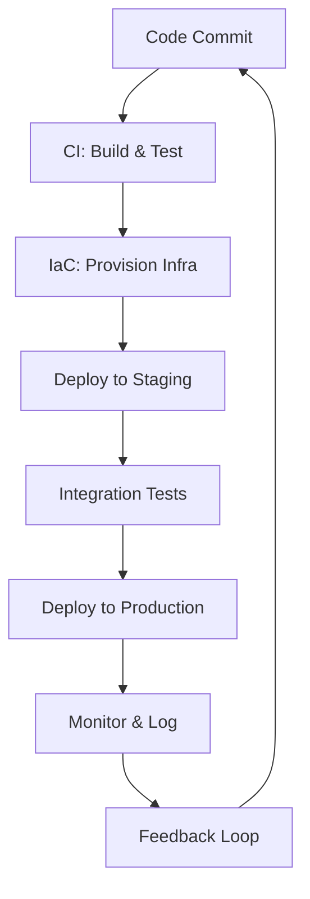

# DevOps & Infrastructure as Code

## Overview

DevOps and Infrastructure as Code (IaC) represent a paradigm shift in software development and IT operations. DevOps integrates development and operations teams to accelerate delivery, while IaC automates infrastructure provisioning through code. Together, they enable organizations to build, test, and deploy applications faster, more reliably, and at scale, fostering a culture of continuous improvement and collaboration.

## Detailed Explanation

### DevOps Principles

DevOps is a cultural and technical approach that bridges the gap between software development (Dev) and IT operations (Ops). It emphasizes automation, collaboration, and rapid iteration to deliver high-quality software.

Key principles include:
- **Collaboration**: Breaking down silos between teams for shared ownership.
- **Automation**: Streamlining processes like testing, deployment, and monitoring.
- **Continuous Integration/Continuous Delivery (CI/CD)**: Frequent code integration and automated releases.
- **Monitoring and Feedback**: Real-time insights into system performance.

### Infrastructure as Code (IaC)

IaC treats infrastructure as software, defining resources in code files that can be versioned, tested, and reused. This approach ensures consistency, reduces errors, and enables scalable infrastructure management.

Approaches:
- **Declarative**: Specify desired state (e.g., Terraform, CloudFormation).
- **Imperative**: Define step-by-step actions (e.g., Ansible, Puppet).

Benefits:
- Version control for infrastructure changes.
- Reproducible environments across dev, staging, and production.
- Faster provisioning and disaster recovery.

### Integration of DevOps and IaC

IaC is a core DevOps practice, enabling automated infrastructure changes within CI/CD pipelines. This integration supports microservices, cloud-native architectures, and agile methodologies.



## Real-world Examples & Use Cases

- **Cloud Infrastructure Provisioning**: Automating AWS EC2 instances and RDS databases using Terraform for scalable web applications.
- **Server Configuration Management**: Standardizing server setups across fleets with Ansible playbooks for consistent security and performance.
- **CI/CD Pipelines**: Integrating IaC into GitHub Actions to deploy containerized apps on Kubernetes, ensuring zero-downtime updates.
- **Multi-Cloud Deployments**: Managing hybrid environments with Terraform modules for cost optimization and vendor lock-in avoidance.
- **Compliance Automation**: Enforcing security policies via IaC scripts in regulated industries like finance and healthcare.
- **Disaster Recovery**: Rapidly recreating infrastructure from code during outages, minimizing downtime.

## Code Examples

### Terraform for AWS VPC and EC2

```hcl
provider "aws" {
  region = "us-east-1"
}

resource "aws_vpc" "main" {
  cidr_block = "10.0.0.0/16"
}

resource "aws_subnet" "public" {
  vpc_id     = aws_vpc.main.id
  cidr_block = "10.0.1.0/24"
}

resource "aws_instance" "web" {
  ami           = "ami-0c55b159cbfafe1d0"
  instance_type = "t2.micro"
  subnet_id     = aws_subnet.public.id

  tags = {
    Name = "WebServer"
  }
}
```

### Ansible Playbook for Nginx Installation

```yaml
---
- name: Install and configure Nginx
  hosts: webservers
  become: yes

  tasks:
    - name: Update apt cache
      apt:
        update_cache: yes

    - name: Install Nginx
      apt:
        name: nginx
        state: present

    - name: Start Nginx service
      service:
        name: nginx
        state: started
        enabled: yes

    - name: Copy custom config
      template:
        src: nginx.conf.j2
        dest: /etc/nginx/nginx.conf
      notify: Reload Nginx

  handlers:
    - name: Reload Nginx
      service:
        name: nginx
        state: reloaded
```

### CloudFormation Template for S3 Bucket

```yaml
AWSTemplateFormatVersion: '2010-09-09'
Description: 'S3 Bucket with versioning'

Resources:
  MyBucket:
    Type: 'AWS::S3::Bucket'
    Properties:
      BucketName: my-unique-bucket-name
      VersioningConfiguration:
        Status: Enabled

Outputs:
  BucketName:
    Value: !Ref MyBucket
    Description: Name of the S3 bucket
```

### Puppet Manifest for Apache

```puppet
class apache {
  package { 'apache2':
    ensure => installed,
  }

  service { 'apache2':
    ensure  => running,
    enable  => true,
    require => Package['apache2'],
  }

  file { '/var/www/html/index.html':
    ensure  => file,
    content => '<h1>Hello from Puppet!</h1>',
    require => Package['apache2'],
  }
}

include apache
```

## STAR Summary

**Situation**: Traditional siloed teams caused slow releases and frequent errors in infrastructure changes.  
**Task**: Implement DevOps and IaC to automate and integrate processes.  
**Action**: Adopted Terraform for declarative infrastructure, Ansible for configuration, and CI/CD pipelines for automated deployments.  
**Result**: Reduced deployment time by 70%, improved reliability, and enabled rapid scaling for a e-commerce platform handling millions of requests.

## Common Pitfalls & Edge Cases

- **State Drift**: Infrastructure deviates from code; mitigate with regular `terraform plan` checks.
- **Secret Management**: Avoid hardcoding credentials; use tools like HashiCorp Vault.
- **Version Conflicts**: Pin tool versions to prevent inconsistencies across environments.
- **Over-Automation Without Testing**: Ensure comprehensive testing before full automation.
- **Cultural Resistance**: Address through training and demonstrating quick wins.
- **Scalability Limits**: For large infrastructures, use modular IaC and parallel executions.
- **Edge Case: Immutable Infrastructure**: Treat servers as disposable; rebuild instead of patching for consistency.

## Tools & Libraries

| Category | Tool | Description | Key Features |
|----------|------|-------------|--------------|
| IaC Declarative | Terraform | Open-source tool for multi-cloud infrastructure | State management, modules, providers |
| IaC Imperative | Ansible | Agentless automation for configuration | Playbooks, roles, idempotent tasks |
| IaC Declarative | CloudFormation | AWS-native IaC service | Templates, stacks, change sets |
| IaC Imperative | Puppet | Configuration management with DSL | Manifests, agents, reporting |
| CI/CD | Jenkins | Extensible automation server | Pipelines, plugins, distributed builds |
| CI/CD | GitHub Actions | GitHub-integrated CI/CD | Workflows, runners, marketplace |
| Monitoring | Prometheus | Metrics collection and alerting | Time-series DB, exporters, Grafana integration |
| Version Control | Git | Distributed version control | Branching, merging, GitOps workflows |

## References

- [What is DevOps? - AWS](https://aws.amazon.com/devops/what-is-devops/)
- [Terraform Documentation](https://www.terraform.io/docs)
- [Ansible Documentation](https://docs.ansible.com/)
- [Infrastructure as Code - AWS](https://aws.amazon.com/devops/infrastructure-as-code/)
- [DevOps Practices - Microsoft](https://learn.microsoft.com/en-us/devops/develop/what-is-devops)
- [IaC Best Practices - HashiCorp](https://www.hashicorp.com/resources/what-is-infrastructure-as-code)

## Github-README Links & Related Topics

- [CI/CD Pipelines](../ci-cd-pipelines/)
- [Infrastructure as Code with Terraform](../infrastructure-as-code-with-terraform/)
- [Docker Containerization](../docker-containerization/)
- [Kubernetes Orchestration](../container-orchestration/)
- [Configuration Management](../configuration-management/)
- [Cloud Deployment Strategies](../cloud-deployment-strategies/)