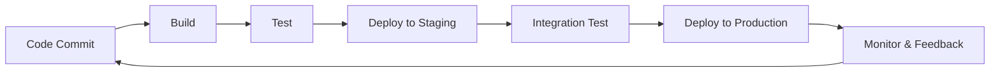

# DevOps & Infrastructure as Code

## Overview

DevOps combines development and operations to improve collaboration and automate processes. Infrastructure as Code (IaC) treats infrastructure provisioning as software code, enabling version control, testing, and automation.

## Detailed Explanation

### DevOps Principles

DevOps is a cultural and technical movement that emphasizes collaboration between software development (Dev) and IT operations (Ops) teams. It aims to shorten the development lifecycle and provide continuous delivery of high-quality software.

- **Culture**: Fosters collaboration, shared responsibility, and breaking down silos between dev and ops.
- **Automation**: Automates manual processes like testing, deployment, and monitoring to reduce errors and speed up releases.
- **Measurement**: Uses metrics and monitoring to gain insights into performance and reliability.
- **Sharing**: Encourages shared tools, practices, and knowledge across teams.

### Infrastructure as Code (IaC)

IaC treats infrastructure provisioning and management as software development practices. Infrastructure is defined in code files, versioned, tested, and automated.

- **Declarative Approach**: Specify the desired end state (e.g., Terraform, CloudFormation). The tool figures out how to achieve it.
- **Imperative Approach**: Provide step-by-step instructions on how to achieve the state (e.g., Ansible, Puppet).

Benefits include consistency across environments, repeatability, version control, reduced manual errors, and faster provisioning.

### DevOps Pipeline

A typical DevOps pipeline includes stages like code commit, build, test, deploy, and monitor.



## Real-world Examples & Use Cases

- **Cloud Deployment**: Provisioning scalable infrastructure on AWS, Azure, or GCP using Terraform to manage EC2 instances, load balancers, and databases.
- **Configuration Management**: Automating server setup and application deployment with Ansible playbooks for consistent environments across dev, staging, and production.
- **CI/CD Pipelines**: Using Jenkins or GitHub Actions to automate building, testing, and deploying applications, ensuring rapid and reliable releases.
- **Microservices Orchestration**: Managing containerized applications with Kubernetes IaC definitions for automated scaling and rolling updates.
- **Multi-Cloud Strategy**: Using IaC to abstract cloud-specific resources, enabling easy migration or hybrid deployments.

## Code Examples

### Terraform for AWS EC2 Instance

```hcl
provider "aws" {
  region = "us-east-1"
}

resource "aws_instance" "web_server" {
  ami           = "ami-0c55b159cbfafe1d0"
  instance_type = "t2.micro"

  tags = {
    Name = "WebServer"
  }
}

resource "aws_security_group" "web_sg" {
  name_prefix = "web-sg-"

  ingress {
    from_port   = 80
    to_port     = 80
    protocol    = "tcp"
    cidr_blocks = ["0.0.0.0/0"]
  }

  egress {
    from_port   = 0
    to_port     = 0
    protocol    = "-1"
    cidr_blocks = ["0.0.0.0/0"]
  }
}
```

### Ansible Playbook for Web Server Setup

```yaml
---
- name: Setup web servers
  hosts: webservers
  become: yes

  tasks:
    - name: Update package cache
      apt:
        update_cache: yes

    - name: Install nginx
      apt:
        name: nginx
        state: present

    - name: Start nginx service
      service:
        name: nginx
        state: started
        enabled: yes

    - name: Copy index.html
      copy:
        src: index.html
        dest: /var/www/html/index.html
```

### GitHub Actions CI/CD Pipeline

```yaml
name: CI/CD Pipeline

on:
  push:
    branches: [ main ]

jobs:
  build:
    runs-on: ubuntu-latest

    steps:
    - uses: actions/checkout@v2
    - name: Set up JDK 11
      uses: actions/setup-java@v1
      with:
        java-version: 11
    - name: Build with Maven
      run: mvn clean install
    - name: Run tests
      run: mvn test
```

## Common Pitfalls & Edge Cases

- **State Drift**: Manual changes to infrastructure not reflected in code; use drift detection tools.
- **Version Conflicts**: Inconsistent tool versions across environments; pin versions in IaC.
- **Security Oversights**: Hardcoded secrets in code; use secret management tools like Vault.
- **Over-Automation**: Automating without proper testing; ensure rollback strategies.
- **Cultural Resistance**: Teams not adopting DevOps practices; focus on training and gradual adoption.
- **Scalability Issues**: IaC scripts not optimized for large infrastructures; modularize and use loops.

## Journey / Sequence

1. **Planning**: Define infrastructure requirements and choose IaC tools.
2. **Coding**: Write IaC scripts and commit to version control.
3. **Testing**: Validate scripts in staging environments.
4. **Deployment**: Apply changes to production with automated pipelines.
5. **Monitoring**: Continuously monitor infrastructure and gather feedback.
6. **Iteration**: Update code based on learnings and redeploy.

## Data Models / Message Formats

### IaC Configuration JSON

```json
{
  "infrastructure": {
    "provider": "aws",
    "region": "us-east-1",
    "resources": [
      {
        "type": "ec2",
        "ami": "ami-123456",
        "instance_type": "t2.micro"
      }
    ]
  }
}
```

## Tools & Libraries

- **IaC Tools**: Terraform, Ansible, Puppet, CloudFormation.
- **CI/CD**: Jenkins, GitHub Actions, GitLab CI, CircleCI.
- **Monitoring**: Prometheus, Grafana, ELK Stack.
- **Version Control**: Git, with branching strategies like GitFlow.
- **Containerization**: Docker, Kubernetes for orchestration.

## References

- [DevOps Guide](https://aws.amazon.com/devops/what-is-devops/)
- [Terraform Docs](https://www.terraform.io/docs)
- [Ansible Docs](https://docs.ansible.com/)

## Github-README Links & Related Topics

- [CI/CD Pipelines](../ci-cd-pipelines/)
- [Infrastructure as Code with Terraform](../infrastructure-as-code-with-terraform/)
- [Docker Containerization](../docker-containerization/)
- [Kubernetes Orchestration](../container-orchestration/)