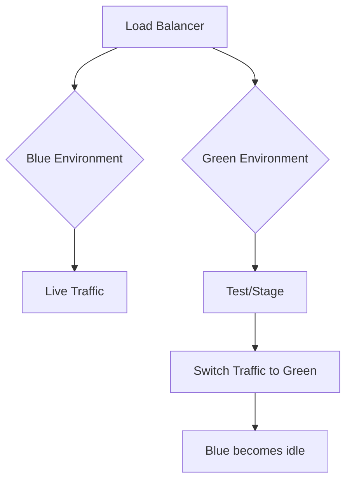

# Blue-Green Deployment

## Overview

Blue-Green Deployment is a release strategy that reduces downtime and risk by running two identical production environments. One (blue) serves live traffic while the other (green) is updated and tested.

## Detailed Explanation

### How It Works

1. **Blue Environment**: Current production version.
2. **Green Environment**: New version deployed and tested.
3. **Traffic Switch**: Route traffic from blue to green instantly.
4. **Rollback**: Switch back if issues arise.

### Benefits

- **Zero Downtime**: Seamless transitions.
- **Instant Rollback**: Quick recovery.
- **Testing**: Validate in production-like environment.

### Challenges

- **Cost**: Double resources.
- **Data Synchronization**: Ensure data consistency.



## Real-world Examples & Use Cases

- **Web Applications**: E-commerce sites during peak seasons.
- **APIs**: Microservices deployments.
- **Cloud Platforms**: AWS, GCP support blue-green.

## Code Examples

### Kubernetes Blue-Green Deployment

```yaml
# Blue deployment
apiVersion: apps/v1
kind: Deployment
metadata:
  name: app-blue
spec:
  replicas: 3
  selector:
    matchLabels:
      app: myapp
      version: blue
  template:
    metadata:
      labels:
        app: myapp
        version: blue
    spec:
      containers:
      - name: app
        image: myapp:v1

# Green deployment
apiVersion: apps/v1
kind: Deployment
metadata:
  name: app-green
spec:
  replicas: 3
  selector:
    matchLabels:
      app: myapp
      version: green
  template:
    metadata:
      labels:
        app: myapp
        version: green
    spec:
      containers:
      - name: app
        image: myapp:v2

# Service
apiVersion: v1
kind: Service
metadata:
  name: myapp-service
spec:
  selector:
    app: myapp
    version: blue  # Switch to green when ready
  ports:
  - port: 80
```

## Common Pitfalls & Edge Cases

- **Data Migration**: Handle schema changes.
- **Session Affinity**: Manage user sessions.
- **Monitoring**: Ensure green is healthy before switch.

## Tools & Libraries

- Kubernetes
- AWS CodeDeploy
- Docker Compose

## References

- [Blue-Green Deployment AWS](https://aws.amazon.com/devops/blue-green/)
- [Kubernetes Rolling Updates](https://kubernetes.io/docs/concepts/workloads/controllers/deployment/#rolling-update-deployment)

## Github-README Links & Related Topics

- [CI/CD Pipelines](../ci-cd-pipelines/README.md)
- [Canary Deployment](../canary-deployment/README.md)
- [DevOps Infrastructure as Code](../devops-infrastructure-as-code/README.md)