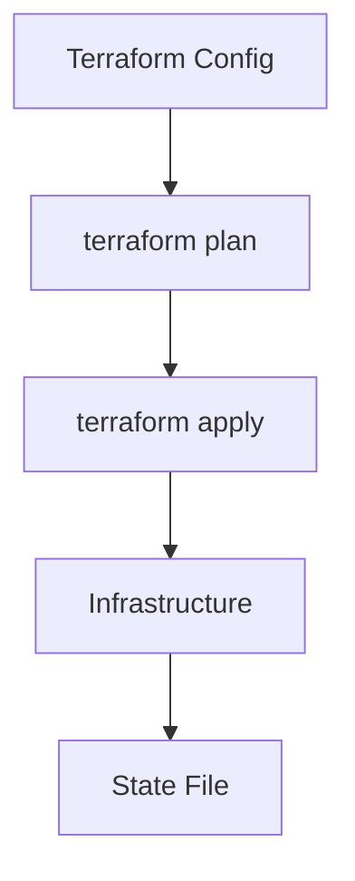

# Overview

Terraform is an open-source tool for provisioning and managing infrastructure as code, supporting multiple cloud providers with declarative configuration.

# Detailed Explanation

Uses HCL (HashiCorp Configuration Language) to define resources. Workflow: Write config, plan, apply. Manages state for tracking changes.

Key concepts: Providers, Resources, Modules, State.



# Real-world Examples & Use Cases

- Provisioning AWS EC2 instances and VPCs.
- Managing Kubernetes clusters on GCP.
- Version-controlled infrastructure changes.

# Code Examples

Basic Terraform config:

```hcl
provider "aws" {
  region = "us-east-1"
}

resource "aws_instance" "example" {
  ami           = "ami-0c55b159cbfafe1d0"
  instance_type = "t2.micro"
}
```

Run commands:

```bash
terraform init
terraform plan
terraform apply
```

# References

- [Terraform Documentation](https://www.terraform.io/docs/)
- [Terraform AWS Provider](https://registry.terraform.io/providers/hashicorp/aws/latest)

# Github-README Links & Related Topics

- [devops-and-infrastructure-as-code/](devops-and-infrastructure-as-code/)
- [ci-cd-pipelines/](ci-cd-pipelines/)
- [cloud-deployment-strategies/](cloud-deployment-strategies/)

# STAR Summary

- **Situation**: Manual infrastructure setup leading to inconsistencies.
- **Task**: Automate and version infrastructure.
- **Action**: Adopt Terraform for declarative IaC.
- **Result**: Faster, reliable deployments with version control.

# Journey / Sequence

1. Install Terraform CLI.
2. Write HCL configurations.
3. Initialize with `terraform init`.
4. Plan changes with `terraform plan`.
5. Apply with `terraform apply`.
6. Manage state and collaborate.

# Common Pitfalls & Edge Cases

- **State File Management**: Avoid manual edits; use remote state.
- **Provider Version Conflicts**: Pin versions to prevent breaking changes.
- **Large State Files**: Use workspaces or modules for isolation.

# Tools & Libraries

- **Terraform CLI**: Core tool for execution.
- **Terragrunt**: Wrapper for DRY configurations.
- **Terraform Cloud**: Remote execution and collaboration.