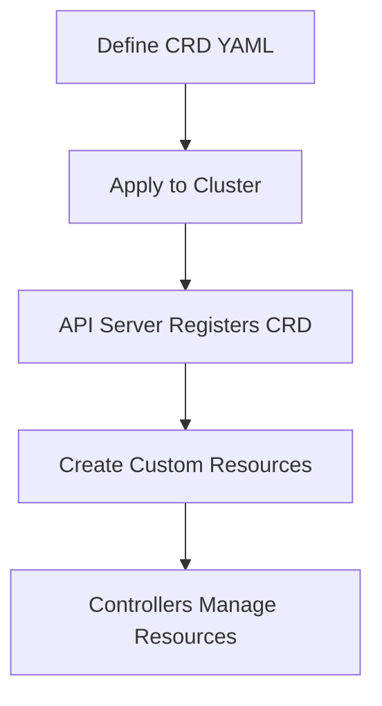
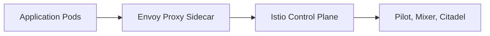

# Overview

Kubernetes Advanced Concepts delve into sophisticated features and patterns that extend the core functionality of Kubernetes (K8s). These include Custom Resource Definitions (CRDs), Operators, Helm charts for package management, service meshes like Istio, advanced networking with Network Policies, Role-Based Access Control (RBAC), and more. Mastering these concepts enables building resilient, scalable, and automated containerized applications in production environments.

# Detailed Explanation

## Custom Resource Definitions (CRDs)

CRDs allow you to extend the Kubernetes API by defining custom resources. They enable the creation of new API endpoints that behave like built-in resources.

### CRD Lifecycle



## Operators

Operators are Kubernetes-native applications that automate complex, stateful application management. They use CRDs and controllers to handle tasks like deployment, scaling, and backups.

### Operator Pattern

- **Custom Controller**: Watches for changes in custom resources and reconciles the desired state.
- **CRD**: Defines the schema for the custom resource.

## Helm Charts

Helm is a package manager for Kubernetes that simplifies deploying and managing applications using charts (pre-configured Kubernetes resources).

### Chart Structure

```
mychart/
├── Chart.yaml
├── values.yaml
├── templates/
│   ├── deployment.yaml
│   ├── service.yaml
│   └── _helpers.tpl
```

## Service Mesh with Istio

Istio provides a service mesh layer for microservices, offering traffic management, security, and observability.

### Istio Architecture



## Network Policies

Network Policies define rules for pod-to-pod communication, enhancing security by controlling ingress and egress traffic.

## Role-Based Access Control (RBAC)

RBAC regulates access to Kubernetes resources based on roles and bindings.

# Real-world Examples & Use Cases

- **Database Operator**: Automate PostgreSQL cluster management with tools like Zalando's Postgres Operator.
- **CI/CD Pipelines**: Use Helm for deploying applications in Jenkins or GitLab CI.
- **Microservices Security**: Implement Istio for mutual TLS and traffic encryption in a e-commerce platform.
- **Multi-tenant Clusters**: Leverage RBAC and Network Policies to isolate namespaces for different teams.

# Code Examples

## Sample CRD YAML

```yaml
apiVersion: apiextensions.k8s.io/v1
kind: CustomResourceDefinition
metadata:
  name: myapps.example.com
spec:
  group: example.com
  versions:
  - name: v1
    served: true
    storage: true
    schema:
      openAPIV3Schema:
        type: object
        properties:
          spec:
            type: object
            properties:
              replicas:
                type: integer
  scope: Namespaced
  names:
    plural: myapps
    singular: myapp
    kind: MyApp
```

## Helm Chart values.yaml

```yaml
replicaCount: 3
image:
  repository: nginx
  tag: "latest"
service:
  type: ClusterIP
  port: 80
```

## Network Policy Example

```yaml
apiVersion: networking.k8s.io/v1
kind: NetworkPolicy
metadata:
  name: allow-frontend
spec:
  podSelector:
    matchLabels:
      app: frontend
  policyTypes:
  - Ingress
  ingress:
  - from:
    - podSelector:
        matchLabels:
          app: backend
    ports:
    - protocol: TCP
      port: 80
```

# Common Pitfalls & Edge Cases

- **CRD Versioning**: Handle API version changes carefully to avoid breaking existing resources.
- **Operator Reconciliation Loops**: Ensure controllers handle failures gracefully to prevent infinite loops.
- **Helm Chart Dependencies**: Manage chart versions and dependencies to avoid conflicts.
- **Istio Sidecar Injection**: Be aware of resource overhead and compatibility with existing applications.

# Tools & Libraries

- **kubectl**: Command-line tool for interacting with Kubernetes clusters.
- **Helm**: Package manager for Kubernetes.
- **Istio**: Service mesh for microservices.
- **Kustomize**: Configuration management tool for Kubernetes.

# References

- [Kubernetes Documentation](https://kubernetes.io/docs/)
- [Custom Resources](https://kubernetes.io/docs/concepts/extend-kubernetes/api-extension/custom-resources/)
- [Operators](https://kubernetes.io/docs/concepts/extend-kubernetes/operator/)
- [Helm Charts](https://helm.sh/docs/)
- [Istio Service Mesh](https://istio.io/)

# Github-README Links & Related Topics

- [Kubernetes Basics](../kubernetes-basics/)
- [Microservices Architecture](../microservices-architecture/)
- [Service Mesh Patterns](../service-mesh-patterns/)
- [Infrastructure as Code with Terraform](../infrastructure-as-code-with-terraform/)