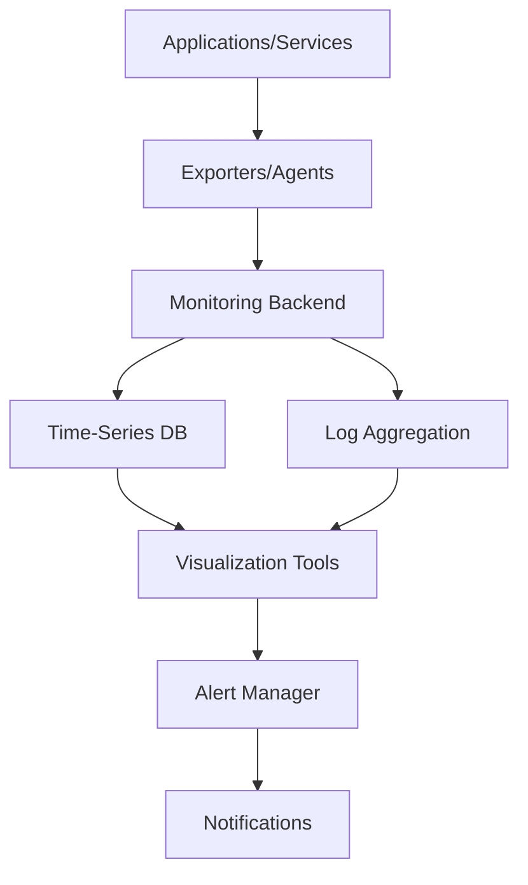

# Monitoring Tools

## Overview

Monitoring tools are essential for observing, analyzing, and maintaining the health and performance of systems, applications, and infrastructure. They provide real-time insights into metrics, logs, and traces to detect issues, optimize performance, and ensure reliability in distributed systems.

## Detailed Explanation

Monitoring encompasses three main pillars:

- **Metrics**: Quantitative measurements (e.g., CPU usage, response times)
- **Logs**: Structured or unstructured records of events
- **Traces**: End-to-end request tracking across services

### Key Components

- **Data Collection**: Agents or exporters gather data from sources
- **Storage**: Time-series databases store metrics and logs
- **Visualization**: Dashboards for real-time monitoring
- **Alerting**: Notifications for anomalies or thresholds
- **Analysis**: Tools for querying and correlating data

### Architecture Diagram



## Real-world Examples & Use Cases

1. **E-commerce Platform**: Monitor transaction rates, error rates, and user experience metrics
2. **Cloud Infrastructure**: Track resource utilization across VMs and containers
3. **Microservices**: Distributed tracing for request flows and latency analysis
4. **DevOps Pipelines**: Monitor CI/CD performance and deployment success rates

| Tool Category | Example Tools | Use Case |
|---------------|---------------|----------|
| Metrics | Prometheus, Datadog | System and application metrics |
| Logs | ELK Stack, Splunk | Centralized logging and analysis |
| Traces | Jaeger, Zipkin | Distributed tracing |
| APM | New Relic, AppDynamics | Application performance monitoring |

## Code Examples

### Prometheus Configuration

```yaml
global:
  scrape_interval: 15s

scrape_configs:
  - job_name: 'myapp'
    static_configs:
      - targets: ['localhost:8080']
    metrics_path: '/actuator/prometheus'
```

### Grafana Dashboard Query

```sql
rate(http_requests_total[5m])
```

### ELK Logstash Configuration

```ruby
input {
  file {
    path => "/var/log/myapp/*.log"
    start_position => "beginning"
  }
}

filter {
  grok {
    match => { "message" => "%{TIMESTAMP_ISO8601:timestamp} %{LOGLEVEL:level} %{DATA:message}" }
  }
}

output {
  elasticsearch {
    hosts => ["localhost:9200"]
  }
}
```

## Common Pitfalls & Edge Cases

- **Alert Fatigue**: Too many alerts leading to ignored notifications
- **Data Overload**: Collecting excessive metrics impacting performance
- **Security**: Protecting sensitive monitoring data
- **Distributed Tracing Overhead**: Performance impact in high-throughput systems

## Tools & Libraries

- **Prometheus**: Open-source monitoring and alerting toolkit
- **Grafana**: Visualization and analytics platform
- **ELK Stack**: Elasticsearch, Logstash, Kibana for log analysis
- **Jaeger**: Distributed tracing system
- **Datadog**: Cloud-based monitoring platform
- **New Relic**: Application performance monitoring

## References

- [Prometheus Documentation](https://prometheus.io/docs/)
- [Grafana Guides](https://grafana.com/docs/)
- [ELK Stack](https://www.elastic.co/elastic-stack)
- [CNCF Observability Landscape](https://landscape.cncf.io/card-mode?category=observability-and-analysis)

## Github-README Links & Related Topics

- [Monitoring and Logging](monitoring-and-logging/README.md)
- [Distributed Tracing](distributed-tracing/README.md)
- [DevOps Infrastructure as Code](devops-infrastructure-as-code/README.md)
- [Performance Optimization Techniques](performance-optimization-techniques/README.md)