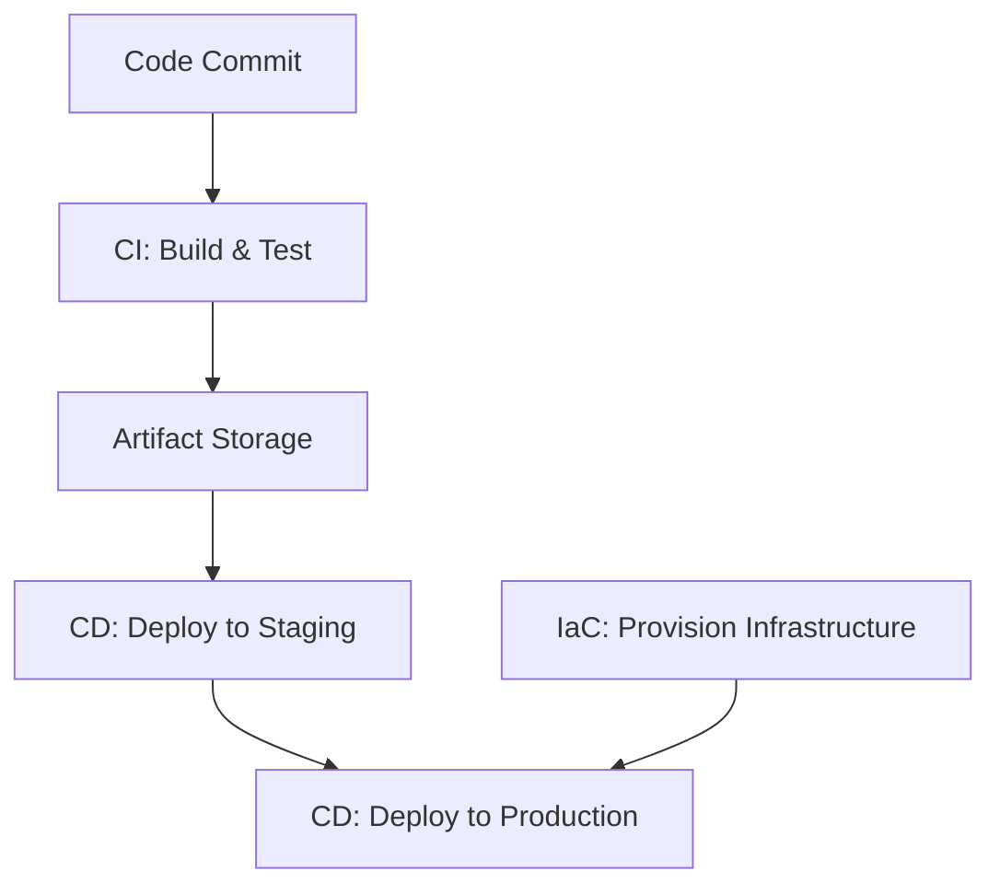

# DevOps & Infrastructure as Code

## Overview

DevOps integrates software development (Dev) and IT operations (Ops) to shorten the development lifecycle and provide continuous delivery. Infrastructure as Code (IaC) manages and provisions infrastructure through machine-readable definition files, rather than physical hardware configuration or interactive configuration tools.

## Detailed Explanation

### Continuous Integration and Continuous Deployment (CI/CD)

CI/CD automates the process of integrating code changes, testing them, and deploying to production.

- **Continuous Integration (CI)**: Developers frequently merge code changes into a central repository. Automated builds and tests run to detect issues early.
- **Continuous Deployment (CD)**: Automated release of software to production after passing tests.

Popular tools: Jenkins, GitHub Actions, GitLab CI/CD, CircleCI.

### Infrastructure as Code (IaC)

IaC allows infrastructure to be versioned, tested, and deployed like software.

- **Declarative vs. Imperative**: Declarative defines the desired state; imperative defines steps.
- **Tools**: Terraform (declarative), Ansible (imperative), Puppet, Chef.

Benefits: Consistency, repeatability, scalability, disaster recovery.



## Real-world Examples & Use Cases

- **Netflix**: Uses Spinnaker for multi-cloud CD pipelines.
- **Amazon**: Employs IaC for managing vast AWS infrastructure.
- **Spotify**: CI/CD for rapid feature releases.

Use cases: Auto-scaling web applications, multi-environment deployments (dev, staging, prod).

## Code Examples

### Terraform (IaC)

```hcl
# main.tf
provider "aws" {
  region = "us-east-1"
}

resource "aws_instance" "web" {
  ami           = "ami-0c55b159cbfafe1d0"
  instance_type = "t2.micro"

  tags = {
    Name = "WebServer"
  }
}
```

### Ansible Playbook (IaC)

```yaml
---
- name: Provision web server
  hosts: webservers
  become: yes
  tasks:
  - name: Install nginx
    apt:
      name: nginx
      state: present
  - name: Start nginx
    service:
      name: nginx
      state: started
```

### GitHub Actions (CI/CD)

```yaml
# .github/workflows/ci.yml
name: CI
on: [push]
jobs:
  build:
    runs-on: ubuntu-latest
    steps:
    - uses: actions/checkout@v2
    - name: Run tests
      run: npm test
```

## References

- [DevOps Handbook](https://itrevolution.com/book/the-devops-handbook/)
- [Terraform Documentation](https://www.terraform.io/docs)
- [Ansible Documentation](https://docs.ansible.com/ansible/latest/index.html)
- [Jenkins User Handbook](https://www.jenkins.io/doc/book/)

## Github-README Links & Related Topics

- [Load Balancing and Routing](load-balancing-and-routing/README.md)
- [Monitoring and Logging](logging-and-monitoring/README.md)
- [Container Orchestration K8s](container-orchestration-k8s/README.md)