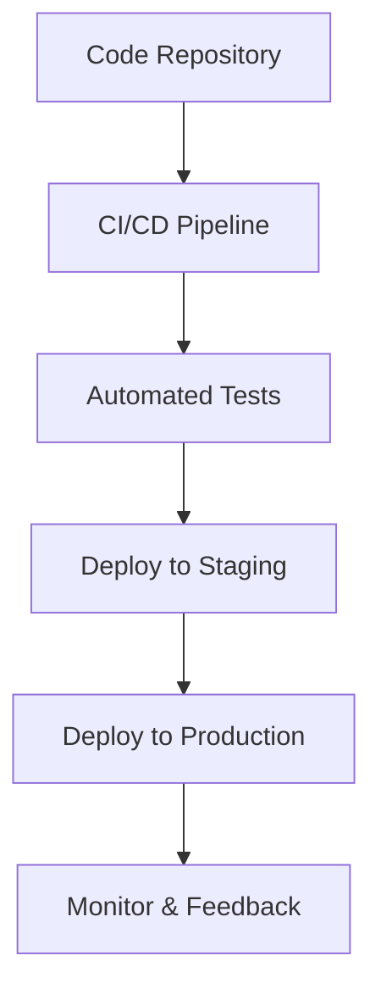

## Overview

DevOps combines development and operations to improve software delivery speed and quality. Infrastructure as Code (IaC) treats infrastructure provisioning as software code, enabling version control, testing, and automation. Together, they enable continuous integration/continuous deployment (CI/CD), automated testing, and scalable infrastructure management.

## Detailed Explanation

### DevOps Principles

- **Collaboration**: Breaks silos between dev and ops teams.
- **Automation**: Automates builds, tests, deployments.
- **Monitoring**: Continuous feedback via metrics and logs.
- **Culture**: Shared responsibility for reliability.

### Infrastructure as Code

IaC defines infrastructure (servers, networks, databases) in code files, deployed via tools like Terraform or CloudFormation.

Benefits:
- **Version Control**: Track changes like code.
- **Reproducibility**: Consistent environments.
- **Scalability**: Easy replication and scaling.



## Real-world Examples & Use Cases

- **Cloud Migration**: IaC provisions AWS/Azure resources for app migration.
- **Microservices Deployment**: DevOps pipelines deploy services with Kubernetes IaC.
- **Compliance**: IaC ensures security policies in regulated industries.
- **Disaster Recovery**: Rebuild infrastructure from code.

## Code Examples

### Terraform IaC

```hcl
resource "aws_instance" "web" {
  ami           = "ami-12345678"
  instance_type = "t2.micro"

  tags = {
    Name = "WebServer"
  }
}
```

### Ansible Playbook

```yaml
---
- hosts: webservers
  tasks:
    - name: Install Apache
      apt:
        name: apache2
        state: present
```

## STAR Summary

- **Situation**: Manual deployments caused downtime.
- **Task**: Automate infrastructure and deployments.
- **Action**: Adopted IaC with Terraform and CI/CD.
- **Result**: 90% faster deployments, zero downtime.

## Journey / Sequence

1. Assess current processes.
2. Choose IaC tools (Terraform, Ansible).
3. Write infrastructure code.
4. Integrate with CI/CD.
5. Test and deploy incrementally.

## Data Models / Message Formats

IaC uses declarative formats like JSON/YAML for resource definitions.

## Common Pitfalls & Edge Cases

- **State Drift**: Manual changes not in code.
- **Security**: Secrets in code; use vaults.
- **Complexity**: Over-engineering simple setups.

## Tools & Libraries

| Tool | Purpose | Example |
|------|---------|---------|
| Terraform | IaC | AWS provisioning |
| Ansible | Configuration | Server setup |
| Jenkins | CI/CD | Pipelines |
| Docker | Containerization | App packaging |

## References

- [DevOps Guide](https://aws.amazon.com/devops/what-is-devops/)
- [Terraform Docs](https://www.terraform.io/docs)
- [Ansible Docs](https://docs.ansible.com/)

## Github-README Links & Related Topics

- [CI/CD Pipelines](./ci-cd-pipelines/)
- [Container Orchestration](./container-orchestration/)
- [Monitoring and Logging](./monitoring-and-logging/)