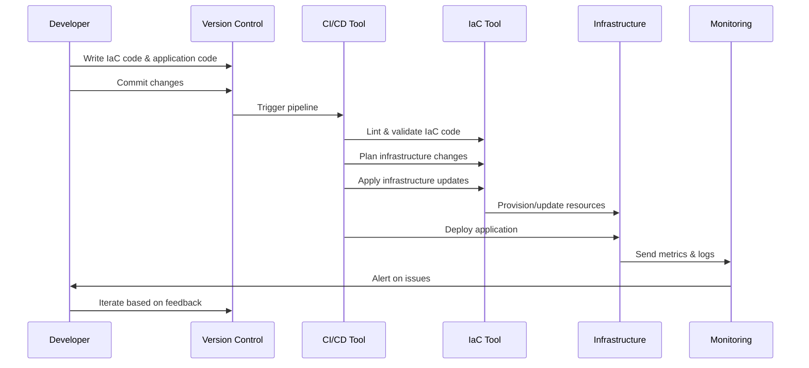

## Overview

DevOps combines software development (Dev) and IT operations (Ops) to shorten the development lifecycle and provide continuous delivery with high software quality. Infrastructure as Code (IaC) treats infrastructure provisioning and management as software development practices, enabling automated, version-controlled, and repeatable deployments.

## Detailed Explanation

### DevOps Core Principles

DevOps emphasizes collaboration, automation, and monitoring throughout the software lifecycle.

| Principle | Description | Benefits |
|-----------|-------------|----------|
| Culture | Fosters collaboration between development, operations, and other stakeholders | Reduces silos, improves communication |
| Automation | Automates repetitive tasks like builds, tests, and deployments | Increases speed, reduces errors |
| Measurement | Uses metrics to monitor and improve processes | Data-driven decisions, continuous improvement |
| Sharing | Shares tools, knowledge, and responsibilities | Builds trust, accelerates learning |

### Infrastructure as Code (IaC)

IaC manages and provisions infrastructure through machine-readable definition files, rather than physical hardware configuration or interactive configuration tools.

#### Declarative vs. Imperative Approaches

- **Declarative**: Specify the desired end state (e.g., Terraform, CloudFormation)
- **Imperative**: Define step-by-step commands to achieve the state (e.g., Ansible, Puppet)

#### Key Benefits

- **Consistency**: Eliminates configuration drift
- **Scalability**: Easily replicate environments
- **Version Control**: Track changes like code
- **Testing**: Validate infrastructure changes
- **Disaster Recovery**: Quickly rebuild infrastructure

### CI/CD Pipelines

Continuous Integration (CI) and Continuous Deployment/Delivery (CD) automate the process of integrating code changes and deploying applications.

```mermaid
graph TD
    A[Developer Commits Code] --> B[CI: Build & Unit Tests]
    B --> C[CI: Integration Tests]
    C --> D{CD: Deploy to Staging]
    D --> E{CD: Automated Tests in Staging]
    E --> F{CD: Deploy to Production]
    F --> G[Monitor & Feedback]
```

## STAR Summary

**Situation:** A fintech startup faced frequent deployment failures and inconsistent environments due to manual server provisioning and configuration.  
**Task:** Implement DevOps practices and IaC to standardize infrastructure management and automate deployments.  
**Action:** Introduced Terraform for cloud resource provisioning, Ansible for configuration management, and GitHub Actions for CI/CD pipelines. Established monitoring with Prometheus and Grafana.  
**Result:** Deployment time reduced by 75%, environment consistency improved, and incident response time decreased by 60%.

## Journey / Sequence

The DevOps and IaC implementation follows a phased approach:



## Real-world Examples & Use Cases

### Multi-Cloud Deployment with Terraform

Managing resources across AWS and Azure for high availability:

```hcl
# main.tf
terraform {
  required_providers {
    aws = {
      source  = "hashicorp/aws"
      version = "~> 4.0"
    }
    azurerm = {
      source  = "hashicorp/azurerm"
      version = "~> 3.0"
    }
  }
}

provider "aws" {
  region = "us-east-1"
}

provider "azurerm" {
  features {}
}

resource "aws_instance" "web" {
  ami           = "ami-0c55b159cbfafe1d0"
  instance_type = "t2.micro"
  tags = {
    Name = "WebServer-AWS"
  }
}

resource "azurerm_linux_virtual_machine" "web" {
  name                = "WebServer-Azure"
  resource_group_name = azurerm_resource_group.example.name
  location            = "East US"
  size                = "Standard_B1s"
  # ... additional configuration
}
```

### Configuration Management with Ansible

Automating server hardening and application deployment:

```yaml
# playbook.yml
---
- name: Configure production servers
  hosts: production
  become: yes
  vars:
    nginx_version: "1.20.1"
  
  tasks:
    - name: Update package cache
      apt:
        update_cache: yes
      when: ansible_os_family == "Debian"
    
    - name: Install required packages
      package:
        name: "{{ item }}"
        state: present
      loop:
        - nginx={{ nginx_version }}
        - curl
        - git
    
    - name: Configure nginx
      template:
        src: nginx.conf.j2
        dest: /etc/nginx/nginx.conf
      notify: restart nginx
    
    - name: Deploy application
      git:
        repo: https://github.com/example/app.git
        dest: /var/www/app
        version: main
    
  handlers:
    - name: restart nginx
      service:
        name: nginx
        state: restarted
```

### GitHub Actions CI/CD Pipeline

Automating testing and deployment for a Node.js application:

```yaml
# .github/workflows/ci-cd.yml
name: CI/CD Pipeline

on:
  push:
    branches: [ main ]
  pull_request:
    branches: [ main ]

jobs:
  test:
    runs-on: ubuntu-latest
    steps:
    - uses: actions/checkout@v3
    - name: Setup Node.js
      uses: actions/setup-node@v3
      with:
        node-version: '18'
    - run: npm ci
    - run: npm test
    - run: npm run lint

  build-and-deploy:
    needs: test
    runs-on: ubuntu-latest
    if: github.ref == 'refs/heads/main'
    steps:
    - uses: actions/checkout@v3
    - name: Configure AWS credentials
      uses: aws-actions/configure-aws-credentials@v2
      with:
        aws-access-key-id: ${{ secrets.AWS_ACCESS_KEY_ID }}
        aws-secret-access-key: ${{ secrets.AWS_SECRET_ACCESS_KEY }}
        aws-region: us-east-1
    - name: Deploy to AWS
      run: |
        terraform init
        terraform plan -out=tfplan
        terraform apply tfplan
```

## Code Examples

### Terraform Module for VPC Setup

Reusable module for creating a secure VPC:

```hcl
# modules/vpc/main.tf
resource "aws_vpc" "main" {
  cidr_block = var.cidr_block
  enable_dns_hostnames = true
  enable_dns_support   = true

  tags = {
    Name = var.name
  }
}

resource "aws_subnet" "public" {
  count             = length(var.public_subnets)
  vpc_id            = aws_vpc.main.id
  cidr_block        = var.public_subnets[count.index]
  availability_zone = var.availability_zones[count.index]

  tags = {
    Name = "${var.name}-public-${count.index + 1}"
  }
}

# modules/vpc/variables.tf
variable "cidr_block" {
  description = "CIDR block for VPC"
  type        = string
}

variable "name" {
  description = "Name of the VPC"
  type        = string
}

variable "public_subnets" {
  description = "List of public subnet CIDR blocks"
  type        = list(string)
}

variable "availability_zones" {
  description = "List of availability zones"
  type        = list(string)
}
```

### Ansible Role for Database Setup

Structured role for PostgreSQL installation and configuration:

```yaml
# roles/postgresql/tasks/main.yml
---
- name: Install PostgreSQL
  package:
    name: postgresql
    state: present

- name: Start and enable PostgreSQL service
  service:
    name: postgresql
    state: started
    enabled: yes

- name: Create database
  postgresql_db:
    name: "{{ db_name }}"
    state: present

- name: Create database user
  postgresql_user:
    db: "{{ db_name }}"
    name: "{{ db_user }}"
    password: "{{ db_password }}"
    priv: "ALL"
    state: present

# roles/postgresql/defaults/main.yml
---
db_name: myapp
db_user: appuser
db_password: changeme
```

### Docker Compose for Development Environment

Local development setup with multiple services:

```yaml
# docker-compose.yml
version: '3.8'

services:
  app:
    build: .
    ports:
      - "3000:3000"
    environment:
      - NODE_ENV=development
      - DATABASE_URL=postgresql://user:password@db:5432/myapp
    depends_on:
      - db
      - redis
    volumes:
      - .:/app
      - /app/node_modules

  db:
    image: postgres:14-alpine
    environment:
      POSTGRES_DB: myapp
      POSTGRES_USER: user
      POSTGRES_PASSWORD: password
    ports:
      - "5432:5432"
    volumes:
      - postgres_data:/var/lib/postgresql/data

  redis:
    image: redis:7-alpine
    ports:
      - "6379:6379"
    volumes:
      - redis_data:/data

volumes:
  postgres_data:
  redis_data:
```

## Common Pitfalls & Edge Cases

1. **State File Management**: Terraform state files can become corrupted; use remote state with locking (e.g., S3 with DynamoDB)
2. **Secret Handling**: Never hardcode secrets in IaC code; use tools like Vault, AWS Secrets Manager, or environment variables
3. **Version Pinning**: Unpinned versions can cause unexpected breaking changes; always specify exact versions
4. **Testing Gaps**: Infrastructure changes often lack comprehensive testing; implement unit tests for IaC and integration tests
5. **Vendor Lock-in**: Over-reliance on single provider tools; design for multi-cloud portability
6. **Drift Detection**: Manual changes to infrastructure not reflected in code; regularly check for drift
7. **Resource Dependencies**: Circular dependencies in IaC can cause deployment failures; carefully manage resource ordering
8. **Cost Management**: IaC can spin up expensive resources accidentally; implement cost estimation and tagging

## Tools & Libraries

### IaC Tools
- **Terraform**: Declarative IaC for multi-cloud provisioning
- **AWS CloudFormation**: AWS-native declarative IaC
- **Azure Resource Manager**: Azure-native IaC templates
- **Pulumi**: Imperative IaC using programming languages
- **CDK (Cloud Development Kit)**: AWS CDK for TypeScript/Python/etc.

### Configuration Management
- **Ansible**: Agentless configuration management
- **Puppet**: Declarative configuration management
- **Chef**: Ruby-based configuration management
- **SaltStack**: Event-driven configuration management

### CI/CD Platforms
- **Jenkins**: Extensible open-source CI/CD
- **GitHub Actions**: GitHub-integrated CI/CD
- **GitLab CI/CD**: GitLab-integrated pipelines
- **CircleCI**: Cloud-native CI/CD
- **Azure DevOps**: Microsoft's CI/CD platform

### Container Orchestration
- **Kubernetes**: Container orchestration platform
- **Docker Swarm**: Docker-native clustering
- **Amazon ECS/EKS**: AWS container services
- **Azure AKS**: Azure Kubernetes Service

### Monitoring & Observability
- **Prometheus**: Metrics collection and alerting
- **Grafana**: Visualization and dashboards
- **ELK Stack**: Elasticsearch, Logstash, Kibana for logging
- **Datadog**: SaaS monitoring platform
- **New Relic**: Application performance monitoring

## References

- [DevOps Handbook](https://www.amazon.com/DevOps-Handbook-World-Class-Reliability-Organizations/dp/1942788002) - Gene Kim, Jez Humble, Patrick Debois, John Willis
- [Infrastructure as Code](https://www.oreilly.com/library/view/infrastructure-as-code/9781098114674/) - Kief Morris
- [Terraform Documentation](https://developer.hashicorp.com/terraform/docs)
- [Ansible Documentation](https://docs.ansible.com/ansible/latest/index.html)
- [The Phoenix Project](https://www.amazon.com/Phoenix-Project-DevOps-Helping-Business/dp/0988262592) - Gene Kim, Kevin Behr, George Spafford
- [Continuous Delivery](https://www.amazon.com/Continuous-Delivery-Deployment-Automation-Addison-Wesley/dp/0321601912) - Jez Humble and David Farley
- [Site Reliability Engineering](https://sre.google/books/) - Google SRE Team

## Github-README Links & Related Topics

- [CI-CD Pipelines](../ci-cd-pipelines/)
- [Container Orchestration](../container-orchestration/)
- [Infrastructure as Code with Terraform](../infrastructure-as-code-with-terraform/)
- [DevOps Infrastructure as Code](../devops-infrastructure-as-code/)  # This seems self-referential, but keeping as is
- [Monitoring and Logging](../monitoring-and-logging/)
- [Cloud Architecture Patterns](../cloud-architecture-patterns/)
- [Docker Best Practices](../docker-best-practices/)

# Data Models / Message Formats

## Terraform Configuration Files

Terraform uses HCL (HashiCorp Configuration Language) or JSON for defining infrastructure:

```hcl
# Resource block structure
resource "resource_type" "resource_name" {
  # Configuration arguments
  argument_name = value
  
  # Nested blocks
  nested_block {
    nested_argument = value
  }
}
```

## Ansible Playbook Structure

YAML-based playbooks with hosts, tasks, and handlers:

```yaml
---
- name: Play name
  hosts: target_hosts
  vars:
    variable_name: value
  tasks:
    - name: Task description
      module_name:
        argument: value
      when: condition
  handlers:
    - name: Handler description
      service:
        name: service_name
        state: restarted
```

## CI/CD Pipeline Configuration

GitHub Actions workflow YAML:

```yaml
name: Workflow Name
on:
  trigger_event:
    branches: [branch_name]
jobs:
  job_name:
    runs-on: runner_type
    steps:
      - name: Step name
        uses: action_name@v1
        with:
          parameter: value
```

## Infrastructure State Representation

Terraform state JSON structure:

```json
{
  "version": 4,
  "terraform_version": "1.0.0",
  "serial": 1,
  "lineage": "uuid",
  "outputs": {},
  "resources": [
    {
      "mode": "managed",
      "type": "aws_instance",
      "name": "example",
      "provider_config_key": "aws",
      "instances": [
        {
          "schema_version": 1,
          "attributes": {
            "id": "i-1234567890abcdef0",
            "instance_type": "t2.micro"
          }
        }
      ]
    }
  ]
}
```
