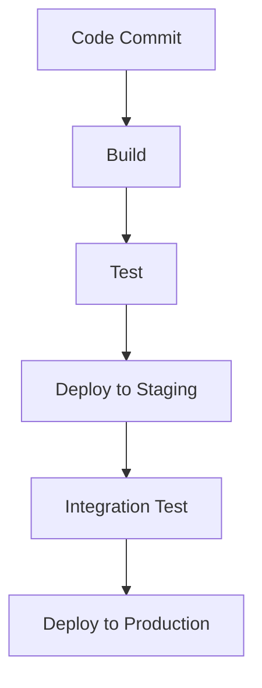

# DevOps & Infrastructure as Code

## Overview

DevOps is a cultural and technical movement that emphasizes collaboration between development and operations teams to automate and streamline the software delivery process. Infrastructure as Code (IaC) is a key practice in DevOps that involves managing and provisioning infrastructure through machine-readable definition files, rather than physical hardware configuration or interactive configuration tools.

## Detailed Explanation

### DevOps Principles

DevOps combines software development (Dev) and IT operations (Ops) to shorten the development lifecycle and provide continuous delivery with high software quality. Key principles include:

- **Automation**: Automate repetitive tasks like testing, deployment, and monitoring.
- **Continuous Integration/Continuous Deployment (CI/CD)**: Frequent code integration and automated deployment.
- **Monitoring and Logging**: Real-time monitoring of applications and infrastructure.
- **Collaboration**: Break down silos between teams.

### Infrastructure as Code

IaC allows infrastructure to be versioned, tested, and deployed like software code. Benefits include:

- **Consistency**: Ensures environments are identical across development, staging, and production.
- **Scalability**: Easily scale infrastructure up or down.
- **Version Control**: Track changes and roll back if needed.

Popular IaC tools:

- **Terraform**: Declarative language for provisioning infrastructure.
- **Ansible**: Agentless automation tool for configuration management.
- **CloudFormation**: AWS-specific IaC service.

## Real-world Examples & Use Cases

- **Cloud Deployments**: Using Terraform to provision AWS EC2 instances, VPCs, and load balancers.
- **Configuration Management**: Ansible playbooks to configure servers for web applications.
- **CI/CD Pipelines**: Jenkins or GitHub Actions automating build, test, and deploy processes.

## Code Examples

### Terraform Example

```hcl
resource "aws_instance" "example" {
  ami           = "ami-0c55b159cbfafe1d0"
  instance_type = "t2.micro"

  tags = {
    Name = "ExampleInstance"
  }
}
```

### Ansible Playbook

```yaml
---
- name: Install and start Apache
  hosts: webservers
  become: yes
  tasks:
    - name: Install Apache
      apt:
        name: apache2
        state: present
    - name: Start Apache
      service:
        name: apache2
        state: started
```

## References

- [DevOps Handbook](https://itrevolution.com/book/the-devops-handbook/)
- [Terraform Documentation](https://www.terraform.io/docs)
- [Ansible Documentation](https://docs.ansible.com/)

## Github-README Links & Related Topics

- [CI/CD Pipelines](./ci-cd-pipelines/)
- [Infrastructure Monitoring](./infrastructure-monitoring/)
- [Container Orchestration](./container-orchestration/)

## CI/CD Pipeline Diagram

