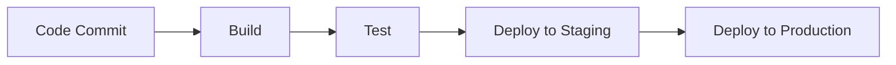
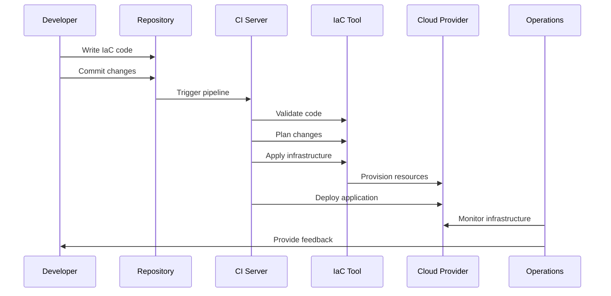

# DevOps & Infrastructure as Code

## Overview

DevOps bridges the gap between development and operations teams, emphasizing collaboration, automation, and rapid delivery. Infrastructure as Code (IaC) enables managing infrastructure through code, promoting consistency, scalability, and version control.

## STAR Summary

**Situation:** Manual infrastructure provisioning causing deployment delays and configuration drift in a growing e-commerce platform.  
**Task:** Implement IaC to automate infrastructure management and reduce deployment time.  
**Action:** Adopted Terraform for cloud resources and Ansible for configuration management, integrated with CI/CD pipeline.  
**Result:** Reduced deployment time from 2 hours to 15 minutes, eliminated configuration drift, improved system reliability by 40%.

## Detailed Explanation

### DevOps Principles

- **Culture**: Collaboration between dev, ops, and other stakeholders.
- **Automation**: Automate repetitive tasks like testing, deployment.
- **Measurement**: Monitor and measure processes for improvement.
- **Sharing**: Share tools, knowledge, and responsibilities.

### Infrastructure as Code

IaC defines infrastructure in code files, allowing provisioning via tools.

- **Declarative vs Imperative**: Terraform (declarative), Ansible (imperative).
- **Benefits**: Reusability, testing, disaster recovery.

### CI/CD

Continuous Integration and Deployment pipelines automate software delivery.

- **Tools**: Jenkins, GitHub Actions, CircleCI.



## Journey / Sequence



## Real-world Examples & Use Cases

### Cloud Infrastructure Provisioning
Using Terraform to provision AWS resources:

```hcl
resource "aws_instance" "web" {
  ami           = "ami-0c55b159cbfafe1d0"
  instance_type = "t2.micro"

  tags = {
    Name = "WebServer"
  }
}
```

### Configuration Management
Ansible playbook for server configuration:

```yaml
---
- name: Configure web server
  hosts: webservers
  tasks:
    - name: Install Apache
      apt:
        name: apache2
        state: present

    - name: Start Apache
      service:
        name: apache2
        state: started
```

### CI/CD Pipeline
Jenkins pipeline for automated deployment:

```groovy
pipeline {
    agent any
    stages {
        stage('Build') {
            steps {
                sh 'mvn clean package'
            }
        }
        stage('Test') {
            steps {
                sh 'mvn test'
            }
        }
        stage('Deploy') {
            steps {
                sh 'kubectl apply -f deployment.yaml'
            }
        }
    }
}
```

## Code Examples

### Terraform: Provision EC2 Instance

```hcl
provider "aws" {
  region = "us-east-1"
}

resource "aws_instance" "web" {
  ami           = "ami-12345678"
  instance_type = "t2.micro"
  tags = {
    Name = "WebServer"
  }
}
```

### Ansible: Install Software

```yaml
---
- hosts: servers
  become: yes
  tasks:
    - name: Install nginx
      apt:
        name: nginx
        state: present
    - name: Start nginx
      service:
        name: nginx
        state: started
```

### Docker Compose for Microservices

```yaml
version: '3.8'
services:
  web:
    build: ./web
    ports:
      - "5000:5000"
    depends_on:
      - db

  db:
    image: postgres:13
    environment:
      POSTGRES_DB: myapp
      POSTGRES_USER: user
      POSTGRES_PASSWORD: password
    volumes:
      - db_data:/var/lib/postgresql/data

volumes:
  db_data:

## Common Pitfalls & Edge Cases

1. **State Management**: Terraform state files can become corrupted or out of sync
2. **Secret Management**: Avoid hardcoding secrets in IaC code
3. **Version Pinning**: Not pinning versions can lead to unexpected changes
4. **Testing Gaps**: Infrastructure changes not thoroughly tested before production
5. **Vendor Lock-in**: Over-reliance on single cloud provider tools

## Tools & Libraries

- **IaC Tools**: Terraform, CloudFormation, Pulumi
- **Configuration Management**: Ansible, Puppet, Chef
- **CI/CD**: Jenkins, GitLab CI, GitHub Actions
- **Container Orchestration**: Kubernetes, Docker Swarm
- **Monitoring**: Prometheus, Grafana, ELK Stack
```

## References

- [What is DevOps?](https://aws.amazon.com/devops/what-is-devops/)
- [Infrastructure as Code](https://www.hashicorp.com/resources/what-is-infrastructure-as-code)
- [Terraform Documentation](https://www.terraform.io/docs)
- [Ansible Documentation](https://docs.ansible.com/)
- [The Phoenix Project](https://www.amazon.com/Phoenix-Project-DevOps-Helping-Business/dp/0988262592)

## Github-README Links & Related Topics

- [Infrastructure as Code with Terraform](../infrastructure-as-code-with-terraform/)
- [CI-CD Pipelines](../ci-cd-pipelines/)
- [Container Orchestration](../container-orchestration/)
- [Monitoring and Logging](../monitoring-and-logging/)
