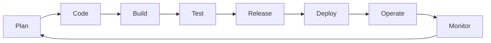

## Overview

DevOps combines cultural philosophies, practices, and tools to accelerate software delivery by fostering collaboration between development and operations teams. Infrastructure as Code (IaC) enables the management of IT infrastructure through machine-readable code, promoting automation, version control, and reproducibility. Together, they form the backbone of modern software engineering, enabling rapid, reliable, and scalable deployments.

## Detailed Explanation

DevOps emerged as a response to the inefficiencies of traditional software development silos, where development and operations teams worked in isolation. By integrating these disciplines, DevOps emphasizes automation, continuous feedback, and iterative improvements to deliver high-quality software faster.

### Key DevOps Practices

- **Continuous Integration (CI):** Frequent code merges with automated testing to detect issues early.
- **Continuous Delivery (CD):** Automated pipelines for deploying code to production environments.
- **Infrastructure as Code (IaC):** Defining infrastructure in code for automated provisioning and management.
- **Monitoring and Logging:** Real-time observability to ensure system health and quick issue resolution.
- **Collaboration and Culture:** Breaking down silos through shared responsibilities and tools.

### Infrastructure as Code Fundamentals

IaC treats infrastructure as software, allowing developers to define, version, and deploy resources programmatically. It supports both declarative (specifying desired state) and imperative (step-by-step instructions) approaches.

| Aspect | Declarative (e.g., Terraform) | Imperative (e.g., Ansible) |
|--------|-------------------------------|----------------------------|
| Focus | What the end state should be | How to achieve the state |
| Advantages | Idempotent, easier to maintain | Flexible for complex logic |
| Use Cases | Cloud resource provisioning | Configuration management |

### DevOps Lifecycle

The DevOps lifecycle is often visualized as an infinite loop, integrating planning, development, testing, deployment, and monitoring.



This loop ensures continuous improvement, with IaC enabling automated infrastructure changes within the cycle.

## Real-world Examples & Use Cases

DevOps and IaC are widely adopted across industries for their ability to scale operations and reduce downtime.

- **E-commerce Platforms:** Netflix uses IaC with Terraform and Ansible for auto-scaling during traffic spikes, combined with CI/CD pipelines for feature rollouts, ensuring 99.99% uptime.
- **Financial Services:** Banks like Capital One employ DevOps practices with IaC to automate compliance checks and deployments, reducing audit times by 50% while maintaining security standards like PCI-DSS.
- **Media Streaming:** Spotify leverages Kubernetes and IaC for global infrastructure management, enabling rapid A/B testing and content delivery via CI/CD pipelines.
- **Healthcare:** Organizations use IaC for HIPAA-compliant environments, with DevOps pipelines automating secure deployments and monitoring for patient data systems.
- **Startups:** Companies like Airbnb started with manual deployments but scaled using DevOps and IaC, reducing deployment times from days to minutes.

## Code Examples

Below are copy-pastable examples demonstrating DevOps and IaC in action.

### Terraform (Declarative IaC) for AWS VPC Setup

```hcl
# main.tf
terraform {
  required_providers {
    aws = {
      source  = "hashicorp/aws"
      version = "~> 5.0"
    }
  }
}

provider "aws" {
  region = "us-east-1"
}

resource "aws_vpc" "main" {
  cidr_block = "10.0.0.0/16"

  tags = {
    Name = "main-vpc"
  }
}

resource "aws_subnet" "public" {
  vpc_id     = aws_vpc.main.id
  cidr_block = "10.0.1.0/24"

  tags = {
    Name = "public-subnet"
  }
}

# Apply with: terraform init && terraform plan && terraform apply
```

### Ansible (Imperative IaC) Playbook for Web Server Deployment

```yaml
---
- name: Deploy Web Application
  hosts: webservers
  become: yes
  vars:
    app_port: 8080

  tasks:
    - name: Install Java
      apt:
        name: openjdk-11-jdk
        state: present
        update_cache: yes

    - name: Download JAR file
      get_url:
        url: https://example.com/app.jar
        dest: /opt/app.jar

    - name: Create systemd service
      template:
        src: app.service.j2
        dest: /etc/systemd/system/app.service

    - name: Start and enable service
      systemd:
        name: app
        state: started
        enabled: yes

  handlers:
    - name: Restart app
      systemd:
        name: app
        state: restarted
```

### GitHub Actions CI/CD Pipeline with IaC Integration

```yaml
name: Deploy Infrastructure and App

on:
  push:
    branches: [main]

jobs:
  test:
    runs-on: ubuntu-latest
    steps:
      - uses: actions/checkout@v4
      - name: Run unit tests
        run: npm test

  deploy-infra:
    needs: test
    runs-on: ubuntu-latest
    steps:
      - uses: actions/checkout@v4
      - name: Setup Terraform
        uses: hashicorp/setup-terraform@v3
      - name: Terraform Init
        run: terraform init
      - name: Terraform Plan
        run: terraform plan
      - name: Terraform Apply
        run: terraform apply -auto-approve

  deploy-app:
    needs: deploy-infra
    runs-on: ubuntu-latest
    steps:
      - uses: actions/checkout@v4
      - name: Deploy to production
        run: |
          # Example deployment script
          echo "Deploying app to production"
```

## References

- AWS DevOps Overview: https://aws.amazon.com/devops/what-is-devops/
- Terraform Introduction: https://www.terraform.io/intro
- Ansible Getting Started: https://docs.ansible.com/ansible/latest/getting_started/index.html
- Pulumi IaC: https://www.pulumi.com/what-is/infrastructure-as-code/
- Wikipedia IaC: https://en.wikipedia.org/wiki/Infrastructure_as_code
- Atlassian DevOps: https://www.atlassian.com/devops
- Martin Fowler IaC: https://martinfowler.com/bliki/InfrastructureAsCode.html

## Github-README Links & Related Topics

- [Docker Containerization](../docker-containerization/README.md)
- [Kubernetes Basics](../kubernetes-basics/README.md)
- [Monitoring and Logging](../monitoring-and-logging/README.md)
- [CI/CD Pipelines](../system-design/ci-cd-pipelines/README.md)
- [Cloud Computing](../system-design/cloud-computing/README.md)