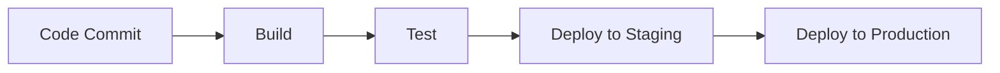

# DevOps & Infrastructure as Code

## Overview

DevOps bridges the gap between development and operations teams, emphasizing collaboration, automation, and rapid delivery. Infrastructure as Code (IaC) enables managing infrastructure through code, promoting consistency, scalability, and version control.

## Detailed Explanation

### DevOps Principles

- **Culture**: Collaboration between dev, ops, and other stakeholders.
- **Automation**: Automate repetitive tasks like testing, deployment.
- **Measurement**: Monitor and measure processes for improvement.
- **Sharing**: Share tools, knowledge, and responsibilities.

### Infrastructure as Code

IaC defines infrastructure in code files, allowing provisioning via tools.

- **Declarative vs Imperative**: Terraform (declarative), Ansible (imperative).
- **Benefits**: Reusability, testing, disaster recovery.

### CI/CD

Continuous Integration and Deployment pipelines automate software delivery.

- **Tools**: Jenkins, GitHub Actions, CircleCI.



## Real-world Examples & Use Cases

- **Cloud Migration**: Use IaC to migrate on-premises to AWS/Azure.
- **Microservices Deployment**: Automate deployment with Kubernetes and IaC.
- **Compliance**: Ensure infrastructure meets security standards via code.

## Code Examples

### Terraform: Provision EC2 Instance

```hcl
provider "aws" {
  region = "us-east-1"
}

resource "aws_instance" "web" {
  ami           = "ami-12345678"
  instance_type = "t2.micro"
  tags = {
    Name = "WebServer"
  }
}
```

### Ansible: Install Software

```yaml
---
- hosts: servers
  become: yes
  tasks:
    - name: Install nginx
      apt:
        name: nginx
        state: present
    - name: Start nginx
      service:
        name: nginx
        state: started
```

## References

- [DevOps Handbook](https://itrevolution.com/book/the-devops-handbook/)
- [Terraform Documentation](https://www.terraform.io/docs)
- [Ansible Documentation](https://docs.ansible.com)

## Github-README Links & Related Topics

- [CI/CD Pipelines](../ci-cd-pipelines/README.md)
- [Infrastructure as Code with Terraform](../infrastructure-as-code-with-terraform/README.md)
- [DevOps Infrastructure as Code](../devops-infrastructure-as-code/README.md)
