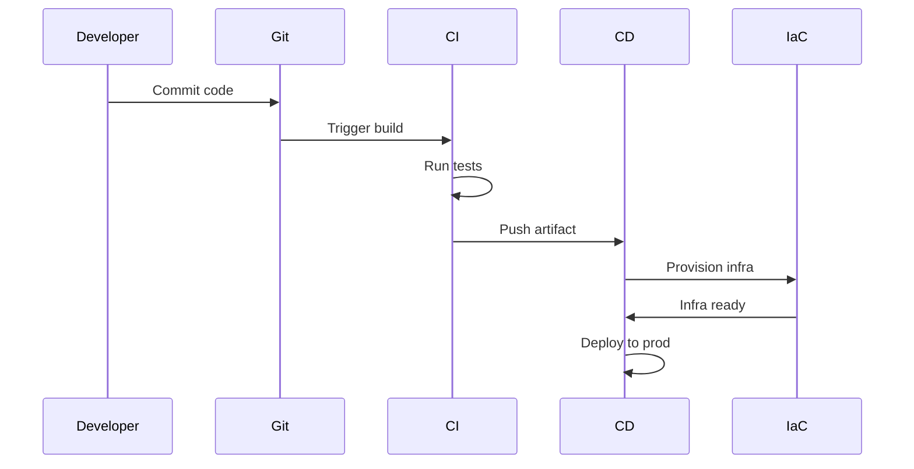
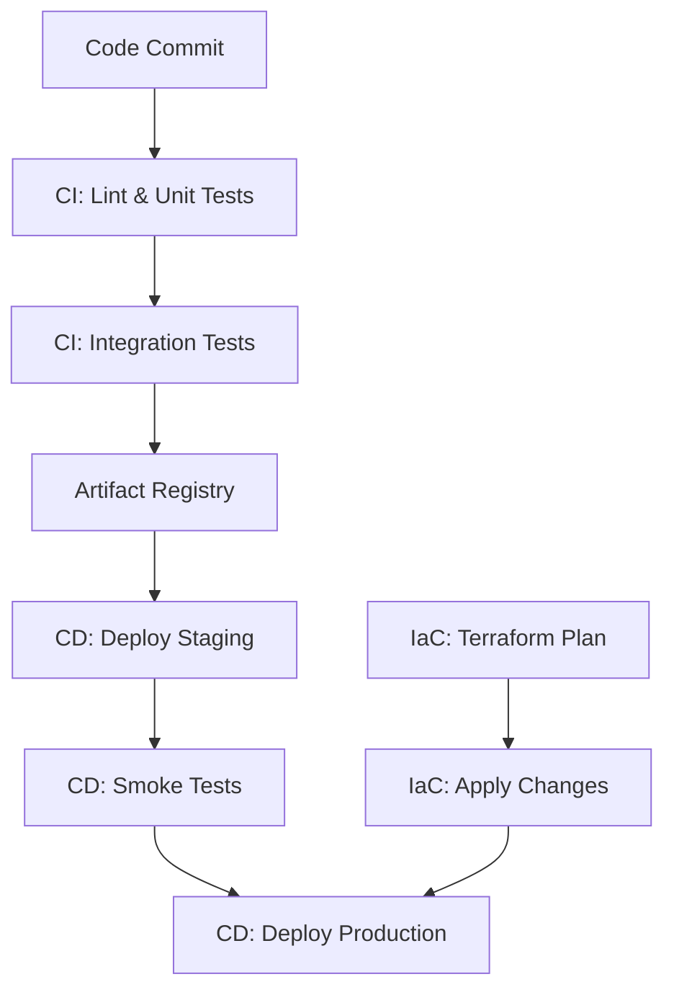

## Overview
DevOps is a cultural and technical movement that emphasizes collaboration between software development and IT operations teams to automate and streamline the software delivery process. Infrastructure as Code (IaC) treats infrastructure provisioning and management as software, enabling version control, testing, and automated deployment of resources.

## Detailed Explanation
DevOps aims to reduce the time between committing code and deploying it to production, fostering a culture of continuous improvement.

### Core Principles of DevOps
- **Collaboration:** Breaking down silos between dev and ops.
- **Automation:** Automating repetitive tasks like builds, tests, deployments.
- **Continuous Feedback:** Monitoring and logging for rapid issue resolution.
- **Incremental Changes:** Small, frequent releases to reduce risk.

### CI/CD Pipeline
- **Continuous Integration (CI):** Merge code changes frequently, run automated tests.
- **Continuous Delivery (CD):** Automate deployment to staging/production.
- **Continuous Deployment:** Fully automated release to production.

### Infrastructure as Code (IaC)
IaC defines infrastructure in code files, allowing for:
- **Version Control:** Track changes like software code.
- **Testing:** Validate configurations before deployment.
- **Reproducibility:** Consistent environments across dev, test, prod.
- **Scalability:** Easily provision/destroy resources.

#### Declarative vs. Imperative IaC
- **Declarative:** Specify desired state (e.g., Terraform).
- **Imperative:** Define step-by-step actions (e.g., Ansible scripts).

### Benefits
- Faster deployment cycles.
- Reduced manual errors.
- Improved scalability and reliability.
- Easier rollback and disaster recovery.

## Real-world Examples & Use Cases
- **E-commerce Platform:** CI/CD for rapid feature deployment, IaC for auto-scaling during peak sales.
- **Financial Services:** Automated testing and deployment with strict compliance checks.
- **Media Streaming:** IaC for global CDN provisioning, CI/CD for app updates.
- **Healthcare:** Secure, auditable deployments with IaC for HIPAA compliance.
- **Startups:** Quick iteration with CI/CD pipelines reducing time-to-market.

## Code Examples
### Terraform for AWS EC2 Instance
```hcl
# main.tf
terraform {
  required_providers {
    aws = {
      source  = "hashicorp/aws"
      version = "~> 4.0"
    }
  }
}

provider "aws" {
  region = "us-east-1"
}

resource "aws_instance" "web_server" {
  ami           = "ami-0c55b159cbfafe1d0"
  instance_type = "t2.micro"

  tags = {
    Name        = "WebServer"
    Environment = "dev"
  }

  security_groups = [aws_security_group.web_sg.name]
}

resource "aws_security_group" "web_sg" {
  name_prefix = "web-sg-"

  ingress {
    from_port   = 80
    to_port     = 80
    protocol    = "tcp"
    cidr_blocks = ["0.0.0.0/0"]
  }

  egress {
    from_port   = 0
    to_port     = 0
    protocol    = "-1"
    cidr_blocks = ["0.0.0.0/0"]
  }
}
```

### Ansible Playbook for Nginx Setup
```yaml
---
- name: Deploy Nginx Web Server
  hosts: webservers
  become: yes
  vars:
    nginx_port: 80

  tasks:
  - name: Update package cache
    apt:
      update_cache: yes

  - name: Install Nginx
    apt:
      name: nginx
      state: present

  - name: Configure Nginx
    template:
      src: nginx.conf.j2
      dest: /etc/nginx/nginx.conf
    notify: Restart Nginx

  - name: Ensure Nginx is running
    service:
      name: nginx
      state: started
      enabled: yes

  handlers:
  - name: Restart Nginx
    service:
      name: nginx
      state: restarted
```

### GitHub Actions CI/CD Pipeline
```yaml
# .github/workflows/ci-cd.yml
name: CI/CD Pipeline

on:
  push:
    branches: [ main ]
  pull_request:
    branches: [ main ]

jobs:
  test:
    runs-on: ubuntu-latest
    steps:
    - uses: actions/checkout@v3
    - name: Set up JDK 17
      uses: actions/setup-java@v3
      with:
        java-version: '17'
        distribution: 'temurin'
    - name: Run tests
      run: mvn test

  build-and-deploy:
    needs: test
    runs-on: ubuntu-latest
    if: github.ref == 'refs/heads/main'
    steps:
    - uses: actions/checkout@v3
    - name: Build JAR
      run: mvn clean package -DskipTests
    - name: Deploy to staging
      run: echo "Deploy to staging environment"
      # Add actual deployment steps
```

## Journey / Sequence


## Data Models / Message Formats
### CI/CD Pipeline Flow


### Infrastructure Configuration JSON
```json
{
  "infrastructure": {
    "servers": [
      {
        "name": "web-01",
        "type": "t2.micro",
        "ami": "ami-12345678",
        "security_groups": ["web-sg"]
      }
    ],
    "databases": [
      {
        "name": "app-db",
        "engine": "postgres",
        "version": "13"
      }
    ]
  }
}
```

## Common Pitfalls & Edge Cases
- **Configuration Drift:** Manual changes not reflected in IaC.
- **State Management:** Terraform state file corruption.
- **Secret Handling:** Exposing credentials in code.
- **Rollback Issues:** Incomplete rollback strategies.
- **Edge Case:** Network partitions during deployment.

## Tools & Libraries
- **CI/CD:** Jenkins, GitHub Actions, GitLab CI, CircleCI, ArgoCD
- **IaC:** Terraform, Ansible, Puppet, Chef, CloudFormation
- **Containers:** Docker, Kubernetes
- **Monitoring:** Prometheus, Grafana, ELK Stack
- **Version Control:** Git, GitHub, GitLab

## Github-README Links & Related Topics
- [load-balancing-and-routing](../system-design/load-balancing-and-routing/)
- [monitoring-and-logging](../monitoring-and-logging/)
- [container-orchestration-k8s](../system-design/container-orchestration-k8s/)

## References
- "The DevOps Handbook" by Gene Kim et al.
- Terraform Documentation: https://www.terraform.io/docs
- Ansible Documentation: https://docs.ansible.com/
- Jenkins Handbook: https://www.jenkins.io/doc/book/
- GitHub Actions: https://docs.github.com/en/actions