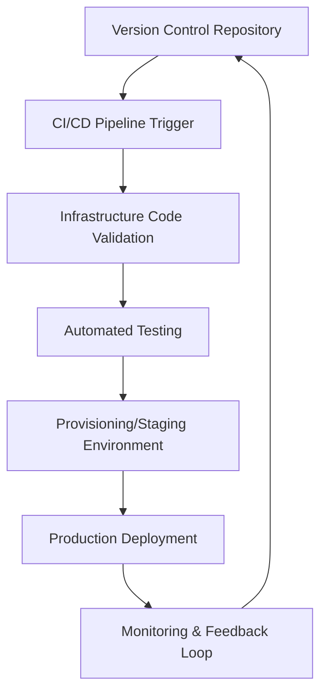

## Overview

DevOps is a cultural and technical movement that emphasizes collaboration between software development (Dev) and IT operations (Ops) teams to automate and streamline the software delivery lifecycle. Infrastructure as Code (IaC) is a key DevOps practice that manages and provisions infrastructure through machine-readable definition files, rather than physical hardware configuration or interactive configuration tools. This approach enables version control, automated testing, and consistent deployments across environments.

## Detailed Explanation

### DevOps Principles

DevOps integrates development and operations to shorten the systems development life cycle while delivering high-quality software continuously. Core principles include:

- **Collaboration and Communication**: Fosters a culture of shared responsibility between Dev and Ops.
- **Automation**: Automates repetitive tasks like builds, tests, and deployments to reduce errors and increase speed.
- **Continuous Integration/Continuous Deployment (CI/CD)**: Integrates code changes frequently and deploys automatically.
- **Monitoring and Logging**: Provides real-time feedback on application performance and infrastructure health.
- **Infrastructure as Code (IaC)**: Treats infrastructure as code for repeatability and scalability.

### Infrastructure as Code Concepts

IaC allows developers and operations teams to define infrastructure in code, using declarative or imperative approaches. Declarative IaC specifies the desired state (e.g., Terraform), while imperative defines the steps to achieve it (e.g., Ansible scripts).

Key benefits:
- **Version Control**: Track infrastructure changes alongside application code.
- **Consistency**: Eliminates configuration drift by ensuring environments match the code.
- **Scalability**: Easily replicate and scale infrastructure.
- **Testing**: Apply unit and integration tests to infrastructure code.
- **Disaster Recovery**: Quickly rebuild infrastructure from code.



### DevOps Workflow

A typical DevOps workflow involves:
1. Code development and commits.
2. Automated builds and tests.
3. Infrastructure provisioning via IaC.
4. Deployment to staging/production.
5. Monitoring and iterative improvements.

## Real-world Examples & Use Cases

- **Cloud Infrastructure Provisioning**: Companies like Netflix use IaC to manage thousands of servers on AWS, ensuring consistent environments for microservices.
- **Multi-Environment Deployments**: Startups deploy identical staging and production environments using IaC, reducing bugs from environment differences.
- **Compliance and Security**: Financial institutions use IaC to enforce security policies and audit trails for regulatory compliance.
- **Disaster Recovery**: E-commerce platforms like Amazon rebuild infrastructure post-incident using IaC scripts.
- **Hybrid Cloud Management**: Enterprises manage on-premises and cloud resources uniformly with IaC tools.

## Code Examples

### Terraform (Declarative IaC)

Provision an AWS EC2 instance and security group:

```hcl
provider "aws" {
  region = "us-east-1"
}

resource "aws_security_group" "web_sg" {
  name_prefix = "web-sg-"

  ingress {
    from_port   = 80
    to_port     = 80
    protocol    = "tcp"
    cidr_blocks = ["0.0.0.0/0"]
  }

  egress {
    from_port   = 0
    to_port     = 0
    protocol    = "-1"
    cidr_blocks = ["0.0.0.0/0"]
  }
}

resource "aws_instance" "web_server" {
  ami           = "ami-0c55b159cbfafe1d0"  # Amazon Linux 2
  instance_type = "t2.micro"
  security_groups = [aws_security_group.web_sg.name]

  tags = {
    Name = "WebServer"
  }
}
```

### Ansible (Imperative IaC)

Install Nginx on Ubuntu servers:

```yaml
---
- name: Install and configure Nginx
  hosts: webservers
  become: yes
  tasks:
    - name: Update apt cache
      apt:
        update_cache: yes

    - name: Install Nginx
      apt:
        name: nginx
        state: present

    - name: Start and enable Nginx
      service:
        name: nginx
        state: started
        enabled: yes

    - name: Copy custom config
      copy:
        src: nginx.conf
        dest: /etc/nginx/nginx.conf
      notify: reload nginx

  handlers:
    - name: reload nginx
      service:
        name: nginx
        state: reloaded
```

### CloudFormation (AWS IaC)

Create an S3 bucket:

```yaml
AWSTemplateFormatVersion: '2010-09-09'
Description: 'S3 Bucket for static website'

Resources:
  S3Bucket:
    Type: 'AWS::S3::Bucket'
    Properties:
      BucketName: my-static-website-bucket
      AccessControl: PublicRead
      WebsiteConfiguration:
        IndexDocument: index.html
        ErrorDocument: error.html

Outputs:
  BucketName:
    Description: 'Name of the S3 bucket'
    Value: !Ref S3Bucket
```

## STAR Summary

- **Situation**: A legacy application suffered frequent deployment failures due to manual server configurations.
- **Task**: Implement automated infrastructure provisioning and CI/CD pipelines.
- **Action**: Adopted Terraform for IaC and Jenkins for CI/CD, integrating version control for infrastructure changes.
- **Result**: Reduced deployment time by 80%, improved uptime to 99.9%, and enabled rapid scaling.

## Journey / Sequence

1. **Assessment**: Evaluate current DevOps maturity and infrastructure setup.
2. **Tool Selection**: Choose IaC tools (e.g., Terraform for cloud, Ansible for config management).
3. **Code Development**: Write infrastructure definitions and integrate with application code.
4. **CI/CD Integration**: Automate provisioning and deployment in pipelines.
5. **Testing and Validation**: Implement infrastructure testing (e.g., Terratest for Terraform).
6. **Monitoring Setup**: Deploy monitoring tools to track infrastructure health.
7. **Continuous Improvement**: Iterate based on feedback and metrics.

## Data Models / Message Formats

IaC uses structured formats:
- **JSON/YAML**: For declarative definitions (e.g., CloudFormation, Kubernetes manifests).
- **HCL (HashiCorp Configuration Language)**: Terraform's syntax for resource definitions.
- **Playbooks**: Ansible's YAML for task sequences.

Example Terraform state file (JSON):

```json
{
  "version": 4,
  "terraform_version": "1.0.0",
  "serial": 1,
  "lineage": "abc123",
  "outputs": {},
  "resources": [
    {
      "mode": "managed",
      "type": "aws_instance",
      "name": "web_server",
      "provider_config_key": "aws",
      "instances": [
        {
          "attributes": {
            "ami": "ami-0c55b159cbfafe1d0",
            "instance_type": "t2.micro"
          }
        }
      ]
    }
  ]
}
```

## Common Pitfalls & Edge Cases

- **State Drift**: Manual changes to infrastructure not reflected in code; mitigate with drift detection tools.
- **Secret Management**: Avoid hardcoding secrets; use tools like HashiCorp Vault or AWS Secrets Manager.
- **Locking Issues**: Terraform state locking prevents concurrent modifications; handle with remote backends.
- **Provider Limitations**: Cloud provider APIs may have rate limits or regional restrictions.
- **Version Compatibility**: Ensure IaC tool versions match across teams to avoid syntax errors.
- **Over-Provisioning**: Allocate resources based on actual needs to control costs.

## Tools & Libraries

| Tool/Library | Purpose | Example Use Case |
|--------------|---------|------------------|
| Terraform | Declarative IaC for multi-cloud | Provisioning AWS/GCP resources |
| Ansible | Configuration management and automation | Server hardening and app deployment |
| Puppet/Chef | Declarative config management | Policy-based server configuration |
| CloudFormation | AWS-specific IaC | Stack deployments on AWS |
| Pulumi | IaC with programming languages | Using TypeScript for infrastructure |
| Jenkins/GitLab CI | CI/CD pipelines | Automating build-test-deploy cycles |
| Docker | Containerization | Packaging apps for consistent deployment |
| Kubernetes | Container orchestration | Managing microservices at scale |

## References

- [What is DevOps? - AWS](https://aws.amazon.com/devops/what-is-devops/)
- [Infrastructure as Code - Terraform](https://www.terraform.io/intro)
- [Ansible Documentation](https://docs.ansible.com/ansible/latest/index.html)
- [DevOps Handbook by Gene Kim](https://itrevolution.com/book/the-devops-handbook/)
- [Infrastructure as Code Best Practices - Microsoft](https://docs.microsoft.com/en-us/azure/devops/learn/what-is-infrastructure-as-code)

## Github-README Links & Related Topics

- [CI/CD Pipelines](../ci-cd-pipelines/)
- [Container Orchestration](../container-orchestration/)
- [Configuration Management](../configuration-management/)
- [Cloud Architecture Patterns](../cloud-architecture-patterns/)
- [Monitoring and Logging](../infrastructure-monitoring/)