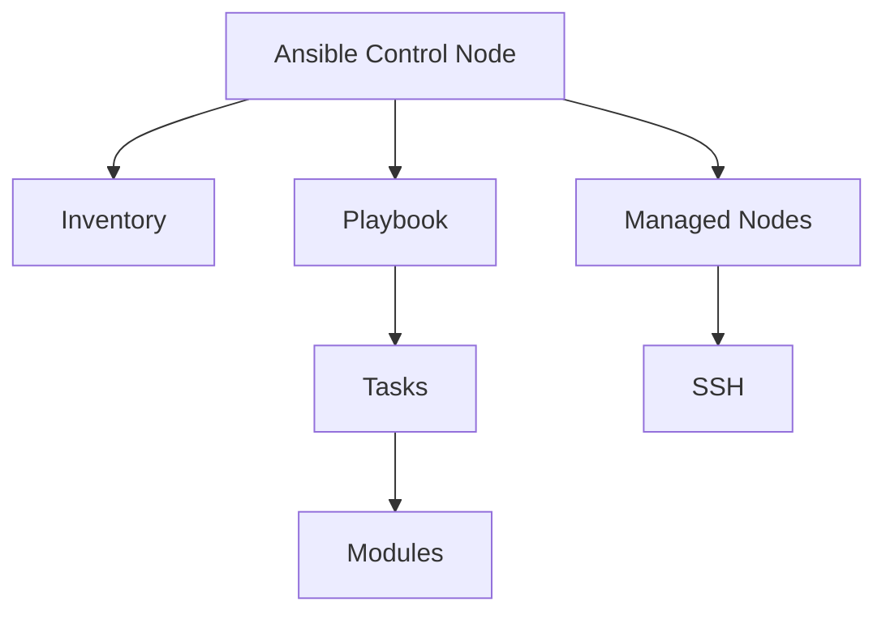

# Ansible Configuration Management

## Overview

Ansible is an open-source automation tool for configuration management, application deployment, and task automation. It uses declarative YAML playbooks to define desired states, enabling idempotent operations.

## Detailed Explanation

Ansible is agentless, using SSH for communication. Key concepts include inventories, playbooks, roles, and modules. It supports complex workflows with conditionals, loops, and handlers.

### Key Features

- **Idempotency**: Running playbooks multiple times produces the same result.
- **Modules**: Pre-built tasks for common operations.
- **Roles**: Reusable collections of tasks, variables, and handlers.
- **Inventories**: Lists of managed hosts.

### Workflow Diagram



## Real-world Examples & Use Cases

- Provisioning servers and configuring software stacks.
- Deploying applications to multiple environments.
- Automating CI/CD pipelines for infrastructure changes.
- Managing cloud resources with Ansible Tower/AWX.

## Code Examples

### Simple Playbook

```yaml
---
- name: Install and start Apache
  hosts: webservers
  become: yes
  tasks:
    - name: Install httpd
      yum:
        name: httpd
        state: present
    - name: Start httpd
      service:
        name: httpd
        state: started
```

### Inventory File

```ini
[webservers]
web1.example.com
web2.example.com

[databases]
db1.example.com
```

## References

- [Ansible Documentation](https://docs.ansible.com/)
- [Ansible for DevOps](https://www.ansiblefordevops.com/)

## Github-README Links & Related Topics

- [DevOps & Infrastructure as Code](../devops-infrastructure-as-code/README.md)
- [CI/CD Pipelines](../ci-cd-pipelines/README.md)
- [Configuration Management](../configuration-management/README.md)