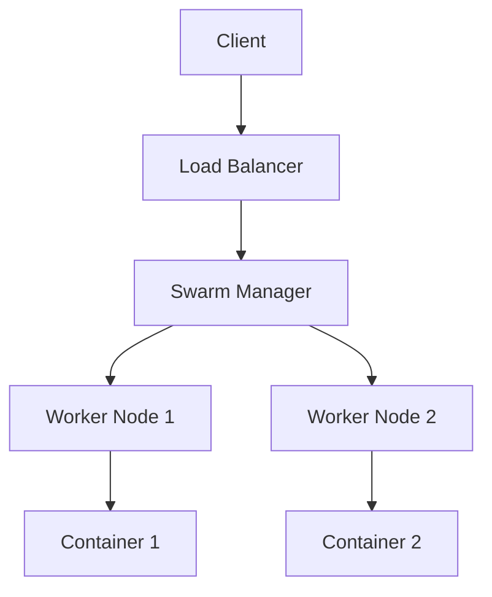

# Overview

Docker container orchestration involves managing the lifecycle of containerized applications at scale. While Docker provides basic tools like Docker Compose for local orchestration, production environments often use Docker Swarm or integrate with Kubernetes for more advanced features like service discovery, load balancing, and rolling updates.

# Detailed Explanation

Container orchestration automates the deployment, scaling, networking, and management of containers. Key concepts include:

- **Services**: Define how containers should run, including replicas, networks, and volumes.
- **Stacks**: Groups of services defined in a compose file for multi-container applications.
- **Swarm Mode**: Docker's native clustering and orchestration feature for managing a cluster of Docker engines.
- **Secrets and Configs**: Secure management of sensitive data and configuration files.

Challenges include ensuring high availability, handling node failures, and maintaining consistent environments across development and production.



# Real-world Examples & Use Cases

- Deploying a web application with database and cache services in a development environment.
- Scaling microservices for a high-traffic e-commerce platform.
- CI/CD pipelines using Docker for consistent build and deployment environments.

# Code Examples

```yaml
# docker-compose.yml for a simple web app
version: '3.8'
services:
  web:
    image: nginx:alpine
    ports:
      - "80:80"
    deploy:
      replicas: 3
  db:
    image: postgres
    environment:
      POSTGRES_PASSWORD: example
```

```bash
# Initialize Swarm
docker swarm init

# Deploy stack
docker stack deploy -c docker-compose.yml myapp

# Scale service
docker service scale myapp_web=5
```

# References

- [Docker Swarm Documentation](https://docs.docker.com/engine/swarm/)
- [Docker Compose](https://docs.docker.com/compose/)

# Github-README Links & Related Topics

- [Docker Containerization](./docker-containerization/README.md)
- [Kubernetes Orchestration](./kubernetes-orchestration/README.md)
- [Container Orchestration Patterns](./container-orchestration-patterns/README.md)