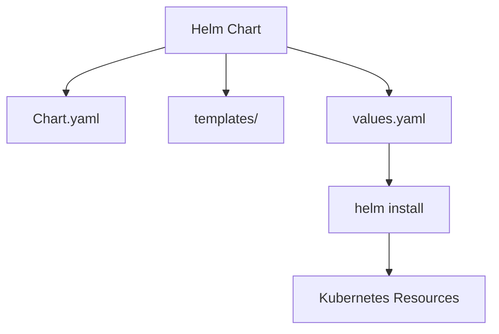

# Overview

Helm is a package manager for Kubernetes that simplifies deploying and managing applications using charts, which are collections of pre-configured Kubernetes resources.

# Detailed Explanation

Charts are templated YAML files defining Kubernetes manifests. Helm installs, upgrades, and manages releases. Key components: Chart.yaml, templates/, values.yaml.

Workflow: Create chart, customize values, install with `helm install`.



# Real-world Examples & Use Cases

- Deploying complex apps like databases or monitoring stacks.
- Managing app versions across environments.
- Sharing reusable components via repositories.

# Code Examples

Basic Chart structure:

```
my-chart/
├── Chart.yaml
├── templates/
│   ├── deployment.yaml
│   └── service.yaml
└── values.yaml
```

Chart.yaml:

```yaml
apiVersion: v2
name: my-chart
description: A Helm chart for Kubernetes
type: application
version: 0.1.0
appVersion: "1.16.0"
```

values.yaml:

```yaml
replicaCount: 1
image:
  repository: nginx
  tag: "latest"
```

Install chart:

```bash
helm install my-release ./my-chart
```

# References

- [Helm Documentation](https://helm.sh/docs/)
- [Helm Charts Guide](https://helm.sh/docs/topics/charts/)

# Github-README Links & Related Topics

- [Kubernetes Basics](./kubernetes-basics/README.md)
- [Helm for Kubernetes](./helm-for-kubernetes/README.md)
- [CI/CD Pipelines](./ci-cd-pipelines/README.md)