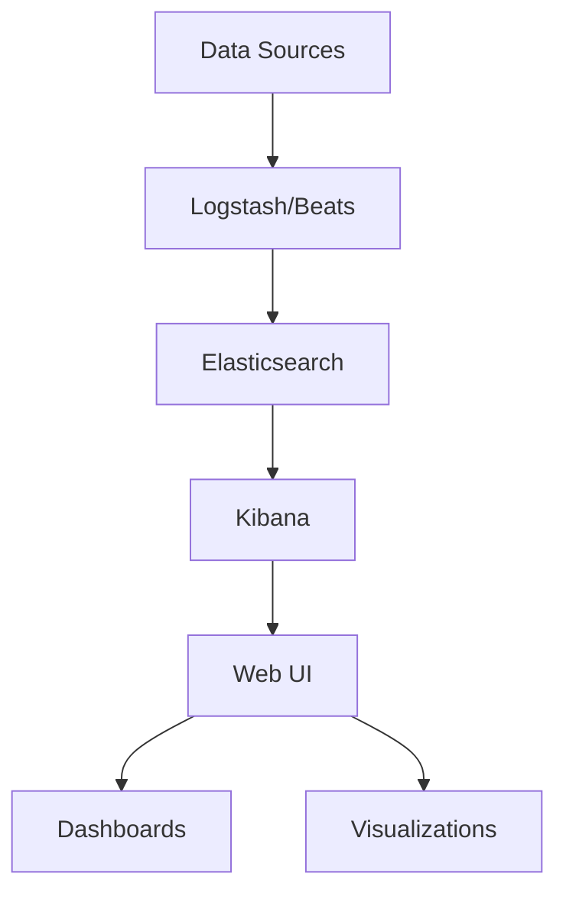

# Kibana

## Overview

Kibana is an open-source data visualization and exploration tool used for log and time-series analytics, application monitoring, and operational intelligence use cases. It offers powerful and easy-to-use features such as histograms, line graphs, pie charts, heat maps, and built-in geospatial support.

## Detailed Explanation

Kibana is part of the Elastic Stack (formerly ELK Stack), working alongside Elasticsearch, Logstash, and Beats. It provides a web interface for searching, viewing, and interacting with data stored in Elasticsearch indices.

Key features:
- **Discover**: Search and explore data.
- **Visualize**: Create charts and graphs.
- **Dashboard**: Combine visualizations.
- **Canvas**: Create pixel-perfect presentations.
- **Maps**: Visualize geospatial data.

### Architecture Diagram



## Real-world Examples & Use Cases

- **Log Analysis**: Visualize and analyze application logs for troubleshooting.
- **Infrastructure Monitoring**: Monitor server metrics and alerts.
- **Security Analytics**: Detect anomalies and threats.
- **Business Intelligence**: Create dashboards for KPIs and metrics.

## Code Examples

### Kibana Configuration (kibana.yml)

```yaml
server.port: 5601
server.host: "0.0.0.0"
elasticsearch.hosts: ["http://localhost:9200"]
kibana.index: ".kibana"
```

### Creating a Visualization with Kibana API

```bash
curl -X POST "localhost:5601/api/saved_objects/visualization" \
  -H 'kbn-xsrf: true' \
  -H 'Content-Type: application/json' \
  -d '{
    "attributes": {
      "title": "CPU Usage",
      "visState": "{\"type\":\"histogram\",\"params\":{\"type\":\"histogram\",\"grid\":{\"categoryLines\":false},\"categoryAxes\":[{\"id\":\"CategoryAxis-1\",\"type\":\"category\",\"position\":\"bottom\",\"show\":true,\"style\":{},\"scale\":{\"type\":\"linear\"},\"labels\":{\"show\":true,\"truncate\":100},\"title\":{\"text\":\"@timestamp per 30 seconds\"}}],\"valueAxes\":[{\"id\":\"ValueAxis-1\",\"name\":\"LeftAxis-1\",\"type\":\"value\",\"position\":\"left\",\"show\":true,\"style\":{},\"scale\":{\"type\":\"linear\",\"mode\":\"normal\"},\"labels\":{\"show\":true,\"rotate\":0,\"filter\":false,\"truncate\":100},\"title\":{\"text\":\"Count\"}}],\"seriesParams\":[{\"show\":true,\"type\":\"histogram\",\"mode\":\"stacked\",\"data\":{\"label\":\"Count\",\"id\":\"1\"},\"valueAxis\":\"ValueAxis-1\",\"drawLinesBetweenPoints\":true,\"showCircles\":true}],\"addTooltip\":true,\"addLegend\":true,\"legendPosition\":\"right\",\"times\":[],\"addTimeMarker\":false},\"aggs\":[{\"id\":\"1\",\"enabled\":true,\"type\":\"count\",\"schema\":\"metric\",\"params\":{}},{\"id\":\"2\",\"enabled\":true,\"type\":\"date_histogram\",\"schema\":\"segment\",\"params\":{\"field\":\"@timestamp\",\"interval\":\"auto\",\"customInterval\":\"2h\",\"min_doc_count\":1,\"extended_bounds\":{},\"customLabel\":\"\"}}]}",
      "uiStateJSON": "{}",
      "description": "",
      "version": 1,
      "kibanaSavedObjectMeta": {
        "searchSourceJSON": "{\"index\":\"logstash-*\",\"filter\":[],\"query\":{\"query\":\"\",\"language\":\"lucene\"}}"
      }
    }
  }'
```

### Elasticsearch Index Template for Logs

```json
{
  "index_patterns": ["logs-*"],
  "settings": {
    "number_of_shards": 1,
    "number_of_replicas": 0
  },
  "mappings": {
    "properties": {
      "@timestamp": {
        "type": "date"
      },
      "message": {
        "type": "text"
      },
      "level": {
        "type": "keyword"
      },
      "host": {
        "type": "keyword"
      }
    }
  }
}
```

## References

- [Kibana Official Documentation](https://www.elastic.co/guide/en/kibana/current/index.html)
- [Elastic Stack Documentation](https://www.elastic.co/guide/en/elastic-stack/current/index.html)

## Github-README Links & Related Topics

- [Elasticsearch for Search](./elasticsearch-for-search/)
- [Monitoring and Logging](./monitoring-logging/)