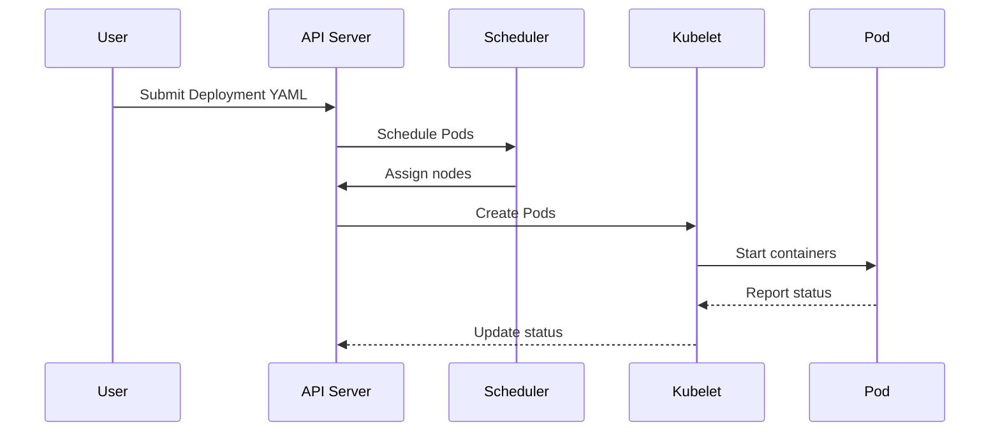

## Overview

Kubernetes Orchestration is the automated management, coordination, and scheduling of containerized applications within a Kubernetes cluster. As an open-source platform, Kubernetes provides a robust framework for deploying, scaling, and operating application containers across clusters of hosts. It emphasizes declarative configuration, self-healing, and automation to ensure applications run reliably in production environments.

## Detailed Explanation

### Key Concepts

- **Pods**: The smallest deployable units in Kubernetes, encapsulating one or more containers, storage, and network resources.
- **Services**: Abstractions that define a logical set of Pods and a policy for accessing them, enabling load balancing and service discovery.
- **Deployments**: Declarative updates to applications, managing ReplicaSets to ensure the desired number of Pod replicas are running.
- **Ingress**: Manages external access to Services, typically HTTP/HTTPS, providing load balancing, SSL termination, and name-based virtual hosting.
- **ConfigMaps and Secrets**: Store configuration data and sensitive information separately from application code.
- **Namespaces**: Virtual clusters within a physical cluster, providing isolation and resource management.

### Components

#### Control Plane Components
- **kube-apiserver**: The front end for the Kubernetes control plane, exposing the Kubernetes API.
- **etcd**: Consistent and highly-available key-value store for all cluster data.
- **kube-scheduler**: Assigns Pods to nodes based on resource requirements and constraints.
- **kube-controller-manager**: Runs controllers that implement Kubernetes API behavior, such as managing Deployments and Services.

#### Node Components
- **kubelet**: Ensures containers are running in Pods on each node.
- **kube-proxy**: Maintains network rules for Services.
- **Container Runtime**: Software like containerd or CRI-O for running containers.

### How It Works

Kubernetes uses a declarative model where users specify the desired state of their applications via YAML manifests. Controllers continuously reconcile the current state with the desired state, automating tasks like scaling, rolling updates, and self-healing. For example, a Deployment creates a ReplicaSet, which in turn manages Pods. If a Pod fails, the ReplicaSet replaces it automatically.

### Tradeoffs

- **Pros**: High availability, scalability, portability, extensive ecosystem.
- **Cons**: Steep learning curve, operational complexity, resource overhead for small deployments.
- **Performance vs. Simplicity**: Kubernetes excels in large-scale, distributed systems but may be overkill for simple applications.

### Capacity Planning

Plan for nodes based on CPU, memory, and storage needs. Consider Pod density, network bandwidth, and etcd performance. Use tools like Kubernetes Metrics Server for monitoring and Horizontal Pod Autoscalers for dynamic scaling.

## Journey / Sequence



## Real-world Examples & Use Cases

- **Microservices Deployment**: Orchestrate multiple interdependent services, each in its own Pod, with Services for communication and Ingress for external access.
- **CI/CD Pipelines**: Automate deployment of application versions using Deployments for rolling updates and rollbacks.
- **Web Application Scaling**: Use Horizontal Pod Autoscalers to scale web servers based on traffic, ensuring high availability.
- **Data Processing**: Run batch jobs with Jobs and CronJobs for scheduled data processing tasks.
- **Hybrid Cloud**: Manage workloads across on-premises and cloud environments using Kubernetes federation.

## Code Examples

### Basic Deployment YAML
```yaml
apiVersion: apps/v1
kind: Deployment
metadata:
  name: nginx-deployment
spec:
  replicas: 3
  selector:
    matchLabels:
      app: nginx
  template:
    metadata:
      labels:
        app: nginx
    spec:
      containers:
      - name: nginx
        image: nginx:1.14.2
        ports:
        - containerPort: 80
```

### Service YAML
```yaml
apiVersion: v1
kind: Service
metadata:
  name: my-service
spec:
  selector:
    app: nginx
  ports:
    - protocol: TCP
      port: 80
      targetPort: 9376
```

### Ingress YAML
```yaml
apiVersion: networking.k8s.io/v1
kind: Ingress
metadata:
  name: minimal-ingress
spec:
  rules:
  - http:
      paths:
      - path: /testpath
        pathType: Prefix
        backend:
          service:
            name: test
            port:
              number: 80
```

### kubectl Commands
- Create a Deployment: `kubectl apply -f deployment.yaml`
- Scale Deployment: `kubectl scale deployment nginx-deployment --replicas=5`
- Check rollout status: `kubectl rollout status deployment/nginx-deployment`
- Rollback: `kubectl rollout undo deployment/nginx-deployment`

## Common Pitfalls & Edge Cases

- **Resource Limits**: Failing to set CPU/memory limits can lead to resource exhaustion.
- **Network Policies**: Overly permissive policies can expose services; overly restrictive ones can block legitimate traffic.
- **Pod Affinity/Anti-affinity**: Misconfigurations can lead to poor scheduling or availability issues.
- **Immutable Secrets/ConfigMaps**: Updates don't propagate automatically; restart Pods to apply changes.
- **Large Clusters**: etcd performance bottlenecks; use sharding or external etcd.
- **Rolling Updates**: Ensure `maxUnavailable` and `maxSurge` are balanced to avoid downtime.

## Tools & Libraries

- **kubectl**: Command-line tool for interacting with Kubernetes clusters.
- **Helm**: Package manager for Kubernetes applications.
- **Kustomize**: Tool for customizing Kubernetes configurations.
- **Lens/K9s**: GUI tools for cluster management.
- **Prometheus**: Monitoring and alerting for Kubernetes metrics.
- **Istio**: Service mesh for advanced traffic management.

## References

- [Kubernetes Documentation](https://kubernetes.io/docs/)
- [Kubernetes Components](https://kubernetes.io/docs/concepts/overview/components/)
- [Cluster Architecture](https://kubernetes.io/docs/concepts/architecture/)
- [Deployments](https://kubernetes.io/docs/concepts/workloads/controllers/deployment/)
- [Services](https://kubernetes.io/docs/concepts/services-networking/service/)
- [Ingress](https://kubernetes.io/docs/concepts/services-networking/ingress/)

## Github-README Links & Related Topics

- [Kubernetes Basics](../kubernetes-basics/)
- [Microservices Architecture](../microservices-architecture/)
- [Containerization](../docker-containerization/)
- [DevOps Infrastructure as Code](../devops-infrastructure-as-code/)
- [Load Balancing and Strategies](../load-balancing-and-strategies/)
- [Monitoring and Logging](../monitoring-and-logging/)