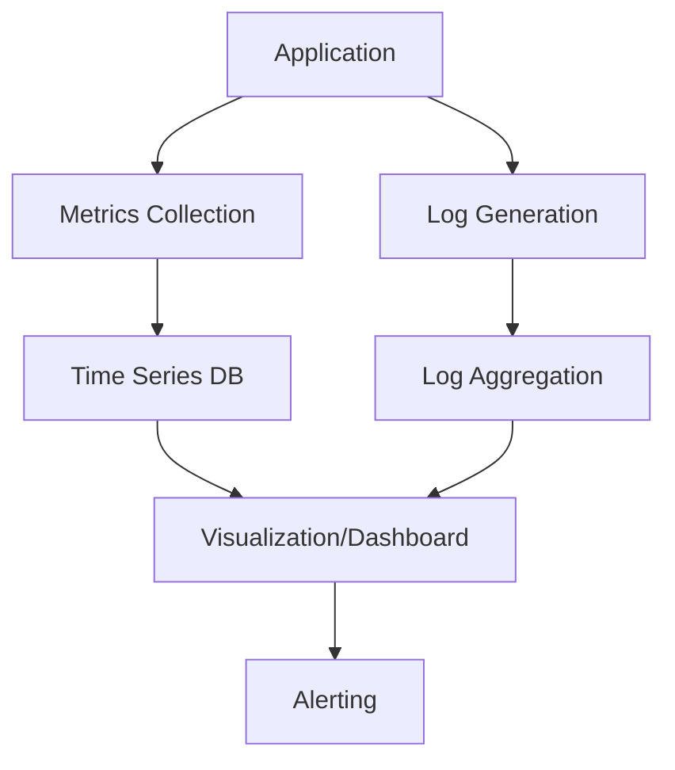

# Monitoring and Logging

## Overview

Monitoring and logging are critical components of modern software systems, providing visibility into application performance, health, and behavior. Monitoring involves collecting and analyzing metrics to track system performance in real-time, while logging captures detailed records of events and errors for debugging and auditing purposes.

## Detailed Explanation

### Monitoring

Monitoring encompasses the collection, storage, and analysis of quantitative data (metrics) about system performance. Key aspects include:

- **Metrics Types**: Counters, gauges, histograms, and summaries
- **Key Metrics**: CPU usage, memory consumption, response times, error rates, throughput
- **Alerting**: Setting thresholds for automatic notifications when metrics exceed acceptable ranges

### Logging

Logging involves recording discrete events and messages from applications. Important concepts:

- **Log Levels**: DEBUG, INFO, WARN, ERROR, FATAL
- **Structured Logging**: Using consistent formats (e.g., JSON) for better searchability
- **Log Aggregation**: Collecting logs from multiple sources into a central system

### Monitoring vs Logging

| Aspect | Monitoring | Logging |
|--------|------------|---------|
| Data Type | Quantitative (metrics) | Qualitative (events/messages) |
| Purpose | Real-time performance tracking | Debugging and auditing |
| Tools | Prometheus, Grafana | ELK Stack, Splunk |



## Real-world Examples & Use Cases

1. **E-commerce Platform**: Monitoring user checkout flow latency, logging failed transactions for fraud detection
2. **Microservices Architecture**: Centralized logging across services to trace request flows, monitoring service health for load balancing
3. **Cloud Infrastructure**: Monitoring auto-scaling groups, logging security events for compliance

## Code Examples

### Java Logging with SLF4J

```java
import org.slf4j.Logger;
import org.slf4j.LoggerFactory;

public class UserService {
    private static final Logger logger = LoggerFactory.getLogger(UserService.class);

    public User getUser(String id) {
        logger.info("Fetching user with id: {}", id);
        try {
            // business logic
            return userRepository.findById(id);
        } catch (Exception e) {
            logger.error("Error fetching user {}: {}", id, e.getMessage(), e);
            throw e;
        }
    }
}
```

### Metrics with Micrometer

```java
import io.micrometer.core.instrument.MeterRegistry;
import io.micrometer.core.instrument.Counter;
import io.micrometer.core.instrument.Timer;

@Service
public class OrderService {
    private final Counter orderCounter;
    private final Timer orderProcessingTimer;

    public OrderService(MeterRegistry registry) {
        this.orderCounter = Counter.builder("orders.total")
                .description("Total number of orders")
                .register(registry);
        this.orderProcessingTimer = Timer.builder("orders.processing.time")
                .description("Time taken to process orders")
                .register(registry);
    }

    public void processOrder(Order order) {
        orderCounter.increment();
        orderProcessingTimer.record(() -> {
            // order processing logic
        });
    }
}
```

## Common Pitfalls & Edge Cases

- **Log Noise**: Excessive logging can impact performance and obscure important messages
- **Metric Cardinality**: High-cardinality metrics can overwhelm monitoring systems
- **Log Rotation**: Failing to rotate logs can lead to disk space issues
- **Distributed Tracing**: Missing correlation IDs across services makes debugging difficult

## Tools & Libraries

- **Monitoring**: Prometheus, Grafana, Datadog, New Relic
- **Logging**: ELK Stack (Elasticsearch, Logstash, Kibana), Splunk, Fluentd
- **Java Libraries**: SLF4J, Logback, Micrometer, Dropwizard Metrics

## References

- [Prometheus Documentation](https://prometheus.io/docs/)
- [ELK Stack Guide](https://www.elastic.co/guide/index.html)
- [Micrometer Documentation](https://micrometer.io/)
- [SLF4J Manual](http://www.slf4j.org/manual.html)

## Github-README Links & Related Topics

- [Async Logging](async-logging/)
- [Distributed Tracing](distributed-tracing/)
- [Infrastructure Monitoring](infrastructure-monitoring/)
- [Monitoring with Prometheus and Grafana](monitoring-with-prometheus-and-grafana/)
- [Logging Frameworks](logging-frameworks/)
