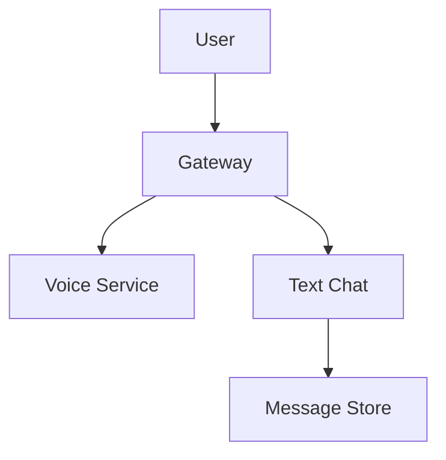

# Discord System Design

## Overview

Discord is a VoIP and instant messaging platform for gamers. This design focuses on real-time communication, voice channels, and server management.

## Detailed Explanation

### Architecture



### Components

- **WebSocket Gateway**: Real-time messaging.
- **Voice Processing**: Low-latency audio.
- **Sharding**: For large servers.

## Real-world Examples & Use Cases

- Gaming communities.
- Voice chat during streams.

## Code Examples

### Node.js for Message Handling

```javascript
socket.on('message', (data) => {
    db.saveMessage(data);
    broadcastToChannel(data.channelId, data);
});
```

## References

- [Discord Engineering](https://discord.com/blog)

## Github-README Links & Related Topics

- [System Design Basics](system-design-basics/README.md)
- [WhatsApp Messaging System](whatsapp-messaging-system/README.md)