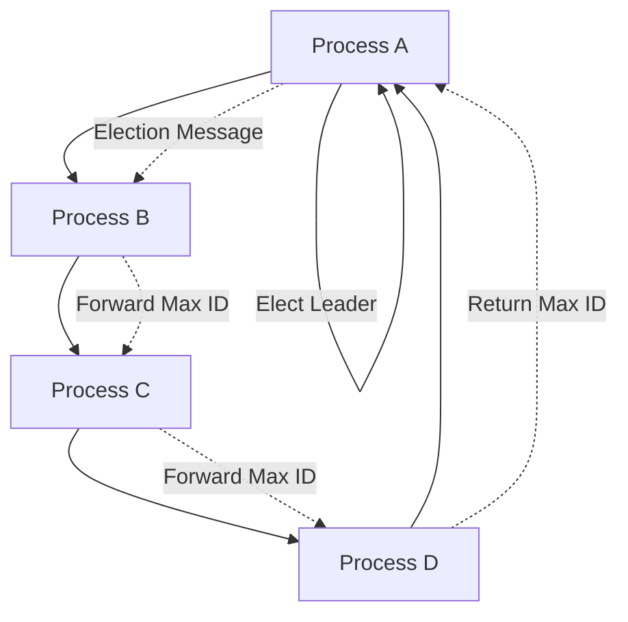

# Leader Election Algorithms

## Overview

Leader election algorithms are used in distributed systems to select a single process as the leader among a group of processes. The leader is responsible for coordinating activities, making decisions, and ensuring consistency.

## Detailed Explanation

Leader election is crucial in systems like distributed databases, consensus protocols, and cluster management. Common algorithms include Bully, Ring, and those integrated into protocols like Raft and Paxos.

### Bully Algorithm

- Processes are ordered by ID.
- A process sends election messages to higher ID processes.
- If no response, it becomes leader.
- If response, waits for higher to become leader.

### Ring Algorithm

- Processes form a ring.
- A process sends election message with its ID.
- Each forwards the max ID.
- Initiator gets back the max, elects it as leader.

### In Consensus Protocols

- Raft: Uses randomized timeouts for election.
- Paxos: Leader election as part of the protocol.



## Real-world Examples & Use Cases

- **ZooKeeper**: Uses a leader election for coordination.
- **etcd**: Leader election for key-value store consistency.
- **Kubernetes**: Leader election for controllers.
- **Apache Kafka**: Controller election.

## Code Examples

### Bully Algorithm Pseudo Code

```java
class Process {
    int id;
    List<Process> higherProcesses;
    
    void startElection() {
        boolean hasHigher = false;
        for (Process p : higherProcesses) {
            if (p.isAlive()) {
                p.receiveElection(this);
                hasHigher = true;
            }
        }
        if (!hasHigher) {
            becomeLeader();
        }
    }
    
    void receiveElection(Process sender) {
        // Respond and start own election if needed
    }
}
```

## Common Pitfalls & Edge Cases

- **Network Failures**: Can lead to multiple leaders.
- **Process Crashes**: Need to re-elect.
- **Split Brain**: Partitioned network elects multiple leaders.

## Tools & Libraries

- **ZooKeeper**: Apache ZooKeeper for leader election.
- **etcd**: CoreOS etcd.
- **Raft Libraries**: Like HashiCorp's Raft implementation.

## References

- [Leader Election in Distributed Systems](https://en.wikipedia.org/wiki/Leader_election)
- [Raft Paper](https://raft.github.io/raft.pdf)

## Github-README Links & Related Topics

- [Raft and Leader Election](raft-and-leader-election/README.md)
- [Paxos Algorithm](paxos-algorithm/README.md)
- [Consensus Algorithms](consensus-algorithms/README.md)
- [Distributed Locks](distributed-locks/README.md)