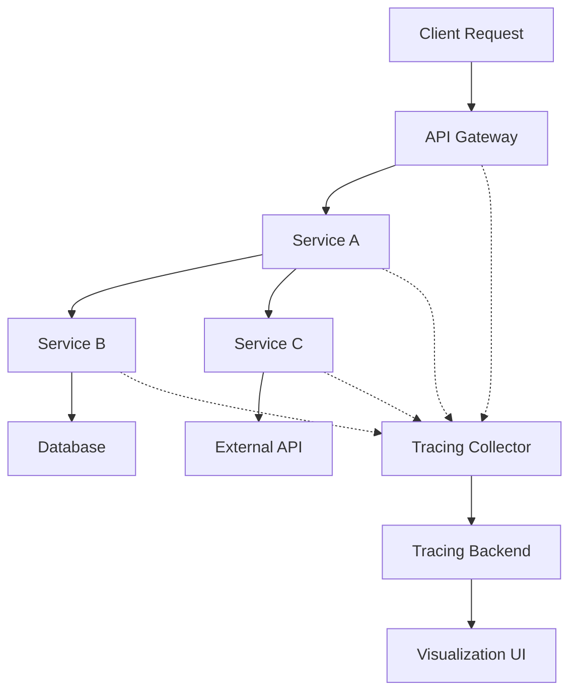

# Distributed Tracing Tools

## Overview

Distributed Tracing Tools are essential components of modern observability stacks that track requests as they flow through distributed systems. They provide end-to-end visibility into application performance, helping identify bottlenecks, debug issues, and optimize system reliability across microservices and serverless architectures.



## Detailed Explanation

### Core Concepts

1. **Spans**: Individual units of work within a trace, representing operations like database calls or HTTP requests
2. **Traces**: Collections of spans that represent the complete journey of a request through the system
3. **Context Propagation**: Mechanism to pass trace context between services
4. **Sampling**: Strategy to collect traces for a subset of requests to balance observability with performance
5. **Instrumentation**: Process of adding tracing code to applications

### Tracing Standards

- **OpenTracing**: Vendor-neutral API specification (now part of OpenTelemetry)
- **OpenCensus**: Google's observability framework (merged into OpenTelemetry)
- **OpenTelemetry**: CNCF project providing unified observability framework
- **Jaeger**: Distributed tracing system inspired by Dapper and OpenZipkin

### Key Features

- **End-to-End Visibility**: Track requests across service boundaries
- **Performance Monitoring**: Identify slow operations and bottlenecks
- **Root Cause Analysis**: Debug issues in complex distributed systems
- **Service Dependencies**: Visualize service interaction graphs
- **Alerting Integration**: Trigger alerts based on trace data

## Real-world Examples & Use Cases

### Microservices Architecture Monitoring

```yaml
# OpenTelemetry Collector Configuration
receivers:
  otlp:
    protocols:
      grpc:
        endpoint: 0.0.0.0:4317
      http:
        endpoint: 0.0.0.0:4318

processors:
  batch:
    timeout: 1s
    send_batch_size: 1024

exporters:
  jaeger:
    endpoint: jaeger-all-in-one:14250
    tls:
      insecure: true

service:
  pipelines:
    traces:
      receivers: [otlp]
      processors: [batch]
      exporters: [jaeger]
```

### E-commerce Order Processing

```java
// OpenTelemetry Java Instrumentation
import io.opentelemetry.api.trace.Span;
import io.opentelemetry.api.trace.Tracer;
import io.opentelemetry.context.Scope;

public class OrderService {

    private static final Tracer tracer = GlobalOpenTelemetry.getTracer("order-service");

    public Order processOrder(OrderRequest request) {
        Span span = tracer.spanBuilder("processOrder").startSpan();
        try (Scope scope = span.makeCurrent()) {
            span.setAttribute("order.id", request.getOrderId());
            span.setAttribute("customer.id", request.getCustomerId());

            // Validate order
            Span validationSpan = tracer.spanBuilder("validateOrder").startSpan();
            try (Scope validationScope = validationSpan.makeCurrent()) {
                validateOrder(request);
            } finally {
                validationSpan.end();
            }

            // Process payment
            Span paymentSpan = tracer.spanBuilder("processPayment").startSpan();
            try (Scope paymentScope = paymentSpan.makeCurrent()) {
                processPayment(request);
            } finally {
                paymentSpan.end();
            }

            // Update inventory
            Span inventorySpan = tracer.spanBuilder("updateInventory").startSpan();
            try (Scope inventoryScope = inventorySpan.makeCurrent()) {
                updateInventory(request);
            } finally {
                inventorySpan.end();
            }

            return createOrder(request);
        } finally {
            span.end();
        }
    }
}
```

### Serverless Function Tracing

```javascript
// AWS Lambda with X-Ray
const AWSXRay = require('aws-xray-sdk-core');
const AWS = AWSXRay.captureAWS(require('aws-sdk'));

exports.handler = async (event) => {
    const segment = AWSXRay.getSegment();
    const subsegment = segment.addNewSubsegment('processing-order');

    try {
        // Add metadata
        subsegment.addMetadata('orderId', event.orderId);
        subsegment.addAnnotation('service', 'order-processor');

        // Simulate processing
        await processOrder(event);

        subsegment.addMetadata('status', 'success');
        return { statusCode: 200, body: 'Order processed' };
    } catch (error) {
        subsegment.addError(error);
        throw error;
    } finally {
        subsegment.close();
    }
};
```

## Code Examples

### Jaeger Client Instrumentation

```go
package main

import (
    "context"
    "log"
    "net/http"

    "github.com/opentracing/opentracing-go"
    "github.com/opentracing/opentracing-go/ext"
    jaeger "github.com/uber/jaeger-client-go"
    "github.com/uber/jaeger-client-go/config"
)

func main() {
    cfg := config.Configuration{
        ServiceName: "my-service",
        Sampler: &config.SamplerConfig{
            Type:  jaeger.SamplerTypeConst,
            Param: 1,
        },
        Reporter: &config.ReporterConfig{
            LogSpans: true,
        },
    }

    tracer, closer, err := cfg.NewTracer()
    if err != nil {
        log.Fatal(err)
    }
    defer closer.Close()

    opentracing.SetGlobalTracer(tracer)

    http.HandleFunc("/api/v1/users", handleUsers)
    log.Fatal(http.ListenAndServe(":8080", nil))
}

func handleUsers(w http.ResponseWriter, r *http.Request) {
    spanCtx, _ := opentracing.GlobalTracer().Extract(
        opentracing.HTTPHeaders,
        opentracing.HTTPHeadersCarrier(r.Header),
    )

    span := opentracing.GlobalTracer().StartSpan("handleUsers", ext.RPCServerOption(spanCtx))
    defer span.Finish()

    ctx := opentracing.ContextWithSpan(context.Background(), span)

    // Business logic here
    users, err := getUsers(ctx)
    if err != nil {
        ext.Error.Set(span, true)
        span.LogKV("error", err.Error())
        http.Error(w, err.Error(), http.StatusInternalServerError)
        return
    }

    span.LogKV("user_count", len(users))
    w.WriteHeader(http.StatusOK)
}
```

### Zipkin with Spring Boot

```java
@Configuration
public class TracingConfig {

    @Bean
    public RestTemplate restTemplate(RestTemplateBuilder builder) {
        return builder
            .interceptors(Collections.singletonList(new TracingRestTemplateInterceptor()))
            .build();
    }

    @Bean
    public Sampler defaultSampler() {
        return Sampler.ALWAYS_SAMPLE;
    }
}

// Custom interceptor for RestTemplate
public class TracingRestTemplateInterceptor implements ClientHttpRequestInterceptor {

    @Override
    public ClientHttpResponse intercept(HttpRequest request, byte[] body,
            ClientHttpRequestExecution execution) throws IOException {

        Span currentSpan = tracer.currentSpan();
        if (currentSpan != null) {
            request.getHeaders().add("X-B3-TraceId", currentSpan.context().traceIdString());
            request.getHeaders().add("X-B3-SpanId", currentSpan.context().spanIdString());
            request.getHeaders().add("X-B3-ParentSpanId", currentSpan.context().parentIdString());
            request.getHeaders().add("X-B3-Sampled", "1");
        }

        return execution.execute(request, body);
    }
}
```

### Distributed Tracing with Python

```python
from opentelemetry import trace
from opentelemetry.sdk.trace import TracerProvider
from opentelemetry.sdk.trace.export import BatchSpanProcessor
from opentelemetry.exporter.jaeger import JaegerExporter
from opentelemetry.instrumentation.flask import FlaskInstrumentor
from flask import Flask

# Set up tracing
trace.set_tracer_provider(TracerProvider())
tracer = trace.get_tracer(__name__)

# Configure Jaeger exporter
jaeger_exporter = JaegerExporter(
    agent_host_name="localhost",
    agent_port=14268,
)

span_processor = BatchSpanProcessor(jaeger_exporter)
trace.get_tracer_provider().add_span_processor(span_processor)

app = Flask(__name__)

# Instrument Flask
FlaskInstrumentor().instrument_app(app)

@app.route('/api/users')
def get_users():
    with tracer.start_as_span("get_users") as span:
        span.set_attribute("operation", "fetch_users")
        span.set_attribute("user_count", 42)

        # Simulate database call
        with tracer.start_as_span("db_query") as db_span:
            db_span.set_attribute("table", "users")
            db_span.set_attribute("query_type", "SELECT")

            # Database operation
            users = query_database()

        return {"users": users}

if __name__ == '__main__':
    app.run(debug=True)
```

## Common Pitfalls & Edge Cases

- **High Overhead**: Tracing can impact performance; use sampling strategies
- **Context Loss**: Ensure proper context propagation across async boundaries
- **Clock Skew**: Handle time synchronization issues in distributed systems
- **Large Payloads**: Avoid logging large request/response bodies in spans
- **Security**: Be careful not to log sensitive information in traces
- **Storage Costs**: Traces can generate large volumes of data
- **Debugging Complexity**: Correlating traces across multiple services

## Tools & Libraries

- **Jaeger**: Open-source distributed tracing system
- **Zipkin**: Distributed tracing system
- **OpenTelemetry**: Observability framework
- **AWS X-Ray**: AWS managed tracing service
- **Google Cloud Trace**: GCP tracing service
- **Azure Application Insights**: Microsoft tracing solution
- **Datadog APM**: Commercial tracing and monitoring
- **New Relic**: Application performance monitoring

## References

- [OpenTelemetry Documentation](https://opentelemetry.io/docs/)
- [Jaeger Documentation](https://www.jaegertracing.io/docs/)
- [Zipkin Documentation](https://zipkin.io/)
- [AWS X-Ray Developer Guide](https://docs.aws.amazon.com/xray/)
- [Google Cloud Trace](https://cloud.google.com/trace/docs)

## Github-README Links & Related Topics

- [Distributed Tracing](../distributed-tracing/README.md)
- [Distributed Tracing with OpenTelemetry](../distributed-tracing-with-opentelemetry/README.md)
- [Monitoring and Logging](../monitoring-and-logging/README.md)
- [Observability Patterns](../observability-patterns/README.md)
- [Microservices Communication Patterns](../microservices-communication-patterns/README.md)