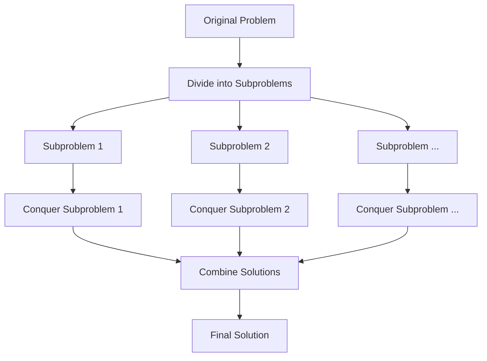

# Overview

Divide and Conquer (D&C) is a fundamental algorithmic paradigm in computer science that breaks down complex problems into smaller, more manageable subproblems, solves them recursively, and combines their solutions to address the original problem. This approach leverages the principle that problems become simpler as their size decreases, often leading to efficient solutions with optimal time complexities. Originating from ancient strategies like the Euclidean algorithm, D&C has been pivotal in developing algorithms for sorting, searching, and computational geometry.

Key characteristics include recursive decomposition, independent subproblem solving, and solution recombination. D&C is particularly effective for problems that can be naturally divided, such as those in sorting (e.g., Merge Sort, Quick Sort) and optimization (e.g., Closest Pair of Points).

# Detailed Explanation

The Divide and Conquer paradigm follows a three-step process:

1. **Divide**: Break the problem into smaller, independent subproblems of the same type.
2. **Conquer**: Solve each subproblem recursively. If a subproblem is small enough (base case), solve it directly.
3. **Combine**: Merge the solutions of the subproblems to form the solution to the original problem.

This recursive structure is often visualized as a tree, where each node represents a subproblem.



## Time Complexity Analysis

D&C algorithms often follow the recurrence relation:  
**T(n) = a * T(n/b) + f(n)**  
- `a`: Number of subproblems  
- `n/b`: Size of each subproblem  
- `f(n)`: Cost of divide and combine steps  

Using the Master Theorem, complexities can be derived:  
- If f(n) = O(n^c) and c < log_b a, then T(n) = O(n^{log_b a})  
- If f(n) = Θ(n^c log^k n) and c = log_b a, then T(n) = O(n^c log^{k+1} n)  
- If f(n) = Ω(n^c) and c > log_b a, then T(n) = O(f(n))  

| Algorithm | Divide | Conquer | Combine | Time Complexity |
|-----------|--------|----------|---------|-----------------|
| Merge Sort | Split array in half | Recurse on halves | Merge sorted halves | O(n log n) |
| Quick Sort | Partition around pivot | Recurse on partitions | None (in-place) | O(n log n) avg, O(n^2) worst |
| Closest Pair | Split points by x-coordinate | Recurse on halves | Check strip for closer pairs | O(n log n) |
| Binary Search | Split search space | Recurse on half | None | O(log n) |

# Real-world Examples & Use Cases

D&C algorithms are ubiquitous in software engineering due to their efficiency and parallelism potential.

- **Sorting Large Datasets**: Merge Sort is used in external sorting for databases and file systems, handling data larger than memory.
- **Search Engines**: Binary Search enables fast lookups in sorted indices, powering search algorithms in databases like B-trees.
- **Geometric Computations**: Closest Pair algorithm detects collisions in physics simulations, robotics, and computer graphics.
- **Signal Processing**: Fast Fourier Transform (FFT) decomposes signals for efficient frequency analysis in audio/video processing.
- **Matrix Operations**: Strassen's algorithm accelerates matrix multiplication in machine learning and graphics.
- **Parallel Computing**: D&C naturally parallelizes, e.g., in MapReduce frameworks for big data processing.
- **Cryptography**: Karatsuba multiplication speeds up large integer operations in RSA and elliptic curve cryptography.

# Code Examples

Below are copy-pastable implementations in Java, focusing on clarity and efficiency.

## Merge Sort

A stable sorting algorithm that divides the array into halves, sorts them recursively, and merges.

```java
public class MergeSort {
    public static void mergeSort(int[] arr) {
        if (arr.length < 2) return;
        int mid = arr.length / 2;
        int[] left = Arrays.copyOfRange(arr, 0, mid);
        int[] right = Arrays.copyOfRange(arr, mid, arr.length);
        mergeSort(left);
        mergeSort(right);
        merge(arr, left, right);
    }

    private static void merge(int[] arr, int[] left, int[] right) {
        int i = 0, j = 0, k = 0;
        while (i < left.length && j < right.length) {
            if (left[i] <= right[j]) {
                arr[k++] = left[i++];
            } else {
                arr[k++] = right[j++];
            }
        }
        while (i < left.length) arr[k++] = left[i++];
        while (j < right.length) arr[k++] = right[j++];
    }
}
```

## Quick Sort

An in-place sorting algorithm that partitions around a pivot and recurses on subarrays.

```java
public class QuickSort {
    public static void quickSort(int[] arr, int low, int high) {
        if (low < high) {
            int pi = partition(arr, low, high);
            quickSort(arr, low, pi - 1);
            quickSort(arr, pi + 1, high);
        }
    }

    private static int partition(int[] arr, int low, int high) {
        int pivot = arr[high];
        int i = low - 1;
        for (int j = low; j < high; j++) {
            if (arr[j] < pivot) {
                i++;
                swap(arr, i, j);
            }
        }
        swap(arr, i + 1, high);
        return i + 1;
    }

    private static void swap(int[] arr, int i, int j) {
        int temp = arr[i];
        arr[i] = arr[j];
        arr[j] = temp;
    }
}
```

## Closest Pair of Points

Finds the minimum distance between any two points in a set using D&C.

```java
import java.util.*;

public class ClosestPair {
    static class Point {
        double x, y;
        Point(double x, double y) { this.x = x; this.y = y; }
    }

    public static double closestPair(Point[] points) {
        Arrays.sort(points, Comparator.comparingDouble(p -> p.x));
        return closestUtil(points, 0, points.length - 1);
    }

    private static double closestUtil(Point[] points, int l, int r) {
        if (r - l <= 3) return bruteForce(points, l, r);
        int mid = (l + r) / 2;
        Point midPoint = points[mid];
        double dl = closestUtil(points, l, mid);
        double dr = closestUtil(points, mid + 1, r);
        double d = Math.min(dl, dr);
        return Math.min(d, stripClosest(points, mid, d));
    }

    private static double stripClosest(Point[] points, int mid, double d) {
        List<Point> strip = new ArrayList<>();
        for (Point p : points) {
            if (Math.abs(p.x - points[mid].x) < d) strip.add(p);
        }
        strip.sort(Comparator.comparingDouble(p -> p.y));
        for (int i = 0; i < strip.size(); i++) {
            for (int j = i + 1; j < strip.size() && (strip.get(j).y - strip.get(i).y) < d; j++) {
                double dist = distance(strip.get(i), strip.get(j));
                if (dist < d) d = dist;
            }
        }
        return d;
    }

    private static double bruteForce(Point[] points, int l, int r) {
        double min = Double.MAX_VALUE;
        for (int i = l; i <= r; i++) {
            for (int j = i + 1; j <= r; j++) {
                double dist = distance(points[i], points[j]);
                if (dist < min) min = dist;
            }
        }
        return min;
    }

    private static double distance(Point a, Point b) {
        return Math.sqrt((a.x - b.x) * (a.x - b.x) + (a.y - b.y) * (a.y - b.y));
    }
}
```

## Binary Search (Decrease and Conquer Variant)

While strictly decrease-and-conquer, it's often grouped with D&C.

```java
public class BinarySearch {
    public static int binarySearch(int[] arr, int target) {
        return binarySearchUtil(arr, target, 0, arr.length - 1);
    }

    private static int binarySearchUtil(int[] arr, int target, int low, int high) {
        if (low > high) return -1;
        int mid = low + (high - low) / 2;
        if (arr[mid] == target) return mid;
        else if (arr[mid] > target) return binarySearchUtil(arr, target, low, mid - 1);
        else return binarySearchUtil(arr, target, mid + 1, high);
    }
}
```

# Common Pitfalls & Edge Cases

- **Recursion Depth**: Deep recursion can cause stack overflow; use iterative versions or increase stack size for large inputs.
- **Pivot Selection in Quick Sort**: Poor pivots (e.g., always smallest/largest) lead to O(n^2) worst-case; use randomized or median-of-three pivots.
- **Base Cases**: Incorrect base cases can result in infinite recursion; ensure they handle smallest possible inputs.
- **Overlapping Subproblems**: If subproblems overlap, switch to dynamic programming to avoid redundant computations.
- **Memory Usage**: Merge Sort requires O(n) extra space; Quick Sort is in-place but may have O(log n) stack space.
- **Edge Cases**: Empty arrays, single elements, duplicates, or nearly sorted data; test thoroughly.
- **Parallelism Overhead**: For small problems, parallel D&C may not yield benefits due to synchronization costs.

# Tools & Libraries

- **Java**: `Arrays.sort()` uses a hybrid Quick Sort/Merge Sort; `ForkJoinPool` for parallel D&C.
- **Python**: `sorted()` and `list.sort()` use Timsort (hybrid); `multiprocessing` for parallelism.
- **C++**: STL `std::sort` uses introsort (hybrid); OpenMP for parallel execution.
- **IDEs**: IntelliJ IDEA or Eclipse for debugging recursive calls.
- **Profiling**: Use tools like VisualVM or JProfiler to monitor recursion depth and performance.

# References

- [Divide-and-conquer algorithm - Wikipedia](https://en.wikipedia.org/wiki/Divide-and-conquer_algorithm)
- [Introduction to Divide and Conquer Algorithm - GeeksforGeeks](https://www.geeksforgeeks.org/divide-and-conquer-algorithm-introduction/)
- [Introduction to Algorithms - Cormen et al.](https://mitpress.mit.edu/9780262033848/introduction-to-algorithms/)
- [Master Theorem for Divide and Conquer - Brilliant](https://brilliant.org/wiki/master-theorem/)

# Github-README Links & Related Topics

- [Algorithms and Data Structures](../algorithms-and-data-structures/README.md)
- [Sorting Algorithms](../sorting-algorithms/README.md)
- [Dynamic Programming](../dynamic-programming/README.md)
- [Recursion](../recursion/README.md)
- [Backtracking](../backtracking/README.md)